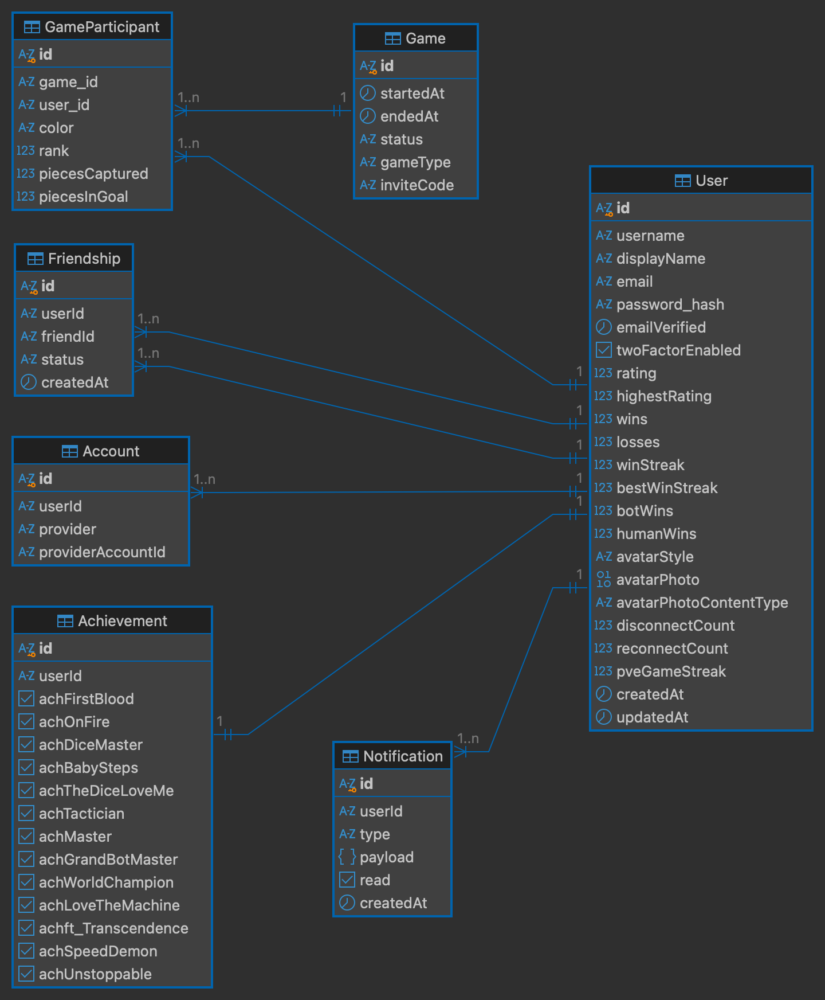

_This project has been created as part of the 42 curriculum by bleow, liyu-her, hang, jow._

# ft_transcendence

## Description

A browser-based multiplayer Ludo platform. Players register or sign in through an external
provider, join a lobby, and play server-authoritative matches against remote opponents, a
local hotseat partner, or an AI. Results feed a persistent profile, a leaderboard, and an
achievement system, and the whole interface is available in multiple languages.

### Key features

- **Server-authoritative Ludo** — dice rolls, turn order, captures, safe squares and home
  entry are all resolved on the server; the client renders, it does not decide
- **Match formats** — Hotseat mode, vs Bot/AI (PVE) mode, vs Multiplayer (PVP) mode
- **Real-time play** — WebSocket transport with live board updates, presence, and reconnect
- **User management** — profiles, avatars, friends, live online status
- **Authentication** — local accounts, OAuth 2.0 sign-in (Google, GitHub, 42), email verification, and two-factor authentication (email code)
- **Progression** — match history, statistics, leaderboard, and achievements
- **Multilingual UI** — English, Malay, and French, including error messages and notices that are translated into the selected language
- **Notifications, game customization, and extended browser support**

## Instructions

### Prerequisites

- **Docker** and **Docker Compose** (the only runtime requirement).
- **make** (to use the provided build commands).
- A `.env` file at the repo root (see [Configuration (.env)](#configuration-env) below). The stack refuses to start if required values are missing.
- OAuth client IDs and secrets for Google, GitHub, and 42 — **optional**. Local sign-up and login work without them.
- At least one free port: `8443` (HTTPS) was chosen for our project.

### Running

```bash
git clone https://github.com/J00ZzZ/ft_transcendence.git
cd ft_transcendence
make
```

`make` builds the images and starts the stack (the `make env` step it runs first validates the `.env` values). Then open https://localhost:8443 in your browser — accept the self-signed certificate warning on first visit.

### Development mode (hot reload)

```bash
make dev
# App:   http://localhost:8080   (Vite dev server, auto-reloads on save)
# Prod:  https://localhost:8443  (still running alongside, via nginx)
```

### Commands

| Command                           | Effect                                                   |
| --------------------------------- | -------------------------------------------------------- |
| `make env`                        | Validate required `.env` values                          |
| `make` or `make all`              | Build images and start the stack                         |
| `make build`                      | Build images only (runs `make env` first)                |
| `make start`                      | Start the stack (detached)                               |
| `make dev`                        | Vite HMR dev + prod SPA (`compose watch`). ⚠️ Running `make dev` will stop any running prod containers. |
| `make stop` / `make down`         | Stop services / remove containers                        |
| `make logs`                       | Tail service logs                                        |
| `make clean` / `make prune`       | Remove all Docker data / `docker system prune`           |
| `make fclean` / `make re`         | `prune` + `clean` / full rebuild from scratch            |
| `make ngrok-auth`                 | One-time: register `NGROK_AUTHTOKEN` with the ngrok CLI  |
| `make tunnel` / `make tunnel-url` | Start the ngrok tunnel / print its public URL            |
| `make dev-tunnel`                 | Open `make dev` + `make tunnel` in two tabs (macOS only) |
| `make stop-tunnel`                | Kill ngrok and stop the dev containers                   |
| `make lan`                        | LAN mode: start the stack and print your LAN URL         |
| `make tunnel_up`                  | One-shot: build + start + open the tunnel                |

### Access

| URL                       | What it is                                                      | Profile | Exposure                                                                                                                    |
| ------------------------- | --------------------------------------------------------------- | ------- | --------------------------------------------------------------------------------------------------------------------------- |
| `https://localhost:8443`  | The app (via nginx)                                             | default | Public entry — TLS 1.2/1.3, security headers/CSP, nginx rate limits, proxies to JWT-guarded backend & token-verified engine |
| `http://localhost:8080`   | Vite dev server with hot reload                                 | dev     | Dev only — no TLS; keep off untrusted/shared hosts                                                                          |
| `http://localhost:3000`   | Backend API (direct, host-only)                                 | default | Loopback-only publish; JWT/2FA/bcrypt, throttling, no CORS headers (same-origin via nginx only)                             |
| `http://localhost:5555`   | Prisma Studio (database browser)                                | default | Loopback-only publish; no app-level auth — interactive host use only                                                        |
| `wss://<host>/socket.io/` | Game engine connection (same-origin through nginx / Vite proxy) | default | Same-origin `wss` only; engine verifies the Socket.IO handshake JWT before joining rooms                                    |
| `https://derived-sassy-amniotic.ngrok-free.dev` | Ngrok tunnel (online multiplayer) | tunnel | Public entry exposed via ngrok — same nginx TLS/security setup as `localhost:8443`. Fixed URL provided by ngrok |

**Security Hardening measures taken**

- **`8443` (nginx)** is the only intentionally public-facing port (published on all host interfaces). It runs **TLS 1.2/1.3 only** with a self-signed cert and **no plain-HTTP listener**, sets HSTS + security headers + a CSP, disables `server_tokens`, denies hidden-file access, and applies per-IP rate limits (login `5r/m`, auth `60r/m`, refresh `30r/m`, leaderboard `30r/m`) in front of the API.
- **`8080` (Vite)** is active only under the `dev` compose profile (`make dev`). It serves the SPA and proxies `/api` and `/socket.io` without TLS. Disabled in production.
- **`3000` (backend)** is published loopback-only; clients reach it exclusively through nginx's `/api` proxy. Backend hardening: JWT auth in httpOnly cookies, bcrypt password hashes, class-validator on DTOs, and NestJS rate throttling. CORS is intentionally not enabled — every call the SPA makes is same-origin through nginx, so the backend emits no cross-origin headers.
- **Avatar uploads** are validated before they are stored. The 2 MB limit is enforced by the upload middleware, and the client refuses a file whose declared MIME type is not PNG, JPEG, GIF or WebP. The server then compares the leading bytes of the file against the signature of the declared type (`89 50 4E 47 0D 0A 1A 0A` for PNG, `FF D8 FF` for JPEG, `47 49 46 38` for GIF, `52 49 46 46…57 45 42 50` for WebP), because the MIME type is only what the client claims. A file whose declared type does not match its bytes is rejected before anything is written. The check reads the signature bytes only and does not decode the image, so a file cut off after its signature is stored, and the client falls back to the generated avatar when the browser cannot decode it. Accepted bytes are stored in Postgres in a `Bytes` column through Prisma, and Prisma reads them back as raw bytes and sends them to the browser with the stored `Content-Type`. The database does not run or open the file; it only stores the bytes.
- **`5555` (Prisma Studio)** is a raw database browser with no application-level authentication — its protection is the loopback-only binding plus the Postgres credentials. Used on the host only.
- **`/socket.io/`** is reachable only same-origin: over TLS via nginx (`wss://`) or through the Vite dev proxy — never on a raw `ws://` port. The engine validates the Socket.IO handshake JWT (game-scoped, with role/color) before the socket can join a room.
- **Infrastructure ports not listed** — all published loopback-only; cross-container traffic rides the private `transcendence_network`:
  - **Postgres** (`127.0.0.1:5432`) — requires credentials.
  - **Redis** (`127.0.0.1:6479`) — requires a password.
  - **Engine** (`127.0.0.1:3001`) — additionally gated by JWT token verification: the Socket.IO handshake JWT (game-scoped, with role/color, signed with `JWT_SECRET` and verified in constant time) must be valid before a socket can join a room, so a loopback connection alone is not enough to interact with any game.

### Configuration (.env)

All config lives in the root `.env` (`KEY=VALUE` per line), loaded into containers via compose's `env_file:`. It is gitignored and shared between the team only (via Discord) — `.env.example` is a template we used. `make` validates it and **fails early** if `.env` is missing or any required field is empty. OAuth credentials are added manually from the provider consoles (Google, GitHub, 42).

## Team Information

| Login      | Role(s)                                   | Responsibilities                                                                                                                                                                                 |
| ---------- | ----------------------------------------- | ------------------------------------------------------------------------------------------------------------------------------------------------------------------------------------------------ |
| `liyu-her` | Product Owner, Project Manager, Developer | Planning sessions, progress and deadline tracking, risk and blocker management, backlog and feature priorities, validating completed work, stakeholder communication — plus feature development. |
| `bleow`    | Tech Lead, Developer                      | Technical architecture, product vision, documentation, stack decisions, code quality and review of critical changes — plus feature development                                                   |
| `hang`     | Developer                                 | Feature implementation, code review, testing, documentation                                                                                                                                      |
| `jow`      | Project Manager, Developer                | Planning sessions, progress and deadline tracking, risk and blocker management — plus feature development                                                                                        |

## Project Management

- **Tools** — Discord and Lark for coordination and task tracking
- **Communication** — Discord for day-to-day, plus in-person working sessions on campus

## Technical Stack

### Frontend

| Technology            | Purpose                                   |
| --------------------- | ----------------------------------------- |
| React 19 + TypeScript | Component model, routing, client state    |
| Vite                  | Build tooling and dev server (hot reload) |
| Tailwind CSS          | Styling                                   |
| i18next               | Localization (English, Malay, French)     |
| Socket.IO client      | Real-time transport                       |

### Backend

| Technology                                 | Purpose                                                    |
| ------------------------------------------ | ---------------------------------------------------------- |
| NestJS                                     | HTTP API, dependency injection, module structure           |
| Socket.IO                                  | WebSocket gateway and room fan-out                         |
| Passport + JWT (httpOnly cookies) + bcrypt | OAuth 2.0 (Google, GitHub, 42), sessions, password hashing |
| Prisma                                     | ORM, schema and generated client                           |
| nginx                                      | Reverse proxy and TLS termination                          |
| Docker Compose                             | One-command reproducible stack, service isolation          |

### Data

| Technology | Purpose                                                                  |
| ---------- | ------------------------------------------------------------------------ |
| PostgreSQL | Durable data — users, friendships, match history, achievements           |
| Redis      | Live game state — board, dice, turn pointer, matchmaking queue, presence |

### Justification for major technical choices

**Why React + NestJS + PostgreSQL.** The stack the team is most comfortable with, and
explicitly allowed by the subject (unlike Django or Spring), so the team could move fast
and defend every choice in review.

**Why Redis alongside it.** A running match is high-frequency, short-lived state — board
position, current dice value, whose turn it is, who is queued for matchmaking. Writing that
to Postgres on every move would put transactional write load on the database for data that
becomes worthless the moment the game ends. Redis holds it in memory; only the durable
outcome — result, opponents, duration, rating delta — is written to Postgres. Redis Pub/Sub
also carries the engine's broadcasts and the notifications between processes, so a socket held
by one process still reaches the clients served elsewhere.

**Why a server-authoritative game loop.** The client never decides a dice value or validates
a move. Every action is a request the server accepts or rejects against its own copy of the
board, so there is reduced chance of hacking or cheating.

**Why Socket.IO over plain WebSockets.** It provides automatic reconnection, rooms, and
broadcasting out of the box, which the live board, presence, and reconnect flows build on.

**Why SSE and client-to-server heartbeats.** The notification system uses Server-Sent
Events (SSE) instead of WebSockets. The reason is one behaviour of ngrok: it closes a
tunnel that carries no traffic for a short time. A WebSocket that stays open for a long
time would be closed with no error message, and the client would stop receiving
notifications. An SSE connection is a normal HTTP response that stays open, and the
client sends a small heartbeat request to the server at a fixed interval, so the tunnel
always carries traffic. This keeps the connection open and still lets the server push
messages to the client as they happen. The heartbeat also tells the server that the client
is still there; if the heartbeat stops, the client reconnects before the user notices that
notifications are missing.

**Why Passport + JWT in httpOnly cookies + bcrypt.** Passport handles OAuth 2.0 callbacks
for Google, GitHub, and 42 — a well-known library, no custom flow. Sessions use a
short-lived JWT (15 minutes) in an httpOnly cookie, so page scripts cannot read it and XSS
cannot steal it. Refresh tokens (7 days) are stored hashed in Redis and rotated on every use
— a leaked token stops working once reused, and can be revoked on logout. Passwords are
hashed with bcrypt, so a database leak does not expose usable credentials.

**Why Prisma.** Prisma keeps the database schema in one place and generates a type-safe
client from it, so queries are checked at compile time and no SQL is written by hand. The
schema is applied with `prisma db push` on every boot, so a fresh database is built from
`schema.prisma` consistently on any machine.

## Database Schema



## Modules

### Major modules

| #   | Module                             | Owner      | How it was implemented                                                                                                                      |
| --- | ---------------------------------- | ---------- | ------------------------------------------------------------------------------------------------------------------------------------------- |
| 1   | Framework for frontend and backend | `liyu-her` | React on the client, NestJS on the server — framework routing, state and dependency injection rather than developing functions from scratch |
| 2   | Real-time features                 | `bleow`    | Socket.IO gateway with a Redis Pub/Sub bridge for cross-process broadcast; live board updates, presence, and reconnect                      |
| 3   | Standard user management           | `hang`     | Profiles, avatar upload, friend requests, live online status                                                                                |
| 4   | AI opponent                        | `bleow`    | Heuristic move selection — no external model, no black-box library                                                                          |
| 5   | Web-based game                     | `bleow`    | Server-authoritative Ludo: dice RNG, turn order, captures, safe squares and exact-count home entry all resolved server-side                 |
| 6   | Remote players                     | `liyu-her` | Two players on separate machines over the network, with reconnect inside a grace window                                                     |
| 7   | Multiplayer, more than two players | `bleow`    | Four concurrent seats with server-enforced turn order and seat identity derived from the session                                            |

### Minor modules

| #   | Module                            | Owner      | How it was implemented                                                 |
| --- | --------------------------------- | ---------- | ---------------------------------------------------------------------- |
| 1   | ORM                               | `jow`      | Prisma — schema, relations and a generated type-safe client             |
| 2   | Multiple languages                | `liyu-her` | Session-based language switching across English, Malay and French      |
| 3   | Game statistics and match history | `bleow`    | Wins, losses, rating and leaderboard, reconciled against match records |
| 4   | Remote authentication             | `jow`      | OAuth 2.0 sign-in via Google, GitHub, and 42 Intra                     |
| 5   | Two-factor authentication         | `jow`      | Email code verification                                                |
| 6   | Gamification                      | `bleow`    | Achievements, badges and leaderboards                                  |
| 7   | User activity analytics           | `liyu-her` | Player insights on the Home page — stats, rank, friends, notifications |
| 8   | Notification system               | `hang`     | Notifications on create, update and delete actions                     |
| 9   | Custom minor module               | `jow`      | Ngrok tunneling for exposing the local stack for remote testing        |

### Points calculation

| Module type   | Count | Points each | Total  |
| ------------- | ----- | ----------- | ------ |
| Major modules | 7     | 2           | 14     |
| Minor modules | 9     | 1           | 9      |
| **Total**     |       |             | **23** |

## Individual Contributions

### `liyu-her`

- **Built:** Frontend/backend framework setup (React + NestJS); remote players module (cross-machine play with reconnect); multiple languages module (session-based language switching across English, Malay and French); frontend design and the revamp to frontend v2; user activity analytics (player insights on the Home page);
- **Challenges:** As team lead, the main challenge was team management — balancing everyone's workload and morale while making sure each member could still learn from the project rather than just clearing tickets. Extracting all user-facing text and data out of the frontend so it could be translated, without breaking the pages being redesigned at the same time

### `bleow`

- **Built:** Real-time features (Socket.IO gateway with a Redis Pub/Sub bridge for cross-process broadcast, live board updates, presence, reconnect); AI opponent (heuristic move selection, no external model); web-based game (server-authoritative Ludo — dice RNG, turn order, captures, safe squares, exact-count home entry); game statistics and match history (wins/losses, rating, leaderboard); gamification (achievements, badges, leaderboards); multiplayer module (four-seat, server-enforced turn order);
- **Challenges:** Debugging and smoothly integrating backend with frontend. Learning new web development languages in a short period of time since no prior background (Typescript and basic CSS). Timely and clear communication with team.

### `hang`

- **Built:** Standard user management module (profiles, avatar upload, friend requests, live online status); notification system module (real-time notifications on create, update and delete actions); frontend implementation
- **Challenges:** Balancing deadlines against wanting the frontend to be pixel-perfect

### `jow`

- **Built:** ORM setup (Prisma — schema, relations and a generated type-safe client); remote authentication module (OAuth 2.0 sign-in via Google, GitHub, and 42 Intra); two-factor authentication module (email code verification); Ngrok tunneling for exposing the local stack, including a new auth setup to secure the tunnel.
- **Challenges:** Day-to-day database management and debugging OAuth provider integrations — tedious but constant work

## Resources

### Documentation

All project documentation lives under `docs/`, grouped by category. Each file is listed with the responsibility it covers.

#### Overview

| Document                                       | Responsibility                                                                              |
| ---------------------------------------------- | ------------------------------------------------------------------------------------------- |
| [docs/architecture.md](docs/architecture.md)   | System topology, services, request paths, data layer, secrets, make targets, file structure |
| [docs/API-list.md](docs/API-list.md)           | Complete HTTP + WebSocket API reference                                                     |
| [docs/avatar-system.md](docs/avatar-system.md) | Avatar storage, Redis metadata, caching and freshness, seat rendering                       |

#### Deployment

| Document                                       | Responsibility                                                                                               |
| ---------------------------------------------- | ------------------------------------------------------------------------------------------------------------ |
| [docs/deploy/nginx.md](docs/deploy/nginx.md)   | How nginx fronts every mode (local, LAN, tunnel) without the frontend or backend knowing which one is active |
| [docs/deploy/lan.md](docs/deploy/lan.md)       | LAN mode — reach the app from another device on the same WiFi                                                |
| [docs/deploy/tunnel.md](docs/deploy/tunnel.md) | Reaching the app from the internet via an ngrok tunnel                                                       |

#### Backend (NestJS API)

| Document                                                                                         | Responsibility                                               |
| ------------------------------------------------------------------------------------------------ | ------------------------------------------------------------ |
| [docs/backend/backend-app-bootstrap-system.md](docs/backend/backend-app-bootstrap-system.md)     | App bootstrap, module wiring, secrets, health check          |
| [docs/backend/backend-auth-module.md](docs/backend/backend-auth-module.md)                       | Registration, login, OAuth, 2FA, sessions, password reset    |
| [docs/backend/backend-user-module.md](docs/backend/backend-user-module.md)                       | Public profiles, game history, avatars                       |
| [docs/backend/backend-friends-module.md](docs/backend/backend-friends-module.md)                 | Friend requests, accept/decline, block/unblock, game invites |
| [docs/backend/backend-match-module.md](docs/backend/backend-match-module.md)                     | Matchmaking (PvP/PvE/hotseat) and game lifecycle             |
| [docs/backend/backend-leaderboard-module.md](docs/backend/backend-leaderboard-module.md)         | Rankings with Redis cache + PostgreSQL fallback              |
| [docs/backend/backend-achievements-module.md](docs/backend/backend-achievements-module.md)       | 13 achievement badges and their evaluation                   |
| [docs/backend/backend-player-stats-module.md](docs/backend/backend-player-stats-module.md)       | Per-player lifetime statistics                               |
| [docs/backend/backend-presence-module.md](docs/backend/backend-presence-module.md)               | Online / in-game / offline presence tracking                 |
| [docs/backend/backend-notification-module.md](docs/backend/backend-notification-module.md)       | Real-time notifications (SSE + Redis pub/sub)                |
| [docs/backend/backend-database-schema-system.md](docs/backend/backend-database-schema-system.md) | PostgreSQL schema — models, enums, relationships, indexes    |
| [docs/backend/backend-seeding-system(Dev).md](<docs/backend/backend-seeding-system(Dev).md>)     | Development/test seed data                                   |

#### Frontend (React SPA)

| Document                                                                                         | Responsibility                                             |
| ------------------------------------------------------------------------------------------------ | ---------------------------------------------------------- |
| [docs/frontend/frontend-app-bootstrap-system.md](docs/frontend/frontend-app-bootstrap-system.md) | App bootstrap, route maps, auth guard                      |
| [docs/frontend/frontend-router-system.md](docs/frontend/frontend-router-system.md)               | Custom client-side router                                  |
| [docs/frontend/frontend-store-system.md](docs/frontend/frontend-store-system.md)                 | Global state (auth, game setup, settings, real-time match) |
| [docs/frontend/frontend-auth-pages-module.md](docs/frontend/frontend-auth-pages-module.md)       | Login and signup pages                                     |
| [docs/frontend/frontend-auth-extras-module.md](docs/frontend/frontend-auth-extras-module.md)     | 2FA, forgot/reset password pages                           |
| [docs/frontend/frontend-home-module.md](docs/frontend/frontend-home-module.md)                   | Home page — stats, rank, friends, notifications            |
| [docs/frontend/frontend-lobby-module.md](docs/frontend/frontend-lobby-module.md)                 | Game lobby — mode/seat setup, match creation               |
| [docs/frontend/frontend-game-module.md](docs/frontend/frontend-game-module.md)                   | Real-time gameplay page (Socket.IO)                        |
| [docs/frontend/frontend-results-module.md](docs/frontend/frontend-results-module.md)             | Post-game results card                                     |
| [docs/frontend/frontend-friends-module.md](docs/frontend/frontend-friends-module.md)             | Friends page — list, requests, blocked, invites            |
| [docs/frontend/frontend-leaderboard-module.md](docs/frontend/frontend-leaderboard-module.md)     | Leaderboard page                                           |
| [docs/frontend/frontend-settings-module.md](docs/frontend/frontend-settings-module.md)           | Settings (language, 2FA, game preferences)                 |
| [docs/frontend/frontend-profile-module.md](docs/frontend/frontend-profile-module.md)             | Profile page — stats, history, friends                     |
| [docs/frontend/frontend-components-system.md](docs/frontend/frontend-components-system.md)       | Shared UI components                                       |
| [docs/frontend/frontend-styles-system.md](docs/frontend/frontend-styles-system.md)               | Stylesheets, theme tokens and the cityscape background     |
| [docs/frontend/frontend-i18n-utilities-system.md](docs/frontend/frontend-i18n-utilities-system.md) | i18n/translations, audio, bot names, legal pages          |

#### Ludo Engine (real-time game engine)

| Document                                                                                       | Responsibility                                     |
| ---------------------------------------------------------------------------------------------- | -------------------------------------------------- |
| [docs/ludo-engine/ludo-engine-core-system.md](docs/ludo-engine/ludo-engine-core-system.md)     | Game state machine, turn logic, win conditions     |
| [docs/ludo-engine/ludo-engine-bot-module.md](docs/ludo-engine/ludo-engine-bot-module.md)       | Bot AI decision logic                              |
| [docs/ludo-engine/ludo-engine-lobby-module.md](docs/ludo-engine/ludo-engine-lobby-module.md)   | Lobby management — colors, ready check, game start |
| [docs/ludo-engine/ludo-engine-socket-system.md](docs/ludo-engine/ludo-engine-socket-system.md) | Socket.IO connection and event protocol            |
| [docs/ludo-engine/ludo-engine-redis-system.md](docs/ludo-engine/ludo-engine-redis-system.md)   | Redis persistence + pub/sub                        |

### Linting and Formatting

The codebase uses **ESLint** to check the code and **Prettier** to format it. Both are
configured to follow common standards. A lint failure is meant to point to a real problem
in the code, not to a difference in style.

#### ESLint

ESLint 10 with a `typescript-eslint` flat config (`eslint.config.mjs`). It extends
`eslint:recommended` and `typescript-eslint:recommended`, and then adds a set of strict
rules. The rules were chosen so that a lint failure points to a real problem in the code
rather than to a difference in style.

- **Plugins:** `typescript-eslint` (rules that read the TypeScript types) and
  `eslint-plugin-react-hooks` (`rules-of-hooks` as an error and `exhaustive-deps` as a
  warning, both applied to the frontend only).
- **Key rules:**
  - `eqeqeq: ['error', 'smart']` — requires `===` and `!==`, but allows `x != null`.
  - `consistent-type-imports` — requires `import type` for imports that are only types.
  - `no-explicit-any: warn` — reports `any`, but does not fail the build for it.
  - `no-floating-promises`, `require-await` — report promises that are never awaited.
  - `no-non-null-assertion`, `no-unnecessary-type-assertion`,
    `no-redundant-type-constituents`, `no-unnecessary-type-arguments` — report type
    assertions and type arguments that do nothing.
  - `prefer-optional-chain`, `no-unnecessary-template-expression` — report an older way
    of writing something when a shorter way does the same thing.
  - `prefer-nullish-coalescing`, `no-unnecessary-condition` — report a check for `null`
    or `undefined` that is written incorrectly, or a condition that can never be true or
    false. Both rules are enabled for the frontend and the backend, because both use
    strict TypeScript.
- **Which rules are enabled where:** the `no-unsafe-*` rules are left out, because they
  report correct code as well as incorrect code. The rule set is not the same for the
  frontend and the backend. For example, `no-confusing-void-expression` is disabled for
  the frontend, because a React event handler normally returns the result of `setState`,
  and `prefer-nullish-coalescing` is only enabled when `strictNullChecks` is turned on.

#### Prettier

Prettier 3 via `.prettierrc`, with the `prettier-plugin-tailwindcss` plugin for auto-sorting
Tailwind classes.

| Setting           | Value     | Why                                                                                      |
| ----------------- | --------- | ---------------------------------------------------------------------------------------- |
| `semi`            | `true`    | Prevents bugs that a missing semicolon can cause.                                        |
| `singleQuote`     | `true`    | The usual convention in JavaScript and TypeScript projects.                              |
| `tabWidth`        | `2`       | Indents with two spaces, which is the common choice in web projects.                     |
| `useTabs`         | `false`   | Uses spaces, so the indentation looks the same in every editor.                          |
| `printWidth`      | `100`     | Wraps lines at 100 characters, which stays readable on a wide screen.                    |
| `trailingComma`   | `all`     | Adds a comma after the last item, so diffs are smaller and reordering items is safer.    |
| `bracketSpacing`  | `true`    | Adds spaces inside braces, as in `{ foo: bar }`.                                         |
| `bracketSameLine` | `false`   | Puts the closing bracket of a JSX element on its own line.                               |
| `arrowParens`     | `always`  | Always puts parentheses around arrow-function parameters, so none are ever left out.     |
| `endOfLine`       | `lf`      | Uses the same line endings for everyone, so diffs do not show changes that are not real. |

### Assorted References

- Ludo rules: [docs/Ludo_Rules.md](docs/Ludo_Rules.md) — the full ruleset the engine enforces (57-step piece journey, star squares, blockades, captures, exact-count home entry)
- Ludo background: [Wikipedia — Ludo](https://en.wikipedia.org/wiki/Ludo)
- File signatures: [Wikipedia — List of file signatures](https://en.wikipedia.org/wiki/List_of_file_signatures) — the magic-byte values used to check uploaded avatar images
- React: [react.dev](https://react.dev)
- TypeScript: [typescriptlang.org/docs](https://www.typescriptlang.org/docs/handbook/intro.html)
- Tailwind CSS: [tailwindcss.com/docs](https://tailwindcss.com/docs/installation/using-vite)
- NestJS: [docs.nestjs.com](https://docs.nestjs.com)
- Socket.IO: [socket.io/docs](https://socket.io/docs)
- Prisma: [prisma.io/docs](https://www.prisma.io/docs)
- Docker Compose: [docs.docker.com/compose](https://docs.docker.com/compose)

### Use of AI

The team used **Claude** and **ChatGPT** during development, in the following areas:

- **Test planning** — deriving an evaluation test plan from the module list, then structuring
  it into per-module test cases and tracking execution against it.
- **Debugging** — narrowing down defects.
- **UI and styling**.
- **Documentation generation** — drafting, structuring, and refining project documentation, including
  the architecture overview, API reference, and the per-module docs under `docs/`.

No AI tool was used to generate a complete module or feature end to end; all generated
material was reviewed and adapted by the team member responsible for that area.

## Known Limitations

- The self-signed certificate triggers a browser warning on first visit (expected for localhost).
- Ngrok's free tier shows an intermediate page for new visitors similar to the issue with localhost.

## License

This project is distributed under the **GPL-3.0** license — see [LICENSE](LICENSE) in the repository root.

## File structure

The full directory and file structure is documented in [docs/architecture.md](docs/architecture.md).
