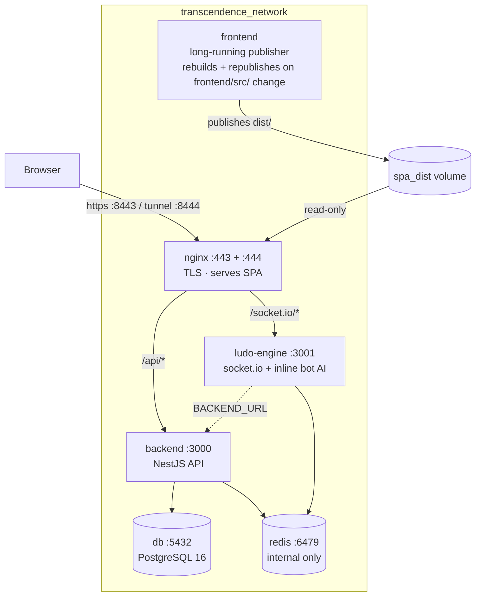

# Architecture

**Project:** ft_transcendence — RETRO LUDO '42
**Updated:** 2026-10-02

An eight-service Docker Compose stack: a React 19 SPA built, published, and
watched for source changes by a long-running `frontend` job, served over TLS by
nginx, a NestJS REST API, a standalone real-time game engine (with an inline bot
AI), PostgreSQL, Redis, and a Prisma Studio DB browser. A separate `frontend-dev`
Vite HMR service is available for development only.


---
---


## Topology



> **Note:** Auth endpoints use `@Controller('api/auth')`, so they are proxied
> through nginx like all other API routes. There is no direct browser→backend
> path for auth.


---
---


## Services

External access URLs live in the [README](../README.md) **Access** section; the full
container / port / role breakdown is in the [Containers, images & volumes](#containers--images--volumes)
section below. This file keeps the deeper service notes:

Images are built from `Dockerfile`s in each service directory. `db` and `redis` wrap
their official images with an init script that reads secrets before `exec`ing the
real process (`backend/app/postgres_16_db/`, `backend/app/redis/`).

> **Note:** The bot AI runs inside the `ludo-engine` process (`backend/app/ludo-engine/src/bot.ts`),
> not in a container of its own. Bot seats need no token: the backend writes them into the `match:*`
> hash as `bot-<color>`, and the engine auto-fills those slots from that hash once a human joins.
> The seat keeps `bot-<color>` as its identity (`username`), and the name the lobby gave it is the
> shown label (`displayName`). That label travels end to end: the lobby's `botNames` in
> `POST /api/match/create` → `player{n}_displayName` in the hash → the engine seat's `displayName` →
> the client, which translates only the colour word. Detail:
> [backend-match-module.md](backend/backend-match-module.md),
> [ludo-engine-socket-system.md](ludo-engine/ludo-engine-socket-system.md),
> [frontend-i18n-utilities-system.md](frontend/frontend-i18n-utilities-system.md).


---
---


## Containers, images & volumes

Everything is defined in the root `compose.yaml`. Image names are `<project>-<service>`,
where `<project>` is the **compose project name** — by default the clone directory's
name, lower-cased and stripped of characters Docker doesn't allow. It is *not* fixed
in the repo (`compose.yaml` sets no `name:` and `COMPOSE_PROJECT_NAME` is unset), so
it differs per machine/checkout: a clone at `Team-submission-10Sep` builds
`team-submission-10sep-backend`, `team-submission-10sep-nginx`, etc. Every container
attaches to the `transcendence_network` bridge and reaches the others by service name.

### Containers

| Container | Image (base) | What runs inside | Host port → container port | Depends on |
|---|---|---|---|---|
| `db` | `…-db` (postgres:16-alpine) | `postgres_16_db-init.sh` validates `POSTGRES_PASSWORD`, then `exec`s the official postgres entrypoint → **PostgreSQL 16** | `127.0.0.1:5432 → 5432` | — |
| `redis` | `…-redis` (redis:7-alpine) | `redis-init.sh` writes `/tmp/redis.conf` (port 6479, AOF persistence, 256 MB LRU, `notify-keyspace-events Ex`) then `exec redis-server … --requirepass` → **Redis 7** | `127.0.0.1:6479 → 6479` | — |
| `backend` | `…-backend` (node:22-alpine) | `docker-entrypoint.sh` validates env → `prisma db push` (no `--accept-data-loss`) → `node dist/main.js` (**NestJS API** on 3000) | `127.0.0.1:3000 → 3000` | db (healthy), redis (healthy) |
| `studio` | `…-studio` (reuses the backend image) | `npx prisma studio --port 5555 --browser none` — **Prisma DB browser** over the `db` service (skips the backend entrypoint to avoid a `prisma db push` race condition) | `127.0.0.1:5555 → 5555` | db (healthy) |
| `ludo-engine` | `…-ludo-engine` (node:22-alpine) | `node dist/index.js` — **Socket.IO game engine + inline bot AI** on 3001 (clients reach it same-origin via nginx; the host port exists for local `npm run dev`) | `127.0.0.1:3001 → 3001` | redis (healthy) |
| `frontend` | `…-frontend` (node:22-alpine) | `publish.sh` — builds the **React SPA**, publishes it into the `spa_dist` volume, then watches the bind-mounted `./frontend/src` (`/app/src` in the container) and `package.json` and republishes on change (long-running build job) | — | — |
| `frontend-dev` *(profile: dev)* | `…-frontend-dev` (node:22-alpine, `Dockerfile.dev`) | `npm run dev` — **Vite dev server with HMR**, serves source from the bind mount | `8080 → 8080` | backend, ludo-engine |
| `nginx` | `…-nginx` (debian + nginx-extras) | `nginx.sh` waits for the backend health check, then `exec nginx -g "daemon off;"` — **TLS reverse proxy**: serves the SPA and proxies `/api/*` + `/socket.io/*`. Two listeners share one server body (`conf/app.inc`): `:443` for direct clients, `:444` for the ngrok tunnel (loopback-published, resolves the real client IP) | `8443 → 443`, `127.0.0.1:8444 → 444` | frontend (healthy), backend, ludo-engine |

### Volumes

| Volume | Mounted into | Purpose |
|---|---|---|
| `db_data` | `db → /var/lib/postgresql/data` | PostgreSQL data directory — survives container recreates |
| `redis_data` | `redis → /data` | Redis persistence (AOF + RDB snapshots) |
| `spa_dist` | `frontend → /export` (write), `nginx → /usr/share/nginx/html:ro` (read) | The SPA build handoff: `frontend` builds into it, `nginx` serves it read-only |

The compose file also uses **bind mounts** (host paths, not volumes): `./frontend → /app`
on `frontend` / `frontend-dev` so Vite watches live source, and
`./nginx/conf/nginx.conf → /etc/nginx/nginx.conf` and
`./nginx/conf/app.inc → /etc/nginx/app.inc:ro` (the shared server body) so nginx
config can be edited without a rebuild.

### Network

`transcendence_network` (bridge) — all containers attach to it; `db`, `redis`,
`backend`, `ludo-engine`, and `nginx` resolve each other by service name.


---
---


## The SPA build handoff

The frontend is **not** a server. It is a **long-running build-and-watch job**
(`frontend/publish.sh`):

1. On every boot it runs `npm install` (keeping the anonymous-volume `node_modules`
   in sync with the current lockfile), builds the SPA, and publishes the output
   into `/export` — the `spa_dist` named volume.
2. The build itself runs outside the bind mount (`BUILD_OUT_DIR=/tmp/dist-out`,
   `BUILD_PUBLIC_DIR=/tmp/public-safe`), because a Docker Desktop for macOS
   VirtioFS bug intermittently fails reads under `/app` (ENOLCK "Unknown system
   error -35"); each step is retried a few times before giving up. The failure is
   specific to the zero-copy syscall used by `fs.copyFileSync`, `cp` and `tar` —
   plain `read()`/`write()` (`cat`, `dd`) is unaffected. Both env vars are
   optional: unset, they fall back to the in-project `public/` and `dist/`, which
   is what local/host builds use.
3. It then watches `/app/src` and `/app/package.json` with `inotifywait` — `/app`
   is the bind mount of the repo's `./frontend`, so this is the SPA's own
   `frontend/src` (unrelated to `backend/src`) — and republishes on every
   change. The container never exits.
4. `nginx` mounts `spa_dist` read-only at `/usr/share/nginx/html`.

`nginx` gates on `depends_on: frontend: condition: service_healthy` — the health
check is `test -f /export/index.html` (retries 20 over ~30s) — so it cannot start
against an empty document root on first boot.

> A failed rebuild does **not** take the site down: `publish.sh` explicitly checks
> the build result and, on failure, keeps the last good build in `/export` rather
> than wiping it. The log line `📦 SPA published to spa_dist` is the success
> marker; a `❌ Build failed` line means the last good build in `/export` is still
> being served — fix the error and save again.

The nginx config is **bind-mounted** from `nginx/conf/nginx.conf` and
`nginx/conf/app.inc` (the shared server body), so config edits need only a
container restart, not an image rebuild. The `Dockerfile` also `COPY`s both as a
fallback so the image stays runnable standalone.


---
---


## Request paths

**Static / SPA** — `https://localhost:8443/*` → nginx → `try_files $uri $uri/ /index.html`,
so client-side routing works on deep links. `frontend/src/router.tsx` is a custom
`window.location` router, not React Router.

**API** — `https://localhost:8443/api/*` → `proxy_pass http://backend:3000`. The `/api`
prefix is *preserved*, so controllers must include it themselves. There is no global
prefix in `backend/src/main.ts`; each controller includes `api/` in its own decorator.

**Auth** — `@Controller('api/auth')` includes the `api/` prefix, so `/api/auth/*`
is proxied through nginx to backend:3000. OAuth callbacks are **browser-facing**:
each provider is registered with a callback URL like
`https://localhost:8443/api/auth/github/callback` (the ngrok variants use the
`*.ngrok-free.dev` origin), so the provider redirects the *browser* back through
nginx, which proxies to backend:3000. The matching callback/strategy set is
selected per request from the `Host` header (`isTunnelRequest` in
`backend/src/secrets.ts`) — see [`deploy/tunnel.md`](./deploy/tunnel.md).

**Game realtime** — the SPA connects to `socket.io` on its **own origin**: nginx
(and the Vite dev proxy) forwards `/socket.io/` to `ludo-engine:3001`
(`frontend/src/socket.ts` → `connectSocket`). The browser never needs to know the
engine's real hostname or port. The inline bot AI connects internally inside the
engine process.


---
---


## Connection liveness (two-direction heartbeats)

Long-lived state is verified by **two independent heartbeats, one in each direction**. They are
deliberately named apart, and neither substitutes for the other.

| Direction | Constant | Where it is defined | Why it exists |
| --- | --- | --- | --- |
| **client → server** | `PRESENCE_HEARTBEAT_MS` (`sendPresenceHeartbeat()`) | `frontend/src/store.tsx` → `POST /api/presence/heartbeat` every 20 s while signed in (`DELETE` on logout) | Liveness of the **client**: proves the browser is still there. The server keeps a per-user Redis key with a 45 s TTL, so a crashed tab or a dropped network expires on its own and friends' presence dots correct themselves. |
| **server → client** | `SSE_HEARTBEAT_MS` | `backend/src/notification/notification.controller.ts` → a `ping` frame written into the `/api/notifications/stream` SSE response every 20 s | Liveness of the **connection**: the SSE response otherwise sends no bytes for minutes, and ngrok's HTTP/2 edge resets an idle stream (`net::ERR_HTTP2_PROTOCOL_ERROR`). The periodic frame satisfies the tunnel's socket requirements, so the stream is never treated as dead. |

**Why both are needed**

- The presence heartbeat is an ordinary **request/response on its own connection**. It contains no
  application meaning for the notification stream and writes nothing into it, so it cannot keep that
  stream alive.
- The SSE keep-alive is **server-pushed** and has no application meaning for presence; the server
  learns nothing about the client from it.

In short: the client → server beat answers *"is the user still connected?"*, while the
server → client beat answers *"is our connection to them still usable?"* — the second exists
specifically because the ngrok tunnel will not tolerate an idle socket. Because SSE has no replay,
keeping the stream up is also what stops live events (for example `avatar_changed`) from being lost
during a drop.

**The SSE stream must not be re-created for unrelated state changes.** On the client,
`useNotifications` opens the stream in a `useEffect` whose dependency array contains the
**user id**, not the whole `user` object. After a successful avatar upload or reset,
`Profile.tsx` calls `setUser({ ...user, hasAvatarPhoto })`, which creates a new `user`
object. If the effect depended on that object, React would close the stream and open a new
one. Any notification published while the stream is closed (for example the
`profile_updated` toast) is not delivered, so the toast would appear only some of the
time. Depending on the user id avoids this, because the id does not change.

### Client polling cadence

The client's periodic requests use named constants, so an interval can be tuned in one place.

| Constant | File | Value | What it polls |
| --- | --- | --- | --- |
| `ROOM_POLL_MS` | `frontend/src/pages/LudoLobby.tsx` | 5000 ms | the open-room list and the "am I already seated?" check (`GET /api/games/rooms`, `GET /api/games/mine`) |
| `ACTIVE_GAME_POLL_MS` | `frontend/src/components/RetroNavbar.tsx` | 10000 ms | the rejoin banner (`GET /api/games/mine`) |
| `PRESENCE_HEARTBEAT_MS` | `frontend/src/store.tsx` | 20000 ms | the presence heartbeat (`POST /api/presence/heartbeat`) |

Both room endpoints walk the Redis `match:*` keyspace, so the interval is what bounds the request
rate. At these values a user on the lobby page sends about 30 requests/min (24 for the room list and
its own check, 6 for the rejoin banner). Two players sharing an IP therefore sit at about 60/min,
well under the global limit of 300 requests/min per IP. A new room or a rejoin banner appears within
a few seconds.

Measured with two tabs on the lobby page: 61 Redis `SCAN`s/min = 60 poll requests (30 per user) plus
the engine's idle sweep, i.e. 6.8 Redis ops/s and 0.003% of one CPU core, with no throttled request.


---
---


## Data layer

### PostgreSQL

Prisma-managed, schema at `backend/prisma/schema.prisma`.

**Models:** `User` (account + per-user stats, avatar, counters), `Account` (OAuth provider links), `Achievement` (13 achievement flags), `Game`, `GameParticipant`, `Friendship`, `Notification`
**Enums:** `FriendshipStatus`, `PlayerColor`, `GameStatus`, `GameType`

Schema is applied with `npx prisma db push` (**no** `--accept-data-loss`) from
`backend/docker-entrypoint.sh` on every boot — the runtime deliberately uses **db
push, not `migrate deploy`**, so schema state is driven by `schema.prisma` (the
single source of truth — never hand-edit the database). No `migrations/` history is
kept — the schema is pushed straight from `schema.prisma` on every boot. Without the
flag, drift that would drop or narrow a column makes the push fail and the container
refuse to boot instead of discarding data unattended; a fresh database and additive
changes still apply.

`DATABASE_URL` comes from the root `.env` via compose's `env_file:`; on the
backend container compose's `environment:` override swaps in `CONTAINER_DATABASE_URL`
(`@db:5432`, service host) before the app boots. The plain `.env` `DATABASE_URL`
holds the host-side URL (`@localhost:5432`) for running scripts outside Docker. The
two are not interchangeable — see `backend/prisma.config.ts`.

### Redis

Several distinct uses:

- **Leaderboard cache** — `LeaderboardRedisService`, sorted sets keyed `leaderboard:{mode}`, backfilled from PostgreSQL when the set is empty (a Redis outage is surfaced as an error, not masked).
- **Live game state** — `MatchService` (matchmaking and match lifecycle) and the engine's `RedisGameStore`.
- **Presence** — heartbeat keys per user for online/offline/playing status (`PresenceService`). The heartbeat itself is the **client → server** direction; see [Connection liveness](#connection-liveness-two-direction-heartbeats).
- **Notifications** — Redis Pub/Sub channels (`notify:<userId>`) bridge persisted notifications to the SSE stream (`NotificationService`).
- **Avatar metadata cache** — `AvatarMetaService`, hash `avatar:<userId>` = `{ has, style, v }`. Written by the user/auth services only **after** the Postgres write succeeds, and read by the ludo-engine at seat join, since the engine has no database access of its own. The profile reads (`/me`, public profile) rewrite it from Postgres, so a missed write or an eviction converges on the next read. A missing entry means "no photo", so no client requests one. See [avatar-system.md](./avatar-system.md).
- **Auth state** — `refresh:<tokenHash>` (refresh token → user, 7-day TTL) with the `sessions:<userId>` set that revoke-all walks, plus the single-use `verify:<tokenHash>`, `reset:<tokenHash>` and `2fa:<pendingTokenHash>` challenge keys, and the staged email-change pair `emailchange:<tokenHash>` / `emailchange:user:<userId>` (`SessionService`, `TwoFactorService`). The reverse pointer's TTL is the change deadline: its Redis key-expiry event is what `MailService` subscribes to in order to email the old address when a staged change lapses.

Redis runs on the internal port **6479** with `requirepass` sourced from the
`REDIS_PASSWORD` env var (written into `/tmp/redis.conf` by `redis-init.sh`).
Every backend service that opens a Redis connection authenticates it with
`secret('REDIS_PASSWORD')` — leaderboard, presence, auth (session, two-factor and
the email-change expiry subscription),
friends, match (creator, player, query, postgame), notification, and the avatar
metadata cache. The engine is a separate process, so its `RedisGameStore` and
`RedisBroadcaster` read `process.env.REDIS_PASSWORD` directly instead.


---
---


## Backend modules

`backend/src/app.module.ts` composes **nine** feature modules:

| Module | Route prefix | Responsibility |
|---|---|---|
| `AuthModule` | `/api/auth` | Local + Google/GitHub/42 OAuth, 2FA, email verification, password reset, refresh tokens |
| `UserModule` | `/api/user` | Profile, avatar, game history |
| `FriendsModule` | `/api/friends` | Requests, accept/decline, block |
| `LeaderboardModule` | `/api/leaderboard` | Rankings, Redis sorted sets (Postgres backfill when the set is empty; a Redis outage surfaces as an error) |
| `AchievementsModule` | `/api/achievements` | 13 Ludo achievements |
| `StatsModule` | `/api/stats` | Per-player aggregates |
| `MatchModule` | `/api/match`, `/api/game` | Matchmaking (PvP/PvE/hotseat), game lifecycle |
| `PresenceModule` | `/api/presence` | Online/offline/playing presence tracking |
| `NotificationModule` | `/api/notifications` | Persisted notifications + SSE stream (Redis pub/sub) |

### Auth flow

1. `GET /api/auth/{google,github,42}` → passport guard redirects to the provider.
2. Provider redirects the browser to the callback URL from `.env`
   (`{GOOGLE,GITHUB,FORTYTWO}_CALLBACK_URL` / `NGROK_*` variants), read at boot by
   the matching Passport strategy via `requireSecret()`.
3. The strategy finds or creates the `User` and `Account` rows, then `AuthService` validates the user.
4. If the user has 2FA enabled, an email code is sent and the browser is redirected to `{frontend-url}/2fa?token={pendingToken}`, using the origin the request arrived on.
5. If 2FA is disabled, a session is issued: a short-lived access token (15 min) and a long-lived refresh token (7 days) are set as `httpOnly`, `sameSite: lax` cookies named `token` and `refresh_token`.
6. Browser is redirected to `{frontend-url}/home` (`https://localhost:8443/home` locally).
7. `JwtStrategy` reads the access token from `req.cookies` — `cookieParser()` in `main.ts` is required for this.
8. When the access token expires, the SPA calls `POST /api/auth/refresh` with the `refresh_token` cookie to silently rotate the session.


---
---


## Security & Threat Model

The wider set of hardening measures, layer by layer from the network edge inward, is in
[`security_measures.md`](security_measures.md). This section covers the one channel where a client
acts on live game state directly, so it is treated as a boundary rather than as a trusted caller. The
boundary rests on three properties:

- **The engine is only reachable same-origin.** `ludo-engine` publishes `127.0.0.1:3001` only, and the browser connects to `/socket.io/` on its own origin, which nginx proxies: a loopback connection on its own is never enough to reach a game.
- **Every socket is authenticated by a match token, and the token, not the client, names the room and the seat.** The backend mints that token only for a seat the caller still owns, in a game the engine has neither started nor finalized.
- **The handshake is bounded before it is authenticated.** The engine answers only the origins on its `CORS_ORIGIN` allow-list (`FRONTEND_URL` + `NGROK_FRONTEND_URL`) and refuses to boot when that list is empty instead of falling back to `origin: '*'`; events are capped at 100 KB, the engine pings every 10 s and closes a socket that takes more than 15 s to answer, and a socket that drains its 20-events-per-5 s bucket is closed.

The table below lists the holes found in the first version of this boundary, why each one mattered, and the rule that now closes it. The engine-side rules are described in [`ludo-engine/ludo-engine-socket-system.md`](ludo-engine/ludo-engine-socket-system.md) (handshake, `join_game`, `disconnect`), the minting and seat gates in [`backend/backend-match-module.md`](backend/backend-match-module.md), and the rejoin row the UI derives from `mySeat` in [`frontend/frontend-lobby-module.md`](frontend/frontend-lobby-module.md).

| # | Hole (before) | Why it mattered | Fix (now) | Code |
|---|---|---|---|---|
| 1 | The engine verified handshake tokens against the session `JWT_SECRET`, with no audience or token-type check | Any session access token, or a token minted by any service sharing that key, was also a valid game token, so one leaked key forged both session and seat credentials | The engine has its own `ENGINE_JWT_SECRET`: a token must carry `aud: 'ludo-engine'`, be `HS256`, have a signature that compares in constant time and a live `exp`, and the boot preflight refuses to start without the key | `backend/src/match/engine-token.util.ts`, `backend/app/ludo-engine/src/socket/auth.ts`, `backend/docker-entrypoint.sh`, `Makefile` |
| 2 | `join_game` took the room from the client whenever the socket had no `gameId` of its own, and nothing ever cleared that binding | The room a socket acted in was not necessarily the room named by its token, and a refused socket stayed bound to the room it already had | The token's match id is kept as `tokenGameId`, is the authoritative id for `join_game`, and `detachSocket()` never clears it, so a refusal cannot re-point a socket at another game | `backend/app/ludo-engine/src/socket/server.ts`, `socket/join-manager.ts` |
| 3 | A refused join returned without leaving the room or clearing `socket.data.gameId` / `playerColor` | The refused socket received every broadcast of a game it was not in, and its close ran `handleDisconnect`, which marked that seat disconnected and opened the 45 s grace window for a player who was online | `detachSocket()` leaves the room and clears both fields before the refusal is emitted, so the refused socket's later close is a no-op | `backend/app/ludo-engine/src/socket/join-manager.ts`, `socket/socket-handlers.ts` |
| 4 | The in-progress guard refused every non-reconnecting join | A seat the engine still held as `active` or `disconnected` (for example right after an abrupt close, before the grace bookkeeping ran) could not be resumed by its own owner | The guard also accepts a join whose token seat is resumable (`active` / `disconnected`); only a seat the engine finalized (`exited`) or never seated is refused, and that one gets `seat_expired` | `backend/app/ludo-engine/src/socket/join-manager.ts` |
| 5 | Nothing unbound an older socket holding the same room + colour | A duplicate tab could keep its binding, and its close marked the seat disconnected while the newer socket was live | An accepted join calls `evictSeatSiblings()`, which detaches any other socket bound to that room + colour, without opening a grace window | `backend/app/ludo-engine/src/socket/join-manager.ts` |
| 6 | `POST /api/match/create` reused any `WAITING`/`ACTIVE` room the caller was seated in and then wrote that hash again (`status`, `createdAt`, `inviteCode`) | A started game could be rewritten to `WAITING` and re-advertised as a lobby, and a seat the engine had already taken away could be handed back | `findReusableRoom()` reuses a room only when it is `WAITING` PvP, its engine game has not started and the caller's seat is not finalized; `handoffExistingRoom()` writes nothing to the hash; every other create gets a fresh `gameId` | `backend/src/match/match.creator.service.ts` |
| 7 | `isSeatFinalized()` was consulted only when the hash said `ACTIVE` | A seat the engine had already pruned (`exited`) under any other hash status could still pass `POST /api/game/:id/rejoin` from a cached tab or a crafted request, which also bypassed the `GET /api/games/mine` filter | The check runs on the caller's seat whatever the hash status says | `backend/src/match/match.player.service.ts`, `backend/src/match/seat-finalization.ts` |
| 8 | Joins checked only the `match:*` hash | The hash can lag behind the engine, so a room whose game had started could still read `WAITING` and take a new seat | `isEngineGameStarted()` reads the engine's own state and is checked in `joinMatch()` and in the room list | `backend/src/match/seat-finalization.ts`, `backend/src/match/match.player.service.ts` |
| 9 | `GET /api/games/rooms` returned one list to all callers and included only `WAITING` rooms | A seated player whose game had started had no rejoin row, and a row only its own holder could reclaim was indistinguishable from a joinable one | The list is computed per caller: rows carry `mySeat`, and an `ACTIVE` room is returned only to a viewer who still holds a reclaimable seat in it | `backend/src/match/match.query.service.ts`, `backend/src/match/match.controller.ts`, `frontend/src/pages/LudoLobby.tsx` |
| 10 | Three `jwt.sign` calls across the match services minted engine tokens with the session `JWT_SECRET` borrowed from `AuthModule`, each overriding only `expiresIn` | With no single mint site, the secret, audience and lifetime rules could drift apart: none of the three carried an audience, so each call had to state every other rule itself | `signEngineToken()` is the single mint site, applying the engine secret, the audience and the 24 h lifetime | `backend/src/match/engine-token.util.ts` |
| 11 | `new Server()` took the Socket.IO CORS default, `origin: '*'`, and nothing bounded a connected socket's input | A socket handshake is the one engine request a browser makes on its own, so any site could open one; and a connected client could send events up to the 1 MB default buffer as fast as it liked | The engine passes an allow-list parsed from `CORS_ORIGIN` and exits when it is empty; it also caps events at 100 KB, sets an explicit 10 s/15 s ping, and closes a socket that drains its 20-events-per-5 s bucket | `backend/app/ludo-engine/src/socket/server.ts`, `socket/allowed-origins.ts`, `socket/event-rate-limiter.ts`, `compose.yaml` |
| 12 | The `X-Engine-Key` header was compared with `!==`, and the engine fell back to `'dev-engine-key'` when `ENGINE_API_KEY` was unset | The comparison result leaked through timing, and a misconfigured deployment would accept one known key from anyone | `verifySecret()` hashes both sides and compares with `timingSafeEqual`; the fallback is gone, and the backend preflight and the engine boot both refuse to start without the variable | `backend/src/secrets.ts`, `backend/src/match/match.controller.ts`, `backend/app/ludo-engine/src/socket/result-submitter.ts`, `backend/docker-entrypoint.sh` |

### Invariants to check

- A session access token is bound to the API: it carries `iss: 'ft_transcendence'`, `aud: 'ft_transcendence-api'`, `HS256` and a string `sub`. An engine token (`aud: 'ludo-engine'`) or an oauth-link token (`aud: 'oauth-link'`) lacks that audience, so it never opens a `JwtAuthGuard` route; detail in [`backend/backend-auth-module.md`](backend/backend-auth-module.md) (Token scope).
- A match token is signed with `ENGINE_JWT_SECRET`, carries `aud: 'ludo-engine'`, uses `HS256` and has a 24 h `exp`; the engine rejects anything else, including a session access token, which has neither the audience nor the signature.
- `join_game` binds the socket to the room and colour named by the token (`tokenGameId`, `tokenColor`); the client's arguments are fallbacks only.
- A socket holds a room and seat binding only while its join is accepted: a refusal or a takeover clears `socket.data.gameId` and `playerColor` (`detachSocket()`), so its later `disconnect` cannot disturb a live seat.
- The backend mints a token only when the caller's seat is not `exited` in the engine state and the engine has not started the game; the `match:*` hash is never trusted on its own.
- `POST /api/match/create` never rewrites an existing room hash: a reusable lobby is handed back unchanged.
- A socket is bounded before it is authenticated: only origins on the `CORS_ORIGIN` allow-list complete a handshake, events are capped at 100 KB, and a socket that drains its 20-events-per-5 s bucket is closed and follows the ordinary disconnect path.
- The engine's CORS allow-list is never empty at runtime: `parseAllowedOrigins('')` returns `[]`, and `start()` exits on `[]` rather than widening to `*`.
- `POST /api/game/end` and `POST /api/game/:id/started` compare `X-Engine-Key` with `verifySecret()` (both sides SHA-256-hashed, then `timingSafeEqual`), and the key has no default on either side.
- `GET /api/games/rooms` is caller-scoped: a started room is visible only to the holder of a reclaimable seat in it (`mySeat`).
- The engine's state readers fail open (a missing or unreadable `game:<gameId>` returns `false`), so a bad read hides no legitimate seat and locks no legitimate room.

> The engine-side rules and the token lifecycle are detailed in [`ludo-engine/ludo-engine-socket-system.md`](ludo-engine/ludo-engine-socket-system.md); the seat gates that decide whether a match token is issued at all are in [`backend/backend-match-module.md`](backend/backend-match-module.md).


---
---


## Configuration (.env)

See the [README](../README.md) **Configuration (.env)** section for the `.env` layout,
the `make env` pipeline, and the OAuth setup. This file keeps the implementation notes:

All configuration is stored in the root `.env` (one `KEY=VALUE` per line). Containers load
it via compose's `env_file:`; host-side scripts load it through dotenv. `backend/src/secrets.ts`
is a single lookup point over `process.env`: `secret(name)` returns `undefined` when unset,
`requireSecret(name)` throws at boot on a missing value. The remaining `${...}` in
`compose.yaml` are non-secret topology values and all carry defaults.

Two host ports are hardcoded in `compose.yaml` rather than read from `.env`:
`8443 → 443` for nginx's direct TLS listener (published on every interface) and
`127.0.0.1:8444 → 444` for the ngrok tunnel listener (published loopback-only).
`HTTPS_PORT` and `NGROK_PORT` in `.env` mirror those two values for host-side
scripts and printed URLs (`make all`, `make lan`, `make tunnel`), so editing them
in `.env` does not move either publish. Neither publish is conditional on a
compose profile, so `8444` is open in every mode, with or without a tunnel, and
the stack fails to start if either port is already in use on the host.


---
---


## Dev vs. production paths

See the [README](../README.md) **Development mode** section for the two modes and
their URLs/ports. This file keeps the implementation note:

`frontend-dev` bind-mounts `./frontend:/app` with an anonymous volume over
`/app/node_modules` so the image's dependencies aren't shadowed by the host. Vite uses
`usePolling` when containerised — Docker Desktop on macOS does not deliver inotify
events through bind mounts, and HMR silently never fires without it.

`make dev` still brings up nginx, so the production path stays verifiable while you
iterate against HMR.


---
---


## Make targets

See the [README](../README.md) **Commands** section for the full list of make targets.


---
---


## Directory Layout

```
.
├── compose.yaml                  # Docker Compose — all 8 services
├── Makefile                      # Build / run / dev / tunnel / LAN targets
├── .env.example                  # Config template (`make env` validates) — real .env is gitignored
├── .gitignore                    # Ignored paths (node_modules, dist, generated, .env, lockfiles, planning docs)
├── LICENSE                       # GPL-3.0
├── README.md                     # Project overview, setup, module list, docs index
│
├── backend/                      # NestJS REST API (port 3000)
│   ├── Dockerfile
│   ├── .dockerignore
│   ├── docker-entrypoint.sh      # Prisma push + app start
│   ├── package.json
│   ├── tsconfig.json
│   ├── nest-cli.json
│   ├── prisma.config.ts
│   │
│   ├── src/                      # NestJS API source (9 feature modules wired into app.module.ts)
│   │   ├── app.module.ts         # Root module (9 feature modules + throttler)
│   │   ├── main.ts               # Bootstrap, cookie-parser, trust proxy, /health, validation codes
│   │   ├── prisma.service.ts     # Prisma client singleton
│   │   ├── secrets.ts            # env-var secret lookup over process.env
│   │   │
│   │   ├── common/               # Shared backend helpers (no Nest module)
│   │   │   ├── scoring.ts         # ratingDeltaFor() — piece-based rating change
│   │   │   └── botname-enforce.ts # isBotUserId() / BOT_PREFIX / isReservedBotName()
│   │   │
│   │   ├── i18n/                 # Backend email localization (consumed by auth/mail.service.ts)
│   │   │   └── email-messages.ts  # EmailLang/EmailStrings, en/fr/ms sets, emailStrings() + fill()
│   │   │
│   │   ├── avatar/               # Avatar metadata + upload signature check (imported by auth and user)
│   │   │   ├── avatar-meta.module.ts    # Provides/exports AvatarMetaService
│   │   │   ├── avatar-meta.service.ts   # Redis cache `avatar:<userId>` = { has, style, v }
│   │   │   └── image-signature.util.ts  # Magic-byte validation of uploaded images
│   │   │
│   │   ├── auth/                 # JWT + OAuth (Google, GitHub, 42) + 2FA + mail
│   │   │   ├── auth.controller.ts    # register, login, logout, me, profile/password, 2FA, OAuth
│   │   │   ├── auth.service.ts       # Token signing, password hashing, account flows
│   │   │   ├── auth.module.ts        # JWT config (15-min access) + local & ngrok OAuth strategies
│   │   │   ├── auth.constants.ts     # Auth tunables (token TTLs, resend limits)
│   │   │   ├── login-lockout.service.ts # Per-account failed-login counters (Redis)
│   │   │   ├── twofactor.service.ts  # Email one-time-code 2FA (idempotent)
│   │   │   ├── session.service.ts    # Refresh-token sessions in Redis (mint/rotate/revoke)
│   │   │   ├── mail.service.ts       # SMTP mailer (nodemailer), localized copy
│   │   │   ├── jwt.strategy.ts       # Reads token from httpOnly cookie
│   │   │   ├── jwt-auth.guard.ts     # Route guard
│   │   │   ├── jwt-payload.ts        # JWT payload type definitions
│   │   │   ├── google.strategy.ts    # Google OAuth
│   │   │   ├── github.strategy.ts    # GitHub OAuth
│   │   │   ├── fortytwo.strategy.ts  # 42 (intra) OAuth
│   │   │   ├── ngrok_google_strategy.ts / ngrok_github_strategy.ts / ngrok_fortytwo_strategy.ts  # tunnel-mode OAuth
│   │   │   ├── oauth.guards.ts       # OAuth route guards (per-Host strategy pick)
│   │   │   └── dto/                  # Request DTOs + shared password policy
│   │   │       ├── login.dto.ts               # username-or-email + password
│   │   │       ├── register.dto.ts            # signup fields (incl. language)
│   │   │       ├── twofactor.dto.ts           # 2FA verify payload
│   │   │       ├── two-factor-setting.dto.ts  # enable/disable 2FA
│   │   │       ├── password.rules.ts          # shared password policy
│   │   │       ├── change-password.dto.ts     # logged-in password change
│   │   │       ├── forgot-password.dto.ts     # reset-link request
│   │   │       ├── reset-password.dto.ts      # reset token + new password
│   │   │       ├── verify-email.dto.ts        # verify-link token (body, never the URL)
│   │   │       ├── resend-verification.dto.ts # resend the signup link
│   │   │       ├── update-profile.dto.ts      # optional profile fields (incl. language)
│   │   │       └── delete-account.dto.ts      # account-deletion confirmation
│   │   │
│   │   ├── user/                 # User profiles & game history
│   │   │   ├── user.controller.ts    # public profile/history + avatar upload/get/delete
│   │   │   ├── user.service.ts       # profile + avatar logic, game history
│   │   │   └── user.module.ts
│   │   ├── friends/              # Friend system (requests, accept/decline, block, invites)
│   │   │   ├── friends.controller.ts # friend + game-invite routes
│   │   │   ├── friends.service.ts    # friendship rules + online enrichment
│   │   │   ├── friendship-pair.ts    # pure pair predicates shared with match + presence
│   │   │   └── friends.module.ts
│   │   ├── match/                # Matchmaking & game lifecycle (split services)
│   │   │   ├── match.controller.ts        # match/game HTTP routes
│   │   │   ├── match.service.ts           # facade over the four match sub-services
│   │   │   ├── match.creator.service.ts   # create/join/rejoin payloads
│   │   │   ├── match.player.service.ts    # join/rejoin/invite/ready/exit actions
│   │   │   ├── match.query.service.ts     # read-only open-rooms / my-rooms queries
│   │   │   ├── match.postgame.service.ts  # POST /api/game/end handling
│   │   │   ├── seat-finalization.ts       # terminal-seat lookup from engine state
│   │   │   ├── engine-token.util.ts       # signEngineToken() — engine secret, aud, 24 h TTL
│   │   │   ├── dto/invite-friend.dto.ts   # required-UUID body for the game-invite route
│   │   │   └── match.module.ts
│   │   ├── leaderboard/          # Rankings (Redis sorted sets, Postgres backfill when empty)
│   │   │   ├── leaderboard.controller.ts     # GET /api/leaderboard
│   │   │   ├── leaderboard.service.ts        # ranking logic + response envelope
│   │   │   ├── leaderboard-redis.service.ts  # Redis sorted-set storage (one set per mode)
│   │   │   └── leaderboard.module.ts
│   │   ├── achievements/         # 13 Ludo achievements
│   │   │   ├── achievements.controller.ts  # progress report + check route
│   │   │   ├── achievements.service.ts     # evaluation logic
│   │   │   ├── achievements.registry.ts    # authoritative list of the 13 achievements
│   │   │   └── achievements.module.ts
│   │   ├── player-stats/         # Per-player aggregates
│   │   │   ├── stats.controller.ts  # GET /api/stats
│   │   │   ├── stats.service.ts     # aggregate stats card
│   │   │   └── stats.module.ts
│   │   ├── presence/             # Online/offline/playing tracking
│   │   │   ├── presence.controller.ts    # heartbeat + online-count routes
│   │   │   ├── presence.service.ts       # per-user presence keys with TTL
│   │   │   ├── presence.module.ts
│   │   │   └── dto/heartbeat.dto.ts      # in-match flag on the heartbeat
│   │   └── notification/         # Notifications (SSE + Redis pub/sub)
│   │       ├── notification.controller.ts  # SSE stream + list/read/read-all
│   │       ├── notification.service.ts     # persist + publish notifications
│   │       └── notification.module.ts
│   │
│   ├── app/
│   │   ├── ludo-engine/          # Standalone game engine (port 3001)
│   │   │   ├── Dockerfile
│   │   │   ├── .dockerignore
│   │   │   ├── package.json
│   │   │   ├── tsconfig.json
│   │   │   └── src/
│   │   │       ├── index.ts              # Entry point → SocketServer.start(3001)
│   │   │       ├── engine.ts             # Game state machine (roll, move, win)
│   │   │       ├── move-validator.ts     # Legal move computation, captures, win check
│   │   │       ├── turn.ts               # Move outcome: mirrors, win check, turn advance
│   │   │       ├── board-mapper.ts       # Board geometry (safe zones, tracks)
│   │   │       ├── bot.ts                # Heuristic bot AI
│   │   │       ├── player-handler.ts     # Disconnect/reconnect/exit/ready
│   │   │       ├── lobby.ts              # Lobby management (color selection)
│   │   │       ├── redis.ts              # RedisGameStore (persistence)
│   │   │       ├── types.ts              # GameState, PlayerColor, events
│   │   │       └── socket/
│   │   │           ├── server.ts             # SocketServer, event routing
│   │   │           ├── allowed-origins.ts    # CORS_ORIGIN allow-list parser
│   │   │           ├── event-rate-limiter.ts # Per-socket inbound event token bucket
│   │   │           ├── socket-handlers.ts    # join_game, roll_dice, move_piece, …
│   │   │           ├── join-manager.ts       # Seat assignment, bot seeding (identity + label)
│   │   │           ├── bot-scheduler.ts      # One timer per game for bot turns
│   │   │           ├── post-game.ts          # End-of-game flow → result-submitter
│   │   │           ├── auth.ts               # JWT middleware, GameSocket type
│   │   │           ├── event-publisher.ts    # Redis pub/sub → Socket.IO bridge
│   │   │           ├── redis-broadcaster.ts  # Room-based state broadcasts
│   │   │           └── result-submitter.ts   # POST /api/game/end to backend
│   │   │
│   │   ├── postgres_16_db/       # Custom PostgreSQL image
│   │   │   ├── Dockerfile
│   │   │   └── postgres_16_db-init.sh
│   │   └── redis/                # Custom Redis image (port 6479)
│   │       ├── Dockerfile
│   │       └── redis-init.sh
│   │
│   └── prisma/
│       ├── schema.prisma         # DB schema (single source of truth)
│       ├── seed.ts               # Development seed data (dev)
│       ├── seed_friends.ts       # Friendship seed (dev)
│       ├── seed_user_profile.ts  # User profile seed (dev)
│       ├── sync_leaderboard.ts   # Leaderboard sync script (dev)
│       ├── drop-all.sql          # Drop-all script (dev)
│       └── truncate-all.sql      # Truncate-all script (dev)
│
├── frontend/                     # React 19 SPA (Vite)
│   ├── Dockerfile                # Build + publish via publish.sh → spa_dist
│   ├── Dockerfile.dev            # Vite HMR (dev profile)
│   ├── .dockerignore
│   ├── package.json
│   ├── vite.config.ts            # Dev proxies for /api and /socket.io
│   ├── tsconfig.json / tsconfig.app.json / tsconfig.node.json
│   ├── index.html
│   ├── .npmrc / .oxlintrc.json    # npm registry config / oxlint rules
│   ├── publish.sh                # Build, publish, watch src/ (long-running)
│   ├── public/                   # Static assets copied as-is: logo.png, google.png, github.png, forty_two.png, synthwave-cityscape.jpeg
│   │
│   └── src/
│       ├── main.tsx              # React entry point
│       ├── App.tsx               # Root component (routes + auth guard)
│       ├── router.tsx            # Custom window.location router
│       ├── store.tsx             # React context + API + game/settings state + presence heartbeat
│       ├── api.ts                # Typed fetch wrapper (refresh + retry, ngrok, error-code translation)
│       ├── socket.ts             # Socket.IO client types + connectSocket()
│       ├── i18n.ts               # i18next init
│       ├── theme.ts              # Shared style constants + bot pool
│       ├── index.css             # Global styles
│       ├── avatarCache.ts        # avatar state store (userId-keyed overrides)
│       ├── dicebear.ts           # @dicebear avatar style resolution
│       ├── validateEmail.ts      # Client-side email-format check (mirror of @IsEmail)
│       ├── validatePassword.ts   # Client-side password policy mirror
│       ├── styles/               # retrowave.css (theme tokens/CSS) + tw.ts (helpers)
│       ├── pages/                # Home, Login, Signup, TwoFactor, ForgotPassword,
│       │                         # ResetPassword, VerifyEmail, LudoLobby, Lobby, Game,
│       │                         # Friends, Leaderboard, Profile, LegalPage
│       ├── components/           # RetroAuthLayout, RetroNavbar,
│       │                         # NotificationBell/Toast, Board, Die,
│       │                         # OAuthButtons, ProfileEditModal, UserAvatar,
│       │                         # CyberModal, DeleteAccountModal, LegalModal,
│       │                         # MarkdownViewer, ResultsModal, railButton.ts
│       ├── game/                 # reducer.ts, types.ts
│       ├── hooks/                # useFitTextSize.ts, useNotifications.tsx
│       ├── locales/              # en.ts, fr.ts, ms.ts
│       ├── content/docs/         # Markdown docs rendered by LegalPage
│       │                         # (Terms-of-Service + Privacy-Policy in en/fr/my)
│       ├── utils/                # audio.ts, botName.ts
│       └── assets/               # hero.png, react.svg, vite.svg
│
├── nginx/                        # TLS termination & reverse proxy
│   ├── Dockerfile
│   ├── nginx.sh
│   └── conf/
│       ├── nginx.conf            # the two TLS listeners (:443, :444)
│       └── app.inc               # shared server body both listeners include
│
└── docs/                         # Documentation
    ├── architecture.md           # Full architecture reference (this file)
    ├── API-list.md               # Complete HTTP + WebSocket API reference
    ├── avatar-system.md          # Avatar pipeline: storage, caching, freshness, seats
    ├── Ludo_Rules.md             # Classic Ludo rules
    ├── security_measures.md      # Hardening measures layer by layer, and the threat each one answers
    ├── backend/                  # Backend module deep-dives
    │   ├── backend-app-bootstrap-system.md   # Bootstrap, module wiring, secrets, health check
    │   ├── backend-auth-module.md            # Registration, login, OAuth, 2FA, sessions, reset
    │   ├── backend-user-module.md            # Public profiles, game history, avatars
    │   ├── backend-friends-module.md         # Friend requests, block/unblock, game invites
    │   ├── backend-match-module.md           # Matchmaking (PvP/PvE/hotseat) + lifecycle
    │   ├── backend-leaderboard-module.md     # Rankings (Redis cache + Postgres fallback)
    │   ├── backend-achievements-module.md    # 13 achievement badges + evaluation
    │   ├── backend-player-stats-module.md    # Per-player lifetime statistics
    │   ├── backend-presence-module.md         # Online / in-game / offline tracking
    │   ├── backend-notification-module.md    # Real-time notifications (SSE + Redis pub/sub)
    │   ├── backend-database-schema-system.md # PostgreSQL schema — models, enums, indexes
    │   └── backend-seeding-system(Dev).md    # Development/test seed data
    ├── frontend/                 # Frontend deep-dives
    │   ├── frontend-app-bootstrap-system.md  # App bootstrap, route maps, auth guard
    │   ├── frontend-router-system.md         # Custom client-side router
    │   ├── frontend-store-system.md          # Global state (auth, game, settings, match)
    │   ├── frontend-auth-pages-module.md     # Login and signup pages
    │   ├── frontend-auth-extras-module.md    # 2FA, forgot/reset password, verify-email pages
    │   ├── frontend-home-module.md           # Home page — stats, rank, friends, notifications
    │   ├── frontend-lobby-module.md          # Lobby — mode/seat setup, match creation
    │   ├── frontend-game-module.md           # Real-time gameplay page (Socket.IO)
    │   ├── frontend-results-module.md        # Post-game results card
    │   ├── frontend-friends-module.md        # Friends page — list, requests, blocked, invites
    │   ├── frontend-leaderboard-module.md    # Leaderboard page
    │   ├── frontend-settings-module.md       # Settings (language, 2FA, game preferences)
    │   ├── frontend-profile-module.md        # Profile page — stats, history, friends
    │   ├── frontend-components-system.md     # Shared UI components
    │   ├── frontend-styles-system.md         # Stylesheets, theme tokens, background
    │   └── frontend-i18n-utilities-system.md # i18n, audio, bot names, legal pages
    ├── images/                   # Diagram + brand assets for the README (repo-only, never bundled)
    │   ├── logo-master.png       # Full-resolution source of frontend/public/logo.png
    │   └── Schema_Team-Submit.png
    ├── ludo-engine/              # Engine internals
    │   ├── ludo-engine-core-system.md        # Game state machine, turn logic, win conditions
    │   ├── ludo-engine-bot-module.md         # Bot AI decision logic
    │   ├── ludo-engine-lobby-module.md       # Lobby — colors, ready check, game start
    │   ├── ludo-engine-socket-system.md      # Socket.IO connection + event protocol
    │   └── ludo-engine-redis-system.md       # Redis persistence + pub/sub
    └── deploy/                   # Deployment guides
        ├── nginx.md              # How nginx fronts every mode (local/LAN/tunnel)
        ├── lan.md                # LAN mode — reach the app from another device
        └── tunnel.md             # Internet access via an ngrok tunnel
```
