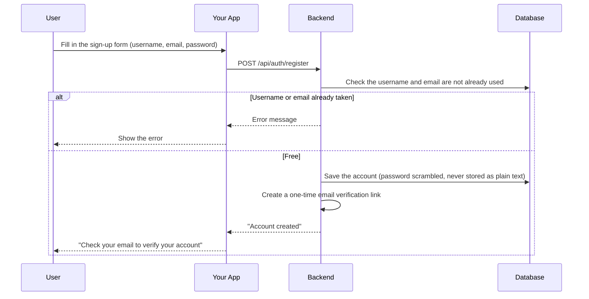
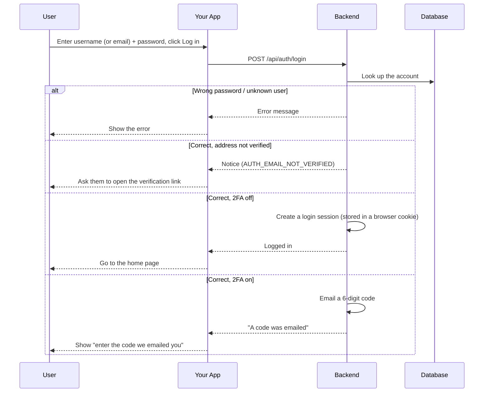
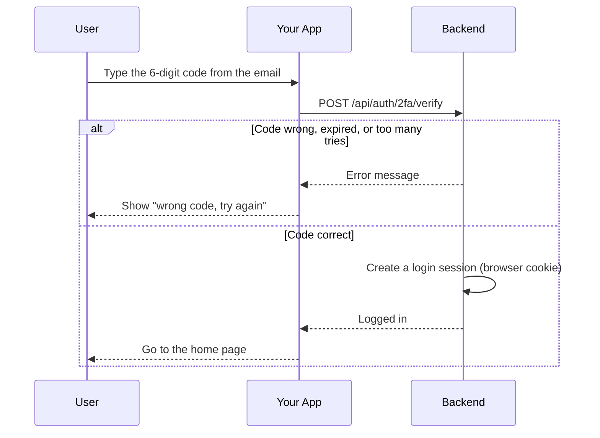
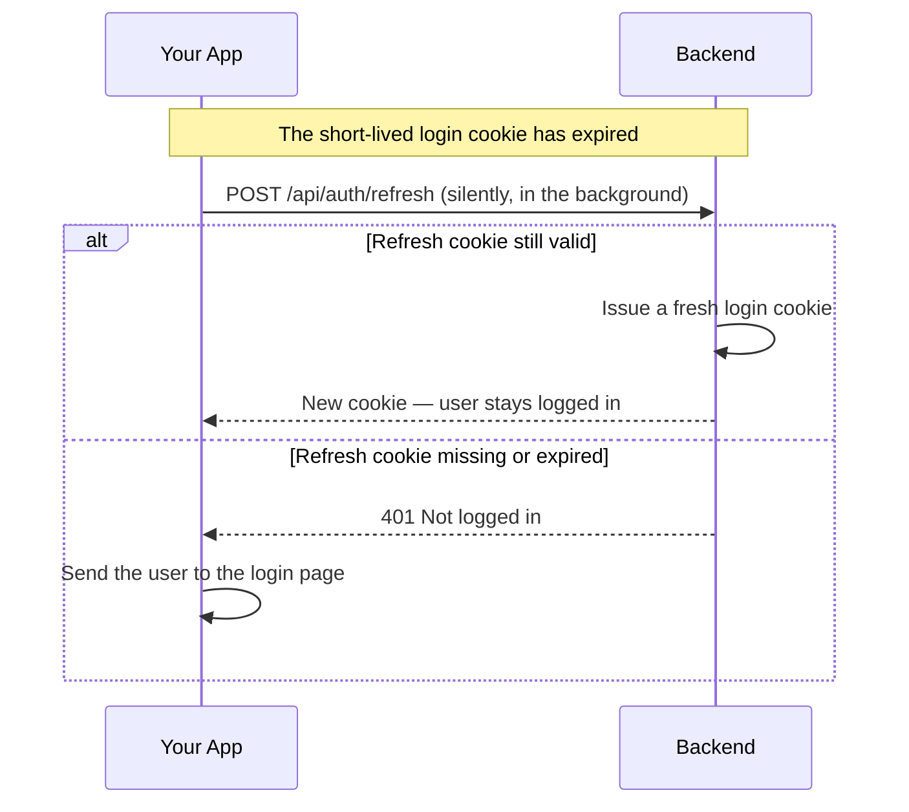
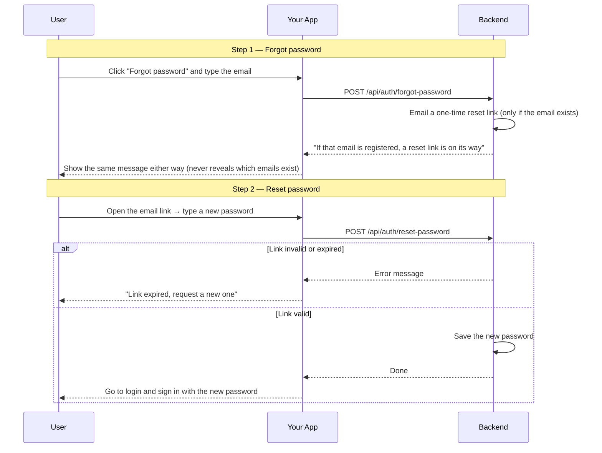
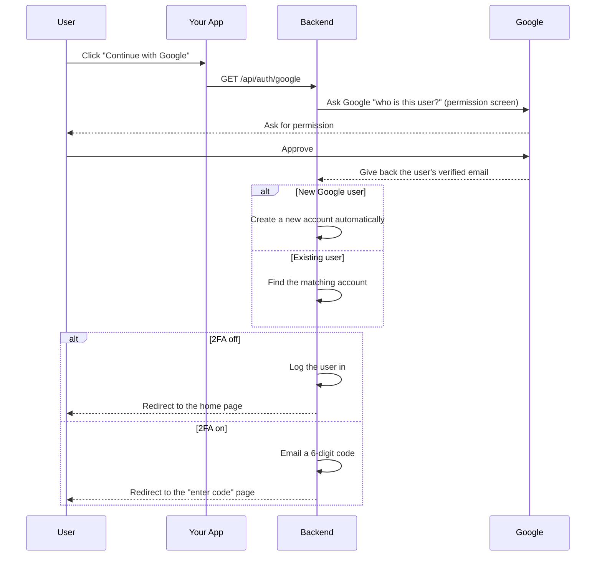
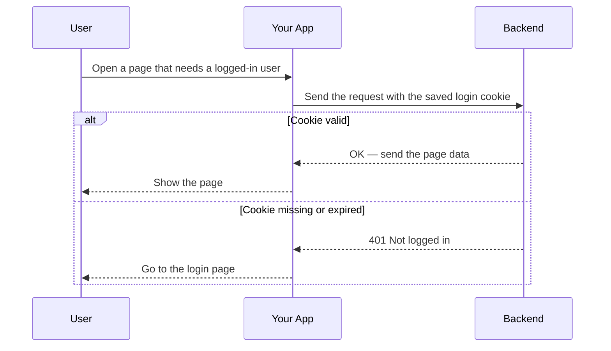
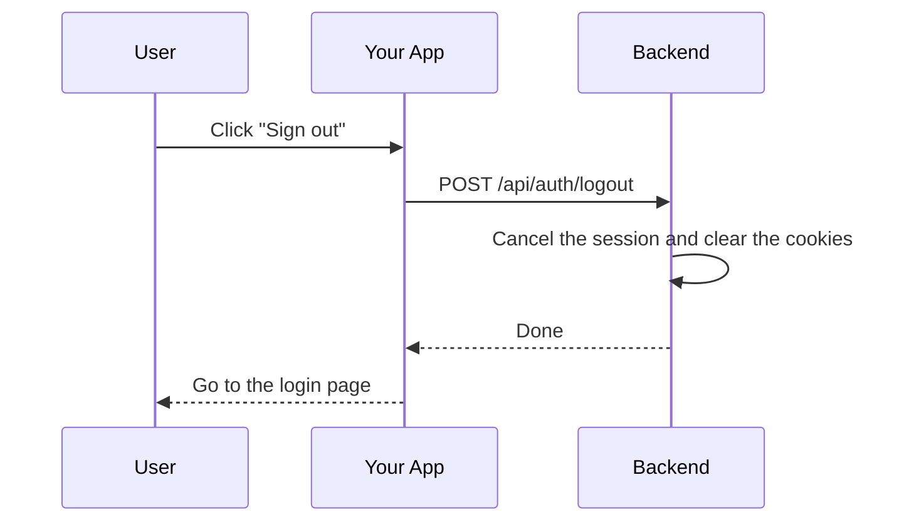

# Auth Module

## Table of Contents

- [Overview](#overview) — What the Auth module does and the authentication flows it supports
- [Files](#files) — Every source file in the module and its role
- [Key Types / Interfaces](#key-types--interfaces) — DTOs, JWT payload, and validation constraints
- [API Endpoints](#api-endpoints) — All routes with method, path, auth, and description
- [Core Logic / Flow](#core-logic--flow) — Mermaid sequence diagrams for registration, login, 2FA, OAuth, JWT validation, and logout
- [Logic Paths Summary](#logic-paths-summary) — Plain-text decision trees for quick reference
- [Email delivery](#email-delivery) — `MailService`: SMTP transport settings, dev fallback, the lapsed-email-change notice, and send-failure behaviour
- [Localization](#localization) — Per-language transactional-email copy (`i18n/email-messages.ts`)
- [Dependencies](#dependencies) — npm packages and internal services this module relies on
- [Configuration / Environment](#configuration--environment) — Secrets and environment variables used
- [Module Exports](#module-exports) — What AuthModule re-exports for other modules


---
---


## Overview

The Auth module handles all authentication concerns for the Ludo Transcendence application. It supports the following flows:

1. **Password-based auth with email verification** — users register with a username/email/password and are sent a verification link, which records the address as verified. Sign-in is refused until that link is redeemed: the reply is a 200 notice (`AUTH_EMAIL_NOT_VERIFIED`), not an error. Login then requires either no 2FA or an emailed code.
2. **Two-factor authentication (2FA)** — email-code-based 2FA. When enabled, login requires a password (factor one) plus a 6-digit emailed code (factor two).
3. **Refresh-token sessions** — a short-lived access token (15 min) plus a long-lived, revocable refresh token (7 days) stored in an httpOnly cookie, with silent rotation via a `/refresh` endpoint.
4. **Password reset** — forgot-password emails a one-time link; reset-password redeems it with a new password.
5. **OAuth 2.0** — users authenticate via Google, GitHub, or 42 (School 42 intra). On first login with a provider, a local user account is created or linked to an existing one by email.

The module also provides the `JwtAuthGuard` used by other modules to protect their endpoints.


---
---


## Files

| File | Role |
|------|------|
| `auth.module.ts` | NestJS module — registers Passport, JwtModule, all strategies, and exports them for other modules |
| `auth.controller.ts` | HTTP routes: register, verify-email, login, 2fa/verify, refresh, forgot-password, reset-password, logout, me, profile read/update, password change, account deletion, 2FA settings, and 3 OAuth flows |
| `auth.service.ts` | Core business logic: password hashing (bcrypt), JWT issuance, OAuth validation, 2FA orchestration, email verification, and the verify-then-commit email change |
| `auth.constants.ts` | `AUTH`: single-source auth tunables (token TTLs, 2FA challenge/resend limits, email-change rate cap) |
| `jwt.strategy.ts` | Passport strategy that extracts JWT from the `token` cookie and requires our issuer, the API audience, `HS256` and a string `sub` |
| `jwt-auth.guard.ts` | `@UseGuards(JwtAuthGuard)` decorator — protects routes behind JWT |
| `jwt-payload.ts` | TypeScript interface for the JWT payload: `{ sub: string; username: string }` |
| `google.strategy.ts` | Passport strategy for Google OAuth 2.0 |
| `github.strategy.ts` | Passport strategy for GitHub OAuth (with `allRawEmails` for verified email detection) |
| `fortytwo.strategy.ts` | Passport strategy for 42 OAuth |
| `ngrok_google_strategy.ts` | Google OAuth variant for tunnelled requests — picked per request when the Host header contains `ngrok` (`isTunnelRequest`) |
| `ngrok_github_strategy.ts` | GitHub OAuth variant for tunnelled requests (same per-request Host check) |
| `ngrok_fortytwo_strategy.ts` | 42 OAuth variant for tunnelled requests (same per-request Host check) |
| `oauth.guards.ts` | Guard classes: `GoogleAuthGuard`, `GithubAuthGuard`, `FortyTwoAuthGuard` — pick strategy per request host |
| `mail.service.ts` | SMTP email sending — verification links, 2FA codes, password-reset and email-change links (degrades to console logging without SMTP config). Selects the copy from the recipient's `User.language` (see [Localization](#localization)). Also owns the Redis keyspace subscription that emails the lapsed-email-change notice (see [Email delivery](#email-delivery)) |
| `i18n/email-messages.ts` | Transactional-email copy per language (`en` / `fr` / `ms`) — lives at `src/i18n/`, consumed by `mail.service.ts` (see [Localization](#localization)) |
| `session.service.ts` | Redis-backed refresh-token management with rotation and revocation |
| `twofactor.service.ts` | Redis-backed short-lived auth state, stored hashed and single-use: signup verification tokens (`verify:`), password-reset tokens (`reset:`), 2FA login challenges (`2fa:`) and staged email changes (`emailchange:` + its `emailchange:user:<id>` reverse pointer) |
| `dto/register.dto.ts` | Validation schema for `POST /api/auth/register` |
| `dto/login.dto.ts` | Validation schema for `POST /api/auth/login` |
| `dto/forgot-password.dto.ts` | Validation schema for `POST /api/auth/forgot-password` |
| `dto/reset-password.dto.ts` | Validation schema for `POST /api/auth/reset-password` |
| `dto/twofactor.dto.ts` | Validation schema for `POST /api/auth/2fa/verify` |
| `dto/two-factor-setting.dto.ts` | Validation schema for `GET/PATCH /api/auth/2fa` |
| `dto/password.rules.ts` | Shared password policy constants used by RegisterDto and ResetPasswordDto |
| `dto/update-profile.dto.ts` | Validation schema for profile updates (incl. `currentPassword` for the email-change re-auth, and `language` for the transactional-email copy) |
| `dto/resend-verification.dto.ts` | Validation schema for `POST /api/auth/resend-verification` |
| `dto/change-password.dto.ts` | Validation schema for `PATCH /api/auth/profile/password` |
| `dto/delete-account.dto.ts` | Validation schema for `DELETE /api/auth/profile` (optional current password + required acknowledgement) |


---
---


## Key Types / Interfaces

### JwtPayload

```typescript
interface JwtPayload {
  sub: string;    // user UUID
  username: string;  // Player's username
}
```

### RegisterDto

| Field | Type | Constraints |
|-------|------|-------------|
| `username` | string | 3–20 chars, alphanumeric + underscore only |
| `email` | string | **Required** — used for verification link and 2FA codes |
| `password` | string | 12–72 chars, must contain uppercase, lowercase, number, and special character |
| `language` | string | Optional — `en` / `fr` / `ms`; selects the transactional-email copy (see [Localization](#localization)). Defaults to `en` |

### LoginDto

| Field | Type | Constraints |
|-------|------|-------------|
| `identifier` | string | Required — accepts either a username or an email address |
| `password` | string | Required, min 1 char |

### ForgotPasswordDto

| Field | Type | Constraints |
|-------|------|-------------|
| `email` | string | Valid email format |

### ResetPasswordDto

| Field | Type | Constraints |
|-------|------|-------------|
| `token` | string | Exactly 64 chars (hex-encoded random bytes) |
| `password` | string | 12–72 chars, same policy as registration |

### TwoFactorDto

| Field | Type | Constraints |
|-------|------|-------------|
| `pendingToken` | string | Exactly 64 chars (hex-encoded random bytes) |
| `code` | string | Exactly 6 digits |

### TwoFactorSettingDto

| Field | Type | Constraints |
|-------|------|-------------|
| `enabled` | boolean | Required |

### Password Policy (password.rules.ts)

```typescript
export const PASSWORD_MIN = 12;
export const PASSWORD_MAX = 72; // bcrypt ignores bytes past 72
export const PASSWORD_REGEX = /^(?=.*[a-z])(?=.*[A-Z])(?=.*\d)(?=.*[^A-Za-z0-9]).+$/;
```


---
---


## API Endpoints

| Method | Path | Auth | Description |
|--------|------|------|-------------|
| `POST` | `/api/auth/register` | None | Create account, send verification email (no session set) |
| `GET` | `/api/auth/verify-email` | None | Redeem a signup or email-change link; redirect to the SPA (`?verified=1` / `?emailChanged=1` / `?error=…`) |
| `POST` | `/api/auth/resend-verification` | None | Resend a signup verification link (generic response, throttled 3/h) |
| `POST` | `/api/auth/profile/resend-email-change` | JWT | Resend the pending email-change link (throttled 5/h) |
| `POST` | `/api/auth/login` | None | Authenticate — returns `{ twoFactorRequired }`, the not-verified notice, or sets session |
| `POST` | `/api/auth/2fa/verify` | None | Redeem 2FA code + pendingToken for session |
| `POST` | `/api/auth/2fa/resend` | None | Re-issue the 2FA code for a live challenge (3 resends/hour per user) |
| `POST` | `/api/auth/refresh` | None (refresh cookie) | Rotate refresh token, issue fresh access token |
| `POST` | `/api/auth/forgot-password` | None | Email reset link (generic response — no enumeration) |
| `POST` | `/api/auth/reset-password` | None | Redeem reset token with new password |
| `POST` | `/api/auth/logout` | None | Revoke refresh token, clear both cookies |
| `GET` | `/api/auth/me` | JWT | Return current user from cookie |
| `GET` | `/api/auth/profile` | JWT | Full profile for the Edit-Profile card (email, providers, hasPassword) |
| `PATCH` | `/api/auth/profile` | JWT | Update profile (display name, email, 2FA, OAuth). Email changes are verify-then-commit |
| `PATCH` | `/api/auth/profile/password` | JWT | Change password while logged in (needs current password) |
| `DELETE` | `/api/auth/profile` | JWT | Permanently delete the account (password-verified) |
| `GET` | `/api/auth/2fa` | JWT | Get current user's 2FA preference |
| `PATCH` | `/api/auth/2fa` | JWT | Toggle the user's 2FA preference |
| `GET` | `/api/auth/google` | None | Redirect to Google OAuth |
| `GET` | `/api/auth/google/callback` | None | Google OAuth callback |
| `GET` | `/api/auth/github` | None | Redirect to GitHub OAuth |
| `GET` | `/api/auth/github/callback` | None | GitHub OAuth callback |
| `GET` | `/api/auth/42` | None | Redirect to 42 OAuth |
| `GET` | `/api/auth/42/callback` | None | 42 OAuth callback |

**Display-name rules** (`PATCH /api/auth/profile`): the name must satisfy
`VALIDATION_DISPLAY_NAME_LENGTH` / `VALIDATION_DISPLAY_NAME_CHARS`, be unique
(`409 AUTH_DISPLAY_NAME_TAKEN`), and may not impersonate a bot — a name starting with
`bot-`, `bot ` or `bot_` is rejected with `400 AUTH_DISPLAY_NAME_RESERVED`
(`isReservedBotName()` in `common/botname-enforce.ts`).

### Rate limits

The controller sets a per-IP limit on the routes below; every other route falls back to the global
throttler default (300 requests per 60 s, installed in `app.module.ts`).

| Route | Limit |
|-------|-------|
| `POST /api/auth/register` | 5 per hour |
| `POST /api/auth/login` | 5 per minute |
| `POST /api/auth/2fa/verify` | 5 per minute |
| `POST /api/auth/2fa/resend` | 5 per hour (+ 3 per hour per user) |
| `POST /api/auth/refresh` | 30 per minute |
| `POST /api/auth/forgot-password` | 3 per hour |
| `POST /api/auth/reset-password` | 5 per 15 minutes |

The counted address is the client's own: `main.ts` trusts internal hops only, so a client-sent
`X-Forwarded-For` cannot move a request into a different bucket.

### Cookie Configuration

Two httpOnly cookies are used:

| Property | Access Cookie | Refresh Cookie |
|----------|--------------|----------------|
| Name | `token` | `refresh_token` |
| httpOnly | `true` | `true` |
| sameSite | `lax` | `lax` |
| secure | `true` in production | `true` in production |
| path | `/` | `/api/auth` |
| maxAge | 15 minutes (`ACCESS_MAX_AGE_MS`) | 7 days (`REFRESH_MAX_AGE_MS` / `REFRESH_TTL_S`) |

### Token scope

A valid signature is not enough for a JWT to count as a session. Each token family is bound to
the one place it may be used:

| Token | Secret | `iss` / `aud` | Accepted by |
|-------|--------|---------------|-------------|
| Session access token (`token` cookie) | `JWT_SECRET` | `ft_transcendence` / `ft_transcendence-api` | `JwtStrategy` (every `JwtAuthGuard` route) and `verifyAccessToken()` |
| oauth-link token (OAuth `state`) | `OAUTH_STATE_SECRET` | `ft_transcendence` / `oauth-link` | `resolveOAuthLink()` only |
| Engine match token | `ENGINE_JWT_SECRET` | `ft_transcendence` / `ludo-engine` | ludo-engine handshake only |

`JwtModule` stamps the session claims on every `jwt.sign()` and requires them, plus `HS256`, on
every `jwt.verify()` (`signOptions` / `verifyOptions` in `auth.module.ts`). The oauth-link and
engine tokens override the secret and audience per call, so neither can pass as a session.
`JwtStrategy.validate()` also rejects a token without a string `sub`: controllers trust
`req.user.id`, and Prisma ignores an `undefined` filter, so `where: { userId: undefined }` would
match every user's rows. The values live in `auth.constants.ts` (`TOKEN_ISSUER`,
`SESSION_TOKEN_AUDIENCE`, `OAUTH_LINK_AUDIENCE`, `OAUTH_LINK_TTL`).

### Frontend URL resolution

`frontendUrlFor(req)` returns the public SPA URL for a request. The Host header decides the mode:

| Mode | Host | Result |
|------|------|--------|
| Tunnel | contains `ngrok` | `NGROK_FRONTEND_URL` |
| LAN | equals `LAN_IP` | `https://<LAN_IP>:<HTTPS_PORT>` |
| Local | anything else | `FRONTEND_URL` |

It is used for OAuth redirects and for every emailed link origin (signup verification, resend,
password reset, email change), so the link always matches the mode the user reached us through.

### Tunable constants

Grouped in `backend/src/auth/auth.constants.ts` (the `AUTH` object). Import from there, so a value
changes in one place:

| Constant | Default | What it controls |
|----------|---------|------------------|
| `AUTH.verifyTokenTtlS` | 24 h | Signup verification link lifetime |
| `AUTH.resetTokenTtlS` | 1 h | Password-reset link lifetime |
| `AUTH.changeTokenTtlS` | 15 min | Email-change confirmation link lifetime |
| `AUTH.maxEmailChangesPerHour` | 3 | Email-change requests per user per hour |
| `AUTH.challenge.ttlS` | 5 min | 2FA login-code lifetime |
| `AUTH.challenge.maxAttempts` | 5 | 2FA code attempts per challenge |
| `AUTH.challenge.resendWindowS` | 1 h | 2FA resend cap window |
| `AUTH.challenge.maxResends` | 3 | 2FA resends per window per user |

Other tunables stay in their own files: `SALT_ROUNDS` (`auth.service.ts`, 10, bcrypt cost),
`ACCESS_MAX_AGE_MS` / `REFRESH_MAX_AGE_MS` (`auth.controller.ts`), `REFRESH_TTL_S`
(`session.service.ts`), `PASSWORD_MIN` / `PASSWORD_MAX` (`auth/dto/password.rules.ts`, 12 / 72,
mirrored in `frontend/src/validatePassword.ts`).


---
---


## Core Logic / Flow

### 1. Password Registration Flow



### 2. Password Login Flow (with 2FA)



### 3. Two-Factor Verification



### 4. Refresh Token Rotation



### 5. Forgot / Reset Password Flow



### 6. OAuth Flow (Google / GitHub / 42)

All three providers follow the same pattern. The example below uses Google:



### 7. JWT Validation on Protected Routes



### 8. Logout




---
---


## Logic Paths Summary

Concise decision trees showing every code path through each auth operation, including error branches.

> Every error that the user can see includes a `code` (for example `AUTH_USERNAME_TAKEN`), and the frontend translates it into the selected language. See [API-list.md](../API-list.md) → Error responses for the full list.

### Registration Path

```
POST /api/auth/register
  ├── Validate RegisterDto (class-validator)
  ├── Check username uniqueness → 409 if taken
  ├── Check email uniqueness → 409 if taken
  ├── bcrypt.hash(password, 10)
  ├── Prisma user.create() — with nested achievement.create (1:1 flags row)
  ├── TwoFactorService.createVerifyToken(userId)
  ├── MailService.sendVerification(email, ...)
  └── Return { message: 'Account created : check your email to verify your address.' }
```

### Login Path

```
POST /api/auth/login
  ├── Validate LoginDto
  ├── Find user by username OR email → 401 if not found
  ├── bcrypt.compare(password, hash) → 401 if mismatch
  ├── If the address is not verified → 200 { code: 'AUTH_EMAIL_NOT_VERIFIED' }, no cookies
  ├── If 2FA enabled:
  │   ├── TwoFactorService.startChallenge(userId)  // returns { pendingToken, code }
  │   ├── MailService.send2faCode(email, code, ...)  // every call emails a fresh code
  │   └── Return { twoFactorRequired: true, pendingToken }
  └── If 2FA disabled:
      ├── SessionService.issue(userId) → refreshToken
      ├── Jwt.sign({ sub, username }) → accessToken
      ├── Set both cookies
      └── Return { twoFactorRequired: false, user }
```

### 2FA Verify Path

```
POST /api/auth/2fa/verify
  ├── Validate TwoFactorDto
  ├── TwoFactorService.verifyChallenge(pendingToken, code)
  │   ├── Invalid/expired/max attempts → 401
  │   └── Valid → issueSession → set cookies → return { user }
```

### Refresh Path

```
POST /api/auth/refresh
  ├── Extract refresh_token cookie
  ├── SessionService.rotate(token)
  │   ├── Invalid/expired → 401
  │   └── Valid → issue new access token + rotated refresh token → set cookies → return { user }
```

### Forgot Password Path

```
POST /api/auth/forgot-password
  ├── Validate ForgotPasswordDto
  ├── Find user by email
  ├── If user has password_hash:
  │   ├── TwoFactorService.createResetToken(userId)
  │   └── MailService.sendPasswordReset(email, ...)
  └── Return generic { message } (always identical)
```

### Reset Password Path

```
POST /api/auth/reset-password
  ├── Validate ResetPasswordDto
  ├── TwoFactorService.consumeResetToken(token)
  │   ├── Invalid/expired → 401
  │   └── Valid → bcrypt.hash(newPassword)
  ├── Prisma user.update({ password_hash, emailVerified: now })  // the link proves inbox control
  ├── SessionService.revokeAll(userId)
  └── Return { message: 'Password updated...' }
```

### OAuth Path (Google / GitHub / 42)

```
GET /api/auth/{provider}
  ├── TunnelAwareAuthGuard picks the local or ngrok strategy from the Host header
  ├── With a valid access-token cookie it signs a 10-minute oauth-link token (`OAUTH_STATE_SECRET`, `aud: oauth-link`) into the provider `state`
  └── Redirect to the provider consent screen

GET /api/auth/{provider}/callback
  ├── Guard failures → /login?error=access_denied, ?error=oauth_failed, or ?error=email-in-use
  ├── Exchange code for access token + profile
  ├── Extract an email the provider has verified (Google, GitHub) or the 42 address
  ├── validateOAuthLogin():
  │   ├── Check existing Account → return linked user
  │   ├── Add-method link: reject a provider email that already belongs to another account (409 AUTH_EMAIL_TAKEN)
  │   ├── Check email match → link provider to existing user
  │   └── Create new user + account
  ├── If the oauth-link token matched the session → redirect to /profile (no new session)
  ├── If 2FA is off → issueSession → set cookies → redirect to {frontend-url}/home
  ├── If 2FA is on and the provider gave no email → redirect to /login?error=add-email-2fa
  └── If 2FA is on with an email → startTwoFactor → send code → redirect to {frontend-url}/2fa?token=...
```

### Authenticated Request Path

```
GET /api/auth/me (or any @UseGuards(JwtAuthGuard) route)
  ├── Extract token from cookie
  ├── jwt.verify(token, JWT_SECRET)
  │   ├── Invalid → 401
  │   └── Valid → attach { id, username } to req.user
  └── Execute handler
```


---
---


## Email delivery (`mail.service.ts`)

`MailService` sends every transactional email the module needs: signup verification
links, 2FA codes, password-reset links, the verify-then-commit email-change link, the
heads-up sent to the current address when a change is requested, and the notice sent
when a staged change lapses.

### Localization

The backend has no i18n framework, so the copy for every transactional email lives in
`backend/src/i18n/email-messages.ts` as the single source of strings. Each language
provides the same six messages:

| Key | Placeholder | Used for |
|-----|-------------|----------|
| `verification` | `{link}` | Signup verification link |
| `passwordReset` | `{link}` | Password-reset link |
| `twoFactor` | `{code}` | Login 2FA code |
| `emailChange` | `{link}` | New-address confirmation link |
| `emailChangeNotice` | `{newEmail}` | Heads-up to the current address when a change is requested |
| `emailChangeExpired` | — | Notice sent when a staged change lapses |

```typescript
export type EmailLang = 'en' | 'fr' | 'ms';

interface EmailStrings {
  verification: { subject: string; text: string };      // {link}
  passwordReset: { subject: string; text: string };     // {link}
  twoFactor: { subject: string; text: string };         // {code}
  emailChange: { subject: string; text: string };       // {link}
  emailChangeNotice: { subject: string; text: string }; // {newEmail}
  emailChangeExpired: { subject: string; text: string };
}
```

Three complete sets are defined — `EN`, `FR` and `MS`. Helpers:

- `emailStrings(lang)` — returns the set for `lang`, falling back to `EN` for any
  missing/unknown value.
- `fill(template, vars)` — substitutes `{placeholder}` tokens (unknown keys become `''`).

Every `mail.service.ts` `send*()` method takes a `lang` argument and resolves it through
`emailStrings()`. The value comes from the recipient's `User.language`, which
`RegisterDto.language` seeds on signup (`dto.language ?? 'en'`) and `UpdateProfileDto.language`
can change afterwards — so the language a user picks is what their verification, 2FA, reset
and email-change mail is written in.

### Transport

The transport is built once in the constructor from `SMTP_CREDENTIALS`
(`[host]:port user:password`). When that value is missing or still the `.env`
placeholder, no transport is created and each `send()` writes a line to the backend
log instead, so every flow stays testable in dev without a mail account. The dev line
records user, recipient and subject but never the body, so a verification or reset
token cannot leak into the console.

| Setting | Value | Reason |
|---------|-------|--------|
| `secure` | `false` | Port 587 upgrades with STARTTLS |
| `pool` | `true` | Reuse one authenticated socket for all sends |
| `maxConnections` | `1` | One connection is enough; sends are serialised |
| `maxMessages` | `100` | Recycle the socket before the server would close it |
| `connectionTimeout` | `10_000` | Fail a slow connect instead of hanging the send (nodemailer default: 2 min) |
| `greetingTimeout` | `10_000` | Fail a slow SMTP greeting instead of hanging it (default: 30 s) |
| `socketTimeout` | default (10 min) | Left alone on purpose — see below |

Without pooling, every email paid a full TCP + STARTTLS + AUTH handshake first.
Against the configured host that handshake alone costs ~1.5–3 s (a `verify()` of
`smtp.gmail.com:587` measured 3.9 s), and each auth flow awaits `send()`, so the delay
was user-visible. With the pool, three consecutive sends shared one connection:
766 ms for the first (which pays the handshake) and 194 ms / 196 ms for the two after
it. `socketTimeout` stays at nodemailer's 10-minute default because a pooled
connection only saves the handshake if it is still open on the next send — it doubles
as the idle keep-alive, and lowering it would drop the socket between two user actions
and pay the handshake again. The pool is closed in `onModuleDestroy`, next to the
Redis subscription release.

### Lapsed email-change notice

An email change is verify-then-commit: the new address is staged in Redis
(`emailchange:<hash>`, plus the reverse pointer `emailchange:user:<userId>` written by
`TwoFactorService.createEmailChangeToken`) and only redeeming the emailed link commits
it. `MailService` keeps one Redis connection in subscriber mode on
`__keyevent@0__:expired`. Redis instance 0 is the only database this app uses, so the
channel name is fixed, and the `Ex` flag in `notify-keyspace-events` (set by
`redis-init.sh`) is what makes the server publish those events. The key that matters
is the reverse pointer: when it lapses the change was never confirmed, so the handler
looks the owner up and emails the old address once. Redeeming or rotating a link
*DELETEs* its keys, and `DEL` never emits `expired`, so a completed change cannot
produce a false notice. This replaced the earlier `@Interval` sweep. A subscribed
client cannot run ordinary commands, so that connection is dedicated to the
subscription — the same idiom as `SessionService` and `TwoFactorService`.

`onModuleInit` reads `notify-keyspace-events` and logs a warning (it never throws)
when `x` is missing, because the notice depends on that one setting. All handlers are
best-effort: failures are caught and logged so a mail or Redis error cannot kill the
process or the listener loop.

### Failure behaviour

`send()` throws `ServiceUnavailableException` (HTTP 503) when SMTP rejects a message.
Callers differ:

| Caller | On a failed send |
|--------|------------------|
| `register`, `forgotPassword`, `startTwoFactor` | Propagates the 503 — the request fails |
| Profile email change | Clears the staged Redis change, then propagates the 503 |
| `resendSignupVerification`, `resendEmailChange`, `resendTwoFactor` | Swallowed with `.catch(() => {})`, so the deliberately generic reply is unchanged |
| Email-change notice, expired-change notice, commit-conflict expiry email | Swallowed — a notice must not fail the action that triggered it |


---
---


## Dependencies

| Dependency | Purpose |
|-----------|---------|
| `@nestjs/jwt` | JWT signing and verification |
| `@nestjs/passport` | Passport integration for NestJS |
| `passport` | Authentication middleware |
| `passport-jwt` | JWT extraction strategy |
| `passport-google-oauth20` | Google OAuth 2.0 |
| `passport-github2` | GitHub OAuth |
| `passport-42` | 42 School OAuth |
| `bcrypt` | Password hashing |
| `class-validator` | DTO validation |
| `nodemailer` | SMTP email delivery (verification, 2FA, password reset, email change — copy localized per recipient) |
| `ioredis` | Redis client (SessionService, TwoFactorService, MailService's expiry subscription) |
| `PrismaService` | Database access (User, Account models) |
| `secrets.ts` | Single env-var lookup (`secret` / `requireSecret`) over the root `.env` — JWT_SECRET, OAUTH_STATE_SECRET, ENGINE_JWT_SECRET, OAuth client IDs/secrets/callback URLs, SMTP credentials |


---
---


## Configuration / Environment

All configuration is read from environment variables — the root `.env` (compose `env_file:` in containers, dotenv for host-side scripts). There are no `/secrets/*.txt` files: `secrets.ts` is a thin `process.env` lookup, and `requireSecret()` throws at boot when a required value is missing.

| Variable | Used By |
|--------|---------|
| `JWT_SECRET` | JwtModule, JwtStrategy (session access tokens only) |
| `OAUTH_STATE_SECRET` | `AuthService.createOAuthLinkToken` / `resolveOAuthLink` (the oauth-link `state` token, a separate key so it can never pass as a session) |
| `ENGINE_JWT_SECRET` | `MatchModule` (signs the ludo-engine match tokens — deliberately a separate key, not read by AuthModule) |
| `GOOGLE_CLIENT_ID` | GoogleStrategy |
| `GOOGLE_CLIENT_SECRET` | GoogleStrategy |
| `GOOGLE_CALLBACK_URL` | GoogleStrategy |
| `GITHUB_CLIENT_ID` | GithubStrategy |
| `GITHUB_CLIENT_SECRET` | GithubStrategy |
| `GITHUB_CALLBACK_URL` | GithubStrategy |
| `FORTYTWO_CLIENT_ID` | FortyTwoStrategy |
| `FORTYTWO_CLIENT_SECRET` | FortyTwoStrategy |
| `FORTYTWO_CALLBACK_URL` | FortyTwoStrategy |
| `NGROK_GOOGLE_CALLBACK_URL` | NgrokGoogleStrategy (reuses `GOOGLE_CLIENT_ID` / `GOOGLE_CLIENT_SECRET`) |
| `NGROK_GITHUB_CALLBACK_URL` | NgrokGithubStrategy (reuses `GITHUB_CLIENT_ID` / `GITHUB_CLIENT_SECRET`) |
| `NGROK_FORTYTWO_CALLBACK_URL` | NgrokFortyTwoStrategy (reuses `FORTYTWO_CLIENT_ID` / `FORTYTWO_CLIENT_SECRET`) |
| `FRONTEND_URL` | AuthController (OAuth redirect target for local requests; required, the example `.env` sets `https://localhost:8443`) |
| `NGROK_FRONTEND_URL` | AuthController (OAuth redirect target when the request Host contains `ngrok`) |
| `SMTP_CREDENTIALS` | MailService (format: `[smtp.gmail.com]:587 address@gmail.com:app-password`) |
| `REDIS_PASSWORD` | SessionService, TwoFactorService, MailService |

### Environment Variables

| Variable | Default | Used By |
|----------|---------|---------|
| `REDIS_HOST` | `redis` | SessionService, TwoFactorService, MailService |
| `REDIS_PORT` | `6479` | SessionService, TwoFactorService, MailService |


---
---


## Module Exports

The `AuthModule` re-exports `AuthService`, `JwtModule`, and `PassportModule` so that other feature modules (e.g. MatchModule, FriendsModule) can use `JwtAuthGuard` and `JwtService` without registering a second, secret-less JwtModule instance.