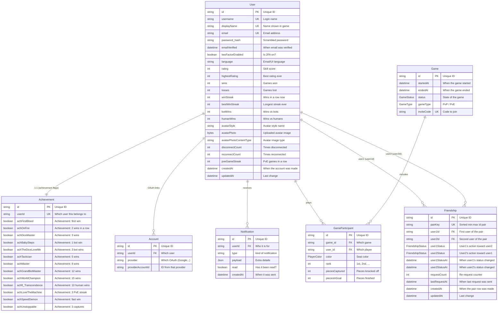

# Database Schema

## Table of Contents

- [Overview](#overview) — Prisma ORM schema for PostgreSQL
- [Enums](#enums) — All enum types used in the database
- [Models](#models) — All 7 models with fields, types, and relations
- [Entity Relationships](#entity-relationships) — ER diagram showing model relations
- [Indexes](#indexes) — Database indexes for query performance


---
---


## Overview

The database uses PostgreSQL 16 with Prisma ORM (Prisma 7, `@prisma/adapter-pg`). The schema defines **7 models** and **4 enums** covering users, achievements, OAuth accounts, games, friendships, and notifications. The Prisma client is generated into `backend/generated` (gitignored).

> **Notable shift:** The `Achievement` model now holds **only the achievement
> flags**. All per-user stats (rating, wins, streaks), avatar data, and
> disconnect/reconnect counters live directly on **`User`**.


---
---


## Enums


---
---


### FriendshipStatus

A directional friendship state. Each `Friendship` row stores two of these — one per
side of the pair (`user1Status` / `user2Status`) — so a block on one side can never
be silently rewritten from the other.

```prisma
enum FriendshipStatus {
  none
  pending
  accepted
  declined
  blocked
}
```


---
---


### PlayerColor

```prisma
enum PlayerColor {
  RED
  GREEN
  YELLOW
  BLUE
}
```


---
---


### GameStatus

```prisma
enum GameStatus {
  COMPLETED
  ABANDONED
}
```


---
---


### GameType

```prisma
enum GameType {
  PVP
  PVE
}
```

> There is no `UserStatus` enum — presence is a runtime Redis concern (see `backend-presence-module.md`), with `'online' | 'playing' | 'offline'` derived from the presence key TTL.


---
---


## Models


---
---


### User

The main account record. Holds login info plus all per-user stats, avatar
data, and disconnect/reconnect counters.

| Field | Type | Attributes | Description |
|-------|------|------------|-------------|
| `id` | String | UUID, PK | Unique user identifier |
| `username` | String | Unique | Login name (3-20 chars, alphanumeric + underscore) |
| `displayName` | String | Unique | Display name shown in-game |
| `email` | String? | Unique | Email address (nullable for OAuth-only edge cases) |
| `password_hash` | String? | | bcrypt hash (null for OAuth-only users) |
| `emailVerified` | DateTime? | | When email was verified |
| `twoFactorEnabled` | Boolean | Default: false | Whether email-code 2FA is required at login |
| `language` | String | Default: `"en"` | UI/transactional-email language (`en` \| `fr` \| `ms`) |
| `rating` | Int | Default: 0 | Elo-like rating |
| `highestRating` | Int | Default: 0 | Peak rating achieved |
| `wins` | Int | Default: 0 | Total games won |
| `losses` | Int | Default: 0 | Total games lost |
| `winStreak` | Int | Default: 0 | Current consecutive wins |
| `bestWinStreak` | Int | Default: 0 | Best consecutive wins |
| `botWins` | Int | Default: 0 | Games won against bots |
| `humanWins` | Int | Default: 0 | Games won against humans |
| `avatarStyle` | String | Default: `"bottts"` | DiceBear avatar style identifier |
| `avatarPhoto` | Bytes? | | Binary custom avatar image data |
| `avatarPhotoContentType` | String? | | MIME type of custom avatar |
| `disconnectCount` | Int | Default: 0 | Number of disconnects |
| `reconnectCount` | Int | Default: 0 | Number of reconnects |
| `pveGameStreak` | Int | Default: 0 | Consecutive PvE games (any outcome) |
| `createdAt` | DateTime | Auto | Account creation timestamp |
| `updatedAt` | DateTime | Auto | Last update timestamp |

**Relations:** `accounts`, `notifications`, `achievement` (1:1), `gameParticipants`, `friendshipsAsUser1`, `friendshipsAsUser2`


---
---


### Achievement

1:1 with `User`. Holds **only the achievement flags** — no stats, rating, or
avatar data (those live on `User`).

| Field | Type | Attributes | Description |
|-------|------|------------|-------------|
| `id` | String | UUID, PK | Unique identifier |
| `userId` | String | Unique, FK | Owning user |
| `achFirstBlood` … `achUnstoppable` | Boolean | Default: false | 13 achievement flags (see `backend-achievements-module.md`) |

**Relations:** `user` (1:1, back-reference)


---
---


### Account

OAuth provider links, one row per provider per user.

| Field | Type | Attributes | Description |
|-------|------|------------|-------------|
| `id` | String | UUID, PK | Unique identifier |
| `userId` | String | FK | Owning user |
| `provider` | String | | Provider name (`google`, `github`, `42`) |
| `providerAccountId` | String | | Provider-side account id |

**Relations:** `user` (back-reference)


---
---


### Game

Historical results only — live matchmaking state is stored in Redis, not here.

| Field | Type | Attributes | Description |
|-------|------|------------|-------------|
| `id` | String | UUID, PK | Unique game identifier |
| `startedAt` | DateTime | | When the game started |
| `endedAt` | DateTime | | When the game ended |
| `status` | GameStatus | Default: COMPLETED | Completion state |
| `gameType` | GameType | Default: PVP | PvP or PvE |
| `inviteCode` | String? | Unique | Join code for invite games |

**Relations:** `participants` (GameParticipant[])


---
---


### GameParticipant

One row per player per game.

| Field | Type | Attributes | Description |
|-------|------|------------|-------------|
| `id` | String | UUID, PK | Unique identifier |
| `game_id` | String | FK | Owning game |
| `user_id` | String | FK | Player (human accounts only; bots are never written) |
| `color` | PlayerColor | | Seat color |
| `rank` | Int | | Final placement (1st-4th) |
| `piecesCaptured` | Int | Default: 0 | Pieces knocked off |
| `piecesInGoal` | Int | Default: 0 | Pieces finished (0-4) |

**Relations:** `game`, `user`


---
---


### Bots

Bots are not stored: a bot's id is the literal string `bot-<color>`
(`bot-red`, `bot-green`, `bot-yellow`, `bot-blue`), built per seat from
`BOT_PREFIX + color`. That id lives in the `match:*` hashes and in the engine's
game state, and it never reaches Postgres. A bot seat gets no token of its own:
the backend writes its slot into the match hash and the engine auto-fills it. The
engine reports only the human seats that finished, and `match.postgame` skips a
bot id before it writes anything.

`backend/src/common/botname-enforce.ts` defines `BOT_PREFIX`, `isBotUserId()` and
`isReservedBotName()` (which stops a human display name from masquerading as a
bot). The engine process keeps its own copy of the bot prefix/check in
`backend/app/ludo-engine/src/socket/auth.ts`, so bot identity must be changed in
both places at once.

The name a bot seat shows is not its id. The creator sends the lobby's own names
as `botNames`, index-aligned with `botColors`, and writes each one to
`player{n}_displayName` as `bot-<color> (<assistant>)`. The engine copies it into
the seat's `displayName`, so the label travels with the match and each client
translates only the colour word.

Modules that must tell humans from bots:

| Module | What it does with bots |
|--------|------------------------|
| Match (`match.creator`, `match.player`, `match.postgame`) | Builds bot seats as `BOT_PREFIX + color` and stores the lobby's `botNames` label as `player{n}_displayName`; excludes bots from seat and invite lists; skips them for rating, scoring, winner selection and persisted results, so a bot never gets an Elo change, a win/loss tally, a game row or a leaderboard entry |
| Achievements (`achievements.service`) | Skips a bot `user_id`, so a bot never collects achievements (games against bots still count toward the human's own bot-win achievements) |
| Leaderboard (`leaderboard.service`) | Excludes bots when it rebuilds from Postgres, using `startsWith BOT_PREFIX` in the query plus `!isBotUserId()` in memory |


---
---


### Friendship

One row per **unordered user pair** (a "superset" row), so a pair has a single
record whatever direction a request was made from. Each direction carries its own
status (`user1Status` = user1's action toward user2), so a block on one side can
never be silently rewritten from the other.

| Field | Type | Attributes | Description |
|-------|------|------------|-------------|
| `id` | String | PK | Unique identifier |
| `pairKey` | String | Unique | Sorted `"min:max"` id pair — enforces one row per pair |
| `user1Id` | String | FK | First user of the sorted pair |
| `user2Id` | String | FK | Second user of the sorted pair |
| `user1Status` | FriendshipStatus | Default: none | User1's action toward user2 |
| `user2Status` | FriendshipStatus | Default: none | User2's action toward user1 |
| `user1StatusAt` | DateTime? | | When user1's status changed (TTL / cooldown base) |
| `user2StatusAt` | DateTime? | | When user2's status changed (TTL / cooldown base) |
| `requestCount` | Int | Default: 0 | Re-request bookkeeping |
| `lastRequestAt` | DateTime? | | When the last request was sent (24 h pending TTL) |
| `createdAt` | DateTime | Auto | When the pair row was created |
| `updatedAt` | DateTime | Auto | Last change |

**Relations:** `user1` (FriendshipUser1), `user2` (FriendshipUser2)

> A live `pending` expires after 24 h and a `declined` direction stops blocking
> re-requests after a 1 h cooldown; both are applied lazily on read by the pure
> helpers in `backend/src/friends/friendship-pair.ts` (see
> [backend-friends-module.md](./backend-friends-module.md)).


---
---


### Notification

Persisted notifications backing the SSE stream and the bell dropdown.

| Field | Type | Attributes | Description |
|-------|------|------------|-------------|
| `id` | String | UUID, PK | Unique identifier |
| `userId` | String | FK | Recipient |
| `type` | String | | `friend_request` \| `friend_accepted` \| `friend_declined` \| `friend_removed` \| `game_invite` \| `achievement` \| `match_finished` \| `match_cancelled` \| `profile_updated` \| `display_name_changed` \| `friend_online` \| `friend_offline` \| `avatar_changed` |
| `payload` | Json | | Flexible per-type data |
| `read` | Boolean | Default: false | Read state |
| `createdAt` | DateTime | Auto | When created |

**Relations:** `user` (back-reference)


---
---


## Entity Relationships




---
---


## Indexes

| Model | Field(s) | Type | Purpose |
|-------|----------|------|---------|
| User | `username` | Unique | Fast lookup by username |
| User | `displayName` | Unique | Fast lookup by display name |
| User | `email` | Unique | Fast lookup by email |
| Achievement | `userId` | Unique | 1:1 lookup by user |
| Account | `(provider, providerAccountId)` | Unique | Fast OAuth lookup |
| Account | `userId` | Index | Fast user account lookup |
| Game | `inviteCode` | Unique | Fast invite code lookup |
| GameParticipant | `(game_id, user_id)` | Unique | Prevent duplicate entries |
| GameParticipant | `(game_id, color)` | Unique | Prevent duplicate colors |
| Friendship | `pairKey` | Unique | One row per unordered user pair |
| Friendship | `(user1Id, user1Status)` | Index | Fast lookup of a user's user1-direction rows |
| Friendship | `(user2Id, user2Status)` | Index | Fast lookup of a user's user2-direction rows |
| Notification | `(userId, read)` | Index | Fast unread-lookup per user |
