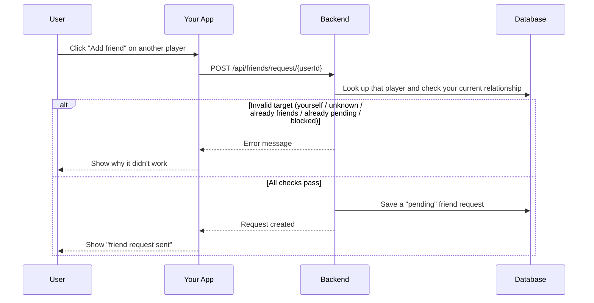
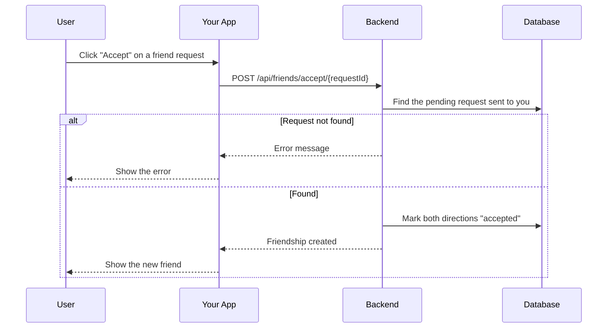
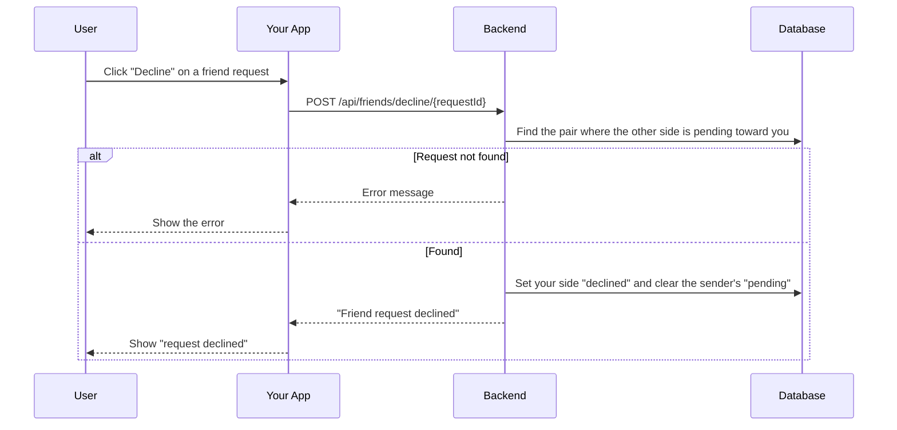
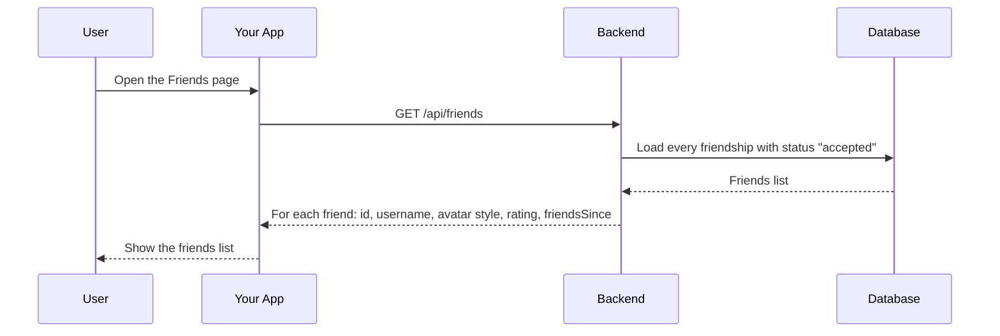
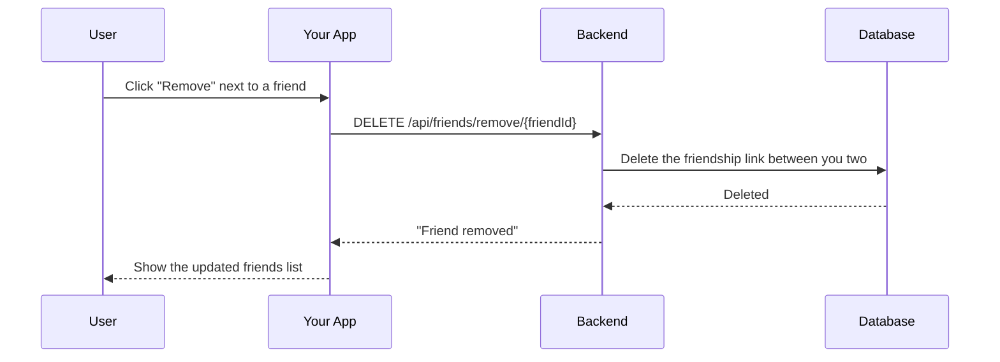
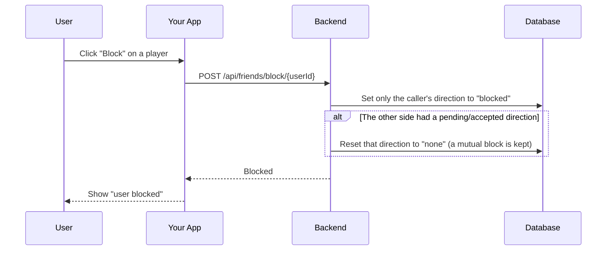
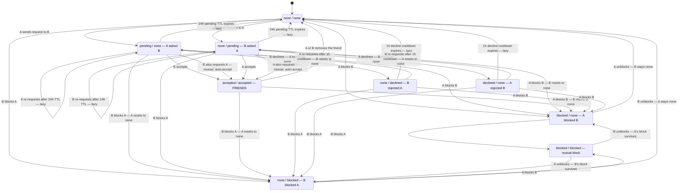

# Friends Module

## Table of Contents

- [Overview](#overview) — Friend request lifecycle and relationship management
- [Files](#files) — Every source file in the module and its role
- [Key Types / Interfaces](#key-types--interfaces) — Friendship status enum and response shapes
- [API Endpoints](#api-endpoints) — All 12 routes with method, path, auth, and description
- [Core Logic / Flow](#core-logic--flow) — Mermaid sequence diagrams for send, accept, decline, list, requests, remove, and block, plus the full pair state machine
- [Logic Paths Summary](#logic-paths-summary) — Decision trees for each operation
- [Dependencies](#dependencies) — Internal services this module relies on


---
---


## Overview

The Friends module manages the friendship lifecycle between users. It supports:

1. **Friend requests** — send a request to another user.
2. **Accept/Decline** — the recipient can accept or decline a pending request.
3. **Listing** — view all friends with their rating and friendsSince date.
4. **Pending requests** — view sent and received pending requests.
5. **Removal** — remove a friend.
6. **Blocking** — block a user.

Each user pair shares a single **superset row** (`Friendship`) keyed by `pairKey`
(the sorted `"min:max"` id pair). The row carries a **directional status per
side** (`user1Status`, `user2Status`), each one of `none`, `pending`,
`accepted`, `declined`, or `blocked`. A pair counts as friends only when *both*
directions are `accepted`; either directional `blocked` hides the pair
everywhere. A call only ever mutates the caller's own direction (taken from the
JWT), so one user can never rewrite or clear another user's block — this closes
the block/unblock bypass where the other side's status was overwritten.

A live `pending` expires after 24h and a `declined` direction stops blocking
re-requests after a 1h cooldown; both are applied lazily on read via the pure
helpers in `friendship-pair.ts`.


---
---


## Files

| File | Role |
|------|------|
| `friends.controller.ts` | HTTP routes: send, accept, decline, remove, list, requests, block/unblock, blocked list, and game invites (invite, pending, dismiss) |
| `friends.service.ts` | Business logic: directional pair transitions, requests, blocking, invites |
| `friendship-pair.ts` | Pure helpers (`pairKey`, `effectiveStatus`, `isFriendPair`, `isBlockedPair`) shared with match + presence — no NestJS/Prisma imports, so no circular DI |
| `friends.module.ts` | NestJS module — registers controller, service, and PrismaService |


---
---


## Key Types / Interfaces

### FriendshipStatus Enum

```prisma
enum FriendshipStatus {
  none       // No action from this side
  pending    // This side sent a request, awaiting response (expires after 24h)
  accepted   // This side consents to the friendship
  declined   // This side rejected the last inbound request (1h sender cooldown)
  blocked    // This side blocked the other
}
```

### Friendship Model

```typescript
{
  id: string;            // Row ID
  pairKey: string;       // Sorted "min:max" id pair, unique (one row per pair)
  user1Id: string;       // Initiator (first requester/blocker)
  user2Id: string;       // Acceptor/target
  user1Status: FriendshipStatus;  // user1's own action toward user2
  user2Status: FriendshipStatus;  // user2's own action toward user1
  user1StatusAt: Date | null;     // When user1 last changed direction
  user2StatusAt: Date | null;     // When user2 last changed direction
  requestCount: number;           // Re-request bookkeeping
  lastRequestAt: Date | null;
  createdAt: Date;
  updatedAt: Date;
}
```

> A pair is friends iff `user1Status === accepted && user2Status === accepted`. Any
> `blocked` on either side hides the pair. `user1StatusAt` / `user2StatusAt` drive
> the lazy 24h pending TTL and 1h declined cooldown.

### Friends List Response Shape

```typescript
{
  id: string;  // Unique ID
  username: string;  // Player's username
  avatarStyle: string | null;  // Avatar style name
  rating: number;  // Player's rating (score)
  friendsSince: Date;  // When the friendship started
}
```

### Friend Requests Response Shape

```typescript
{
  sent: Array<{  // Requests I sent (my own direction is 'pending')
    id: string;  // Pair row ID (used as requestId for accept/decline)
    userId: string;  // ID of the other user
    username: string;
    displayName: string;
    avatarStyle: string | null;
    createdAt: Date;
  }>;
  received: Array<{  // Requests sent to me (the other direction is 'pending')
    id: string;  // Pair row ID (used as requestId for accept/decline)
    userId: string;  // ID of the sender
    username: string;
    displayName: string;
    avatarStyle: string | null;
    createdAt: Date;
  }>;
}
```

> Both lists hide any pair where either side is `blocked`, and drop entries whose
> `pending` is older than the 24h TTL. `id` is the pair row ID, so the same value
> works for both `POST /api/friends/accept/:requestId` and
> `POST /api/friends/decline/:requestId`.


---
---


## API Endpoints

| Method | Path | Auth | Description |
|--------|------|------|-------------|
| `POST` | `/api/friends/request/:userId` | JWT | Send friend request to target user |
| `POST` | `/api/friends/accept/:requestId` | JWT | Accept a pending friend request |
| `POST` | `/api/friends/decline/:requestId` | JWT | Decline a pending friend request |
| `DELETE` | `/api/friends/remove/:friendId` | JWT | Remove a friend by friend's user ID |
| `GET` | `/api/friends` | JWT | List all friends (optional `?username=` filter) |
| `GET` | `/api/friends/requests` | JWT | List pending sent and received requests |
| `GET` | `/api/friends/blocked` | JWT | List users I have blocked |
| `POST` | `/api/friends/block/:userId` | JWT | Block a user |
| `POST` | `/api/friends/unblock/:userId` | JWT | Unblock a user |
| `POST` | `/api/friends/:friendId/invite` | JWT | Invite a friend to a PvP game (creates a room + seats them) |
| `GET` | `/api/friends/invites/pending` | JWT | Get my pending game invite |
| `POST` | `/api/friends/invites/dismiss` | JWT | Dismiss a pending game invite |

> **Real-time touches:** friend requests and accepted friendships fire a `NotificationService.notify()` push (bell + SSE), and friend lists show live presence status via `PresenceService.getStatuses()`. Game invites create a room and send a `game_invite` notification.


### Timeouts

Two clocks govern the pair row, and both are **lazy** — nothing is scheduled on the
database; `effectiveStatus()` (`friendship-pair.ts`) normalises the stored status on the
next read.

| Timeout | Value | Source | Effect when it elapses |
|---|---|---|---|
| Pending request TTL | 24 h | `PENDING_TTL_MS` (`friendship-pair.ts`) | A live `pending` direction reads as `none`: the sender may re-request (`requestCount` +1) and the row drops out of the sent/received lists |
| Decline cooldown | 1 h | `DECLINE_COOLDOWN_MS` (`friendship-pair.ts`) | A `declined` direction reads as `none`, so the declined sender may re-request; before it elapses a retry returns `400 FRIEND_REQUEST_COOLDOWN` |
| Unblock cooldown | none | — | Unblocking is immediate — contact can restart with a fresh request, no waiting period |
| Pending game-invite record | 5 min | Redis `invite:<userId>`, set `EX 300` by the invite creator | `GET /api/friends/invites/pending` stops returning the invite and Redis drops the key |

> The two friendship timeouts are per-direction and independent: each side's
> `pending`/`declined` expires off its own `user1StatusAt` / `user2StatusAt` timestamp.


---
---


## Core Logic / Flow

### 1. Send Friend Request

Sequence of steps when a user sends a friend request to another user.


### 2. Accept Friend Request

Sequence of steps when a user accepts a pending friend request.


### 3. Decline Friend Request

Sequence of steps when a user declines a pending friend request.


### 4. List Friends

Sequence of steps when a user lists their friends.


### 5. Remove Friend

Sequence of steps when a user removes a friend.


### 6. Block User

Sequence of steps when a user blocks another user.



### 7. Full Pair State Machine

The six diagrams above walk through one operation at a time. This one shows the whole
model at once: every persisted row state and every action **user1 (A)** or **user2 (B)**
can take that changes it. Each state is the stored directional pair
`(user1Status, user2Status)` — so the same two people only ever have one box on the
diagram. Solid arrows are real writes to the row; `(lazy)` arrows are expiries applied on
the next read, meaning the stored value is left alone until something normalises it.



> **Legend.** `A` is `user1` (whoever created the row first) and `B` is `user2`. Every
> write touches only the caller's own direction, so A can never change or clear B's status
> — the one exception is the conditional reset, which sets the *other* direction to `none`
> and only when that side is not itself `blocked`. That single rule is what makes the
> mutual-block case (`blocked / blocked`) survive one-sided unblocks, and why a block by
> A always hides the pair from B while still leaving B's own block intact.

> **Fail-closed checks — attempts that change no state.** An action either satisfies its
> precondition or never reaches Prisma. These are rejected (or idempotent):
>
> | Attempted action | Rejected when | Result |
> |---|---|---|
> | A requests B | either side is `blocked` | `403 FRIEND_BLOCKED` |
> | A requests B | both directions are already `accepted` | `400 FRIEND_ALREADY` |
> | A requests B | A's own direction has a live `pending` | `400 FRIEND_REQUEST_PENDING` |
> | A requests B | B's direction is `declined` inside the 1h cooldown | `400 FRIEND_REQUEST_COOLDOWN` |
> | A requests themself | — | `400 FRIEND_REQUEST_SELF` |
> | A accepts B | no live inbound `pending` for A | `404 FRIEND_REQUEST_NOT_FOUND` |
> | A accepts B | either side is `blocked` | `403 FRIEND_BLOCKED` |
> | A declines B | no live inbound `pending` for A | `404 FRIEND_REQUEST_NOT_FOUND` |
> | A removes B | the pair is not currently friends | `404 FRIEND_NOT_FOUND` |
> | A blocks B | A already blocked B | idempotent `200` |
> | A blocks themself | — | `400 FRIEND_BLOCK_SELF` |
> | A unblocks B | A's own direction is not `blocked` | `404 FRIEND_BLOCK_NOT_FOUND` |
> | A invites B to a game | the pair is not currently friends | `403 NOT_FRIENDS_WITH_USER` |
> | A invites B to a game | either side is `blocked` | `403 FRIEND_BLOCKED` |
> | A invites themself | — | `400 FRIEND_INVITE_SELF` |


---
---


## Logic Paths Summary

### Send Friend Request Path
```
POST /api/friends/request/{userId} (JWT required)
  ├── Check target is self → 400 FRIEND_REQUEST_SELF
  ├── Check target exists → 404 USER_NOT_FOUND
  ├── Load the pair by pairKey
  ├── No row → create pair (caller = user1, user1Status 'pending') + notify → 201
  ├── Either side 'blocked' → 403 FRIEND_BLOCKED
  ├── Both sides 'accepted' → 400 FRIEND_ALREADY
  ├── Caller's own direction live 'pending' → 400 FRIEND_REQUEST_PENDING
  ├── Other side 'declined' within 1h → 400 FRIEND_REQUEST_COOLDOWN
  ├── Other side live 'pending' (mutual request) → set both 'accepted', notify → 200
  └── Otherwise (re)send: caller 'pending', reset an expired other side → 201
```

### Accept Friend Request Path
```
POST /api/friends/accept/{requestId} (JWT required)
  ├── Load row by id; caller must be a member → 404 FRIEND_REQUEST_NOT_FOUND
  ├── Other direction must be live 'pending' → 404 FRIEND_REQUEST_NOT_FOUND
  ├── Either side 'blocked' → 403 FRIEND_BLOCKED
  ├── Set both directions 'accepted'
  └── 200 (friendship row); notifies the sender friend_accepted
```

### Decline Friend Request Path
```
POST /api/friends/decline/{requestId} (JWT required)
  ├── Load row by id; caller must have a live inbound 'pending' → 404
  ├── Caller's direction := 'declined' (starts the sender's 1h cooldown)
  ├── Sender's direction := 'none'
  └── 200 { message: 'Friend request declined' }; notifies the sender friend_declined
```

### List Friends Path
```
GET /api/friends (JWT required)
  ├── Find pairs where caller is user1/user2 AND both directions 'accepted'
  ├── Map to { id, username, avatarStyle, rating, friendsSince }
  ├── Overlay live presence via PresenceService.getStatuses()
  └── 200 [{ id, username, avatarStyle, rating, friendsSince, status }]
```

### Remove Friend Path
```
DELETE /api/friends/remove/{friendId} (JWT required)
  ├── Load pair by pairKey; must be friends (both 'accepted') → 404 FRIEND_NOT_FOUND
  ├── Reset both directions to 'none' (row kept as a log)
  └── 200 { message: 'Friend removed' }; notifies the friend friend_removed
```

### Block User Path
```
POST /api/friends/block/{userId} (JWT required)
  ├── Check target is self → 400 FRIEND_BLOCK_SELF
  ├── No row → create pair (caller = user1, 'blocked')
  ├── Caller already 'blocked' → idempotent 200
  ├── Set caller's direction 'blocked'; reset the other side to 'none'
  │   unless the other side is itself 'blocked'
  └── 200 { message: 'User blocked' }
```

### Unblock User Path
```
POST /api/friends/unblock/{userId} (JWT required)
  ├── Load pair by pairKey; the caller's own direction must be 'blocked' → 404
  ├── Set caller's direction 'none'; reset the other side to 'none'
  │   unless the other side is itself 'blocked'
  └── 200 { message: 'User unblocked' } (friendship is not restored)
```


---
---


## Dependencies

| Dependency | Purpose |
|-----------|---------|
| `PrismaService` | Database access (Friendship, User models) |
| `PresenceService` | Live status in friend lists |
| `MatchService` | Create/join rooms for game invites |
| `NotificationService` | Push `friend_request` / `friend_accepted` / `friend_declined` / `friend_removed` / `game_invite` notifications |
| `friendship-pair.ts` | Shared pure predicates (`pairKey`, `isFriendPair`, `isBlockedPair`) reused by match + presence |
| `Redis` (ioredis) | Pending game-invite records (`invite:<userId>`) |
| `JwtAuthGuard` | Protects all friend endpoints |