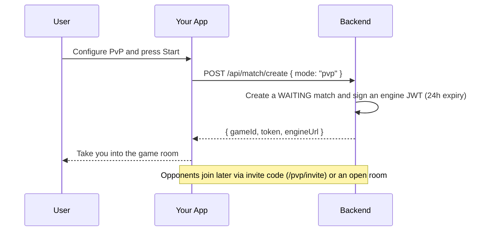
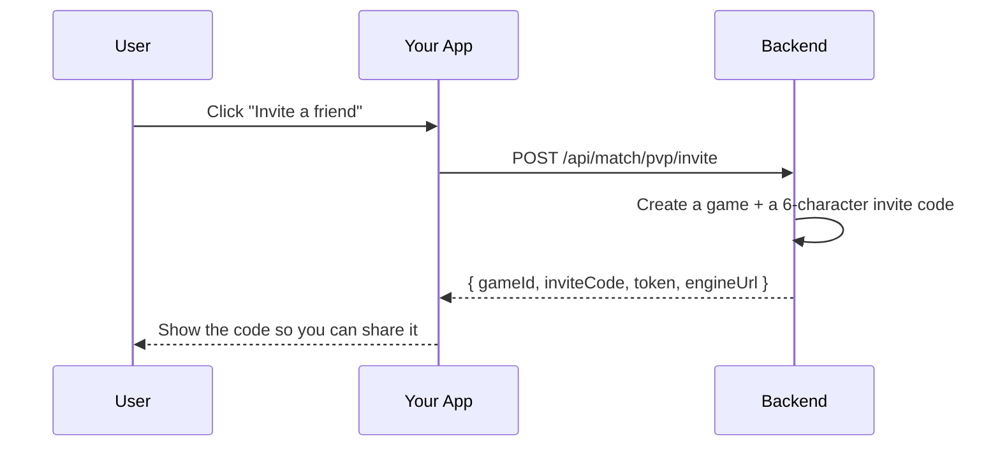
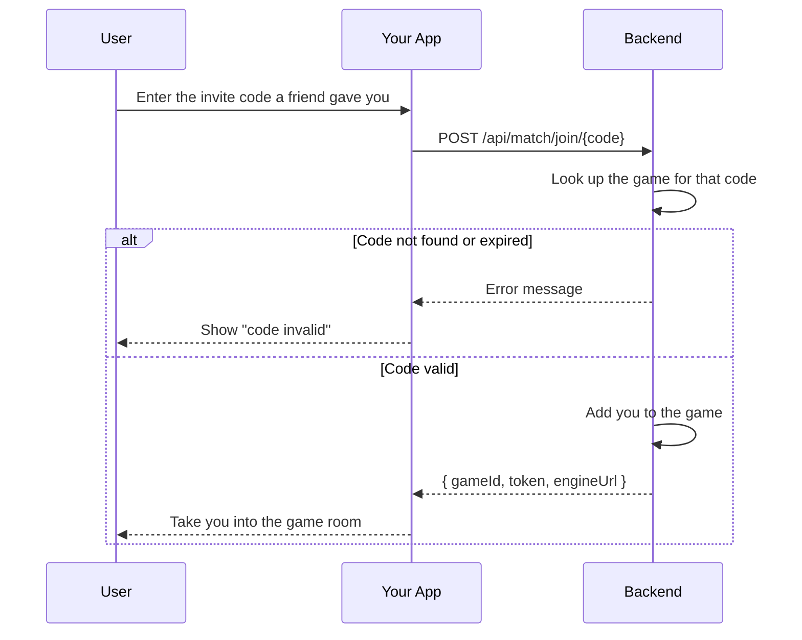
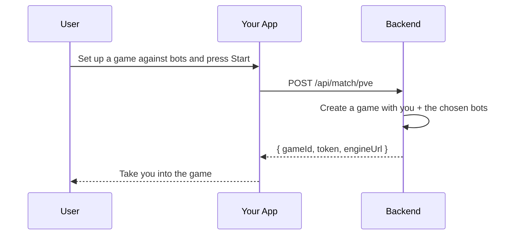

# Match Module

## Table of Contents

- [Overview](#overview) — Matchmaking and the game lifecycle
- [Files](#files) — Every source file in the module and its role
- [Key Types / Interfaces](#key-types--interfaces) — Match creation DTOs and response shapes
- [API Endpoints](#api-endpoints) — Matchmaking endpoints and in-game actions
- [Core Logic / Flow](#core-logic--flow) — Mermaid sequence diagrams for match flows
- [Logic Paths Summary](#logic-paths-summary) — Decision trees for each operation
- [Dependencies](#dependencies) — Internal services this module relies on
- [Configuration / Environment](#configuration--environment) — Redis and engine configuration


---
---


## Overview

The Match module is the bridge between the REST API and the real-time ludo-engine. It handles:

1. **Matchmaking** — creates or joins PvP, PvE, or invite games.
2. **Game lifecycle** — moves the engine's game state through `waiting` → `active` → `finished`, and the match record through `WAITING` → `ACTIVE` → `ABORTED` or `ENDED`.
3. **Room browsing** — `GET /api/games/rooms` lists joinable PvP rooms, and `GET /api/games/mine` lists the rooms you are seated in.

The module uses Redis for short-lived match data (queues, active games) and lets the ludo-engine own the actual game logic over Socket.IO.


---
---


## Files

| File | Role |
|------|------|
| `match.controller.ts` | HTTP routes: matchmaking, game actions, room browsing, engine callbacks |
| `match.service.ts` | Facade — composes the four split services (`MatchCreatorService`, `MatchPlayerService`, `MatchQueryService`, `MatchPostgameService`) and re-exports `ENGINE_WS_URL` |
| `match.creator.service.ts` | Match creation: PvP/PvE/hotseat, invite codes, room joining, bot seeding |
| `match.player.service.ts` | In-game actions: join, rejoin, invite friend, ready, exit, cancel |
| `match.query.service.ts` | Browse queries: open rooms, my rooms |
| `match.postgame.service.ts` | `POST /api/game/end` processing (scoring, ratings, achievements) |
| `match.module.ts` | NestJS module — registers all services, PrismaService |


---
---


## Key Types / Interfaces

### MatchMode

```typescript
type MatchMode = 'pvp' | 'pve' | 'hotseat'
```

### CreateMatchBody

```typescript
{
  mode: 'pvp' | 'pve' | 'hotseat';  // REQUIRED — no silent fallback
  playerCount?: number;      // 2-4 (2 or 4 for PvE)
  botCount?: number;         // 0 - (playerCount-1), PvE only
  botColors?: string[];      // Optional per-bot slot colors
  seatColors?: string[];     // Optional human seat colors
}
```

### MatchResponse

```typescript
{
  gameId: string;            // UUID of the match
  token: string;             // JWT for the Socket.IO handshake
  engineUrl: string;         // Socket.IO endpoint name. Derived from `FRONTEND_URL`
                             // (`ENGINE_WS_URL`, prefix `http` → `ws`). The SPA does not use it
                             // to connect — it connects to its own origin.
  color: string;             // Assigned seat color (server-chosen)
  mode: 'pvp' | 'pve' | 'hotseat';  // Game mode (persisted for refresh/rejoin)
  playerCount: number;       // How many players/seats
  inviteCode?: string;       // 6-char code (invite games only)
}
```


---
---


## API Endpoints

| Method | Path | Auth | Description |
|--------|------|------|-------------|
| `POST` | `/api/match/pvp/invite` | JWT | Create invite-only PvP match |
| `POST` | `/api/match/join/:code` | JWT | Join PvP match by invite code |
| `POST` | `/api/match/pve` | JWT | Start PvE (vs bot) game |
| `POST` | `/api/match/create` | JWT | Unified match creation (mode required: pvp/pve/hotseat) |
| `POST` | `/api/game/:id/ready` | JWT | Signal player is ready |
| `POST` | `/api/game/:id/exit` | JWT | Acknowledge leaving post-game |
| `POST` | `/api/game/:id/abort` | JWT | Cancel unstarted game |
| `POST` | `/api/game/:id/rejoin` | JWT | Rejoin a room after refresh |
| `POST` | `/api/game/:id/invite` | JWT | Invite a friend into a WAITING PvP room |
| `GET` | `/api/games/rooms` | JWT | List open (WAITING PvP) rooms |
| `GET` | `/api/games/mine` | JWT | List rooms the user is seated in |
| `POST` | `/api/game/end` | engine key | Engine callback — process game end (scoring/achievements) |
| `POST` | `/api/game/:id/started` | engine key | Engine callback — mark game started |


---
---


## Seat Finalization (`isSeatFinalized`)

**Source:** `backend/src/match/seat-finalization.ts`

This helper answers one question: can this seat still be rejoined? It is used in two places — `GET /api/games/mine` (stop advertising a match to a departed player) and `POST /api/game/:id/rejoin` (refuse to mint a token for a seat that is gone).

The engine owns the authoritative live game state (`game:{gameId}` hash, field `state`, one JSON blob). A seat whose `PlayerMeta.status` is `exited` (pruned on grace expiry, or removed by End Game) is terminal: the player can never resume that seat, so the backend must stop treating the match as rejoinable for them. `exited` is the only terminal status.

Deliberately **not** terminal:

| Status | Why it can still rejoin |
|--------|-------------------------|
| `disconnected` | The grace window is running; the player can still come back |
| `inactive` | A waiting-room leave, or a seat that has not joined a live game yet |

The helper is fail-open: a missing key, unreadable value, or schema drift returns `false`, which keeps the match advertised rather than locking a legitimate player out.


---
---


## Core Logic / Flow

### 1. Create a PvP Match



### 2. Create Invite Match



### 3. Join by Invite Code



### 4. Start PvE Game




---
---


## Logic Paths Summary

### Create PvP Path
```
POST /api/match/create   (mode: "pvp")
  ├── Validate the mode and the seat counts
  ├── Write the match hash (status WAITING) with a 24h TTL
  ├── Sign the engine JWT for the host seat (`jwt.sign`, 24h expiry)
  └── Return { gameId, token, engineUrl }
```

### Invite Path
```
POST /api/match/pvp/invite
  ├── Generate a 6-character inviteCode
  ├── Write the match hash (status WAITING) with a 24h TTL
  ├── Sign the engine JWT for the host seat
  └── Return { gameId, inviteCode, token, engineUrl }

POST /api/match/join/:code
  ├── SCAN match:* for a room whose inviteCode matches and whose status is WAITING
  │   ├── no match → 404 MATCH_INVITE_INVALID
  │   ├── the caller is the host → 400 MATCH_OWN_INVITE
  │   └── found → seat the player, then return { gameId, token, engineUrl }
```

### PvE Path
```
POST /api/match/pve
  ├── Create the match with the host and the chosen bots
  ├── Write the match hash with status ACTIVE
  ├── Sign the engine JWT for the host seat
  └── Return { gameId, token, engineUrl }
```

### In-Game Actions Path
```
POST /api/game/:id/ready
  └── Mark player ready → return { message, gameId }

POST /api/game/:id/exit
  └── Acknowledge post-game exit → return { message, gameId }

POST /api/game/:id/abort
  └── Cancel WAITING game, notify engine → return { message, gameId }

POST /api/game/:id/rejoin
  ├── Verify the caller holds a seat → else 403 MATCH_NOT_PLAYER
  ├── ACTIVE room whose seat is finalized → 403 MATCH_SEAT_EXPIRED
  └── Clear the reservation flag and mint a fresh engine JWT

GET /api/games/mine
  ├── Scan match:* hashes where the caller is seated
  ├── Skip rooms that are not WAITING or ACTIVE
  └── ACTIVE room whose seat is finalized (isSeatFinalized) → skip, so no
      REJOIN MATCH button is offered for a seat that is gone
```


---
---


## Dependencies

| Dependency | Purpose |
|-----------|---------|
| `PresenceService` | Updates player presence when entering/leaving games |
| `Redis` (ioredis) | Match state, invite codes; match.postgame posts finished-game ratings into `leaderboard:global` (zadd) |
| `PrismaService` | Game history, rating updates, achievement evaluation |
| `JwtService` | Issue JWTs for Socket.IO engine handshake |
| `secrets.ts` | `ENGINE_API_KEY` for validating engine callbacks |


---
---


## Configuration / Environment

| Variable | Default | Used By |
|----------|---------|---------|
| `REDIS_HOST` | `redis` | Redis connection for match state |
| `REDIS_PORT` | `6479` | Redis port |
| `REDIS_PASSWORD` | (from secrets) | Redis authentication |
| `ENGINE_API_KEY` | (from secrets) | Validates `POST /api/game/end` and `/api/game/:id/started` from engine |
| `FRONTEND_URL` | `https://localhost:8443` (from `.env`) | Derives `ENGINE_WS_URL` by replacing `http` with `ws`; required, so the app throws at startup if it is unset |

### Tunable constants

| Constant | File | Default | What it controls |
|----------|------|---------|------------------|
| `SLOT_COLORS` | `match.creator.service.ts`, `match.player.service.ts` | blue, red, green, yellow | Seat order used when creating/joining rooms |
| `ENGINE_WS_URL` | `match.creator.service.ts` | derived from `FRONTEND_URL` | WebSocket URL handed to clients for the ludo-engine |
| `POINTS_PER_PIECE` | `common/scoring.ts` | 2 | Rating points per piece brought home (halved for PvE) |
| `WIN_BONUS_PIECE` | `common/scoring.ts` | 1 | Extra "piece" counted for the winner when scoring |