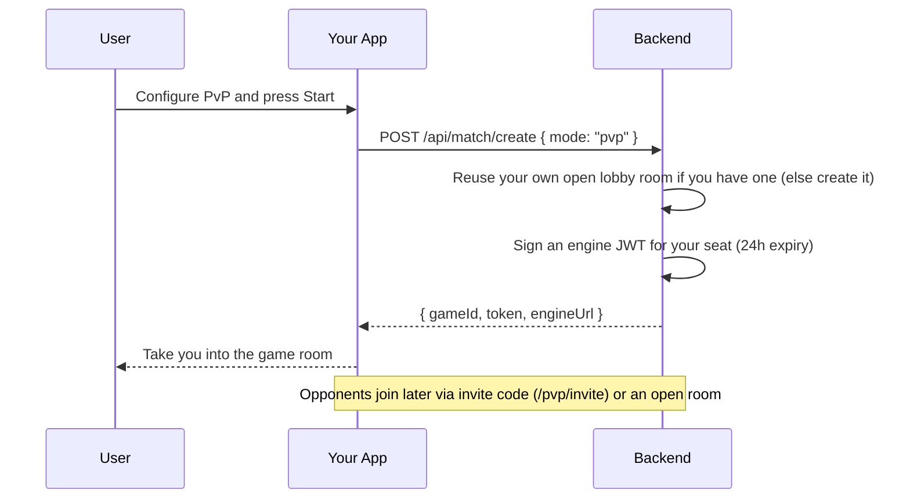
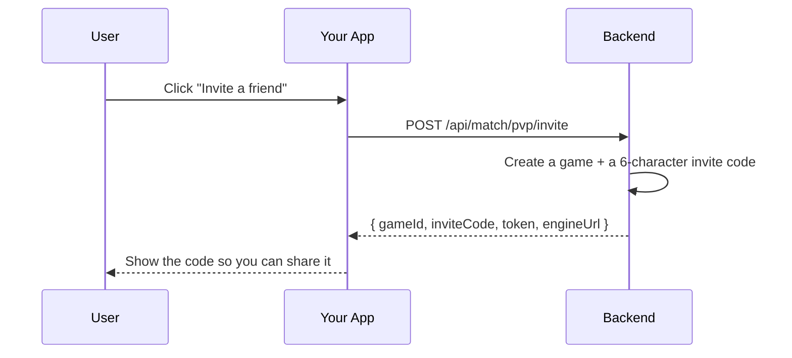
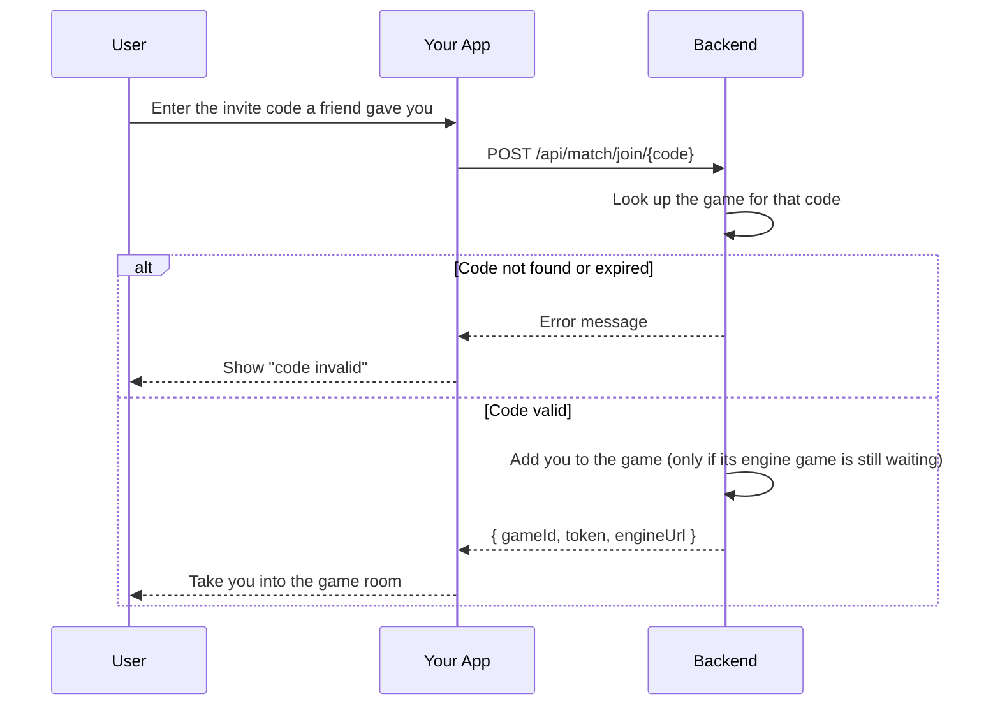
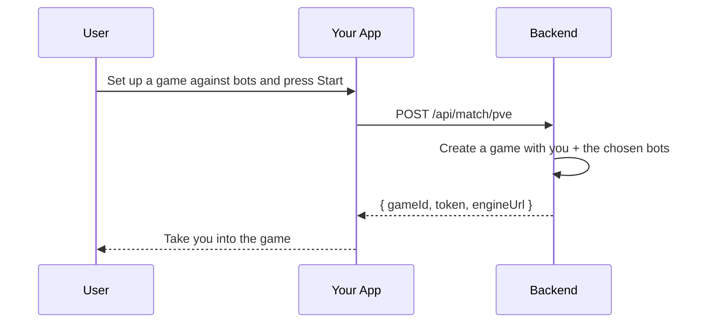

# Match Module

## Table of Contents

- [Overview](#overview) — Matchmaking and the game lifecycle
- [Files](#files) — Every source file in the module and its role
- [Key Types / Interfaces](#key-types--interfaces) — Match creation DTOs and response shapes
- [API Endpoints](#api-endpoints) — Matchmaking endpoints and in-game actions
- [Core Logic / Flow](#core-logic--flow) — Mermaid sequence diagrams for match flows
- [Logic Paths Summary](#logic-paths-summary) — Decision trees for each operation
- [Dependencies](#dependencies) — Internal services this module relies on
- [Configuration / Environment](#configuration--environment) — Redis and engine configuration


---
---


## Overview

The Match module is the bridge between the REST API and the real-time ludo-engine. It handles:

1. **Matchmaking** — creates or joins PvP, PvE, or invite games.
2. **Game lifecycle** — moves the engine's game state through `waiting` → `active` → `finished`, and the match record through `WAITING` → `ACTIVE` → `ABORTED` or `ENDED`.
3. **Room browsing** — `GET /api/games/rooms` lists the PvP rooms you may enter (open lobby rooms, plus your own still-reclaimable seats in games that have already started), and `GET /api/games/mine` lists the rooms you are seated in.

The module uses Redis for short-lived match data (queues, active games) and lets the ludo-engine own the actual game logic over Socket.IO.


---
---


## Files

| File | Role |
|------|------|
| `match.controller.ts` | HTTP routes: matchmaking, game actions, room browsing, engine callbacks |
| `match.service.ts` | Facade — composes the four split services (`MatchCreatorService`, `MatchPlayerService`, `MatchQueryService`, `MatchPostgameService`) and re-exports the `GameEndPayload` type from `match.postgame.service.ts` (`ENGINE_WS_URL` is defined/exported by `match.creator.service.ts`) |
| `match.creator.service.ts` | Match creation: PvP/PvE/hotseat, invite codes, room joining, bot seeding |
| `match.player.service.ts` | In-game actions: join, rejoin, invite friend, ready, exit, cancel |
| `match.query.service.ts` | Browse queries: open rooms, my rooms |
| `match.postgame.service.ts` | `POST /api/game/end` processing (scoring, ratings, achievements) |
| `seat-finalization.ts` | Engine GameState readers — `isSeatFinalized()` (can this seat still be rejoined?) and `isEngineGameStarted()` (has the ready-check already started the game?). Used by `GET /api/games/mine`, `GET /api/games/rooms`, `POST /api/game/:id/rejoin`, `POST /api/match/join/:code`, and the create reuse lookup |
| `engine-token.util.ts` | `signEngineToken()` — signs the game-scoped Socket.IO tokens with `ENGINE_JWT_SECRET` and `aud: 'ludo-engine'` (the single place both mint sites below go through) |
| `match.module.ts` | NestJS module — registers all services, PrismaService |


---
---


## Key Types / Interfaces

### MatchMode

```typescript
type MatchMode = 'pvp' | 'pve' | 'hotseat'
```

### CreateMatchBody

```typescript
{
  mode: 'pvp' | 'pve' | 'hotseat';  // REQUIRED — no silent fallback
  playerCount?: number;      // 2-4 (2 or 4 for PvE)
  botCount?: number;         // 0 - (playerCount-1), PvE only
  botColors?: string[];      // Optional per-bot slot colors
  seatColors?: string[];     // Optional human seat colors
}
```

### InviteFriendBody

```typescript
{
  friendId: string;  // REQUIRED, UUID — validated by class-validator. The route
                     // then requires a both-directions-accepted, unblocked pair.
}
```

### MatchResponse

```typescript
{
  gameId: string;            // UUID of the match
  token: string;             // JWT for the Socket.IO handshake
  engineUrl: string;         // Socket.IO endpoint name. Derived from `FRONTEND_URL`
                             // (`ENGINE_WS_URL`, prefix `http` → `ws`). The SPA does not use it
                             // to connect — it connects to its own origin.
  color: string;             // Assigned seat color (server-chosen)
  mode: 'pvp' | 'pve' | 'hotseat';  // Game mode (persisted for refresh/rejoin)
  playerCount: number;       // How many players/seats
  inviteCode?: string;       // 6-char code (invite games only)
}
```


---
---


## API Endpoints

| Method | Path | Auth | Description |
|--------|------|------|-------------|
| `POST` | `/api/match/pvp/invite` | JWT | Create invite-only PvP match |
| `POST` | `/api/match/join/:code` | JWT | Join PvP match by invite code |
| `POST` | `/api/match/pve` | JWT | Start PvE (vs bot) game |
| `POST` | `/api/match/create` | JWT | Unified match creation (mode required: pvp/pve/hotseat) |
| `POST` | `/api/game/:id/ready` | JWT | Signal player is ready |
| `POST` | `/api/game/:id/exit` | JWT | Acknowledge leaving post-game |
| `POST` | `/api/game/:id/abort` | JWT | Cancel unstarted game |
| `POST` | `/api/game/:id/rejoin` | JWT | Rejoin a room after refresh |
| `POST` | `/api/game/:id/invite` | JWT | Invite a friend into a WAITING PvP room |
| `GET` | `/api/games/rooms` | JWT | List the PvP rooms the caller may enter (open lobby rooms + their own reclaimable seats in started games) |
| `GET` | `/api/games/mine` | JWT | List rooms the user is seated in |
| `POST` | `/api/game/end` | engine key | Engine callback — process game end (scoring/achievements) |
| `POST` | `/api/game/:id/started` | engine key | Engine callback — mark game started |

> **Invite body validation:** `POST /api/game/:id/invite` takes an
> `InviteFriendBody` (`{ friendId }`). `friendId` is validated as a required UUID
> by the global `ValidationPipe`, so an empty or malformed body is rejected at the
> boundary instead of silently skipping the friendship check. The handler then
> requires one friendship pair row where both directions are `accepted` and
> neither is `blocked`, reusing the shared `friendship-pair.ts` predicates.


---
---


## Engine GameState Readers (`seat-finalization.ts`)

**Source:** `backend/src/match/seat-finalization.ts`

Both helpers read the engine's own live state instead of trusting the `match:*` hash, because the hash can lag behind the engine (and, before the guards below existed, a duplicate create could rewrite a live `ACTIVE` room back to `WAITING`).

### `isSeatFinalized(redis, gameId, color)`

This helper answers one question: can this seat still be rejoined? It is used in three places — `GET /api/games/mine` (stop advertising a match to a departed player), `GET /api/games/rooms` (stop offering a rejoin row for a seat the engine is done with) and `POST /api/game/:id/rejoin` (refuse to mint a token for a seat that is gone). It is evaluated on the caller's seat regardless of the hash status, because a `WAITING` room has engine state too.

The engine owns the authoritative live game state (`game:{gameId}` hash, field `state`, one JSON blob). A seat whose `PlayerMeta.status` is `exited` (pruned on grace expiry, or removed by End Game) is terminal: the player can never resume that seat, so the backend must stop treating the match as rejoinable for them. `exited` is the only terminal status.

Deliberately **not** terminal:

| Status | Why it can still rejoin |
|--------|-------------------------|
| `disconnected` | The grace window (45 s) is running; the player can still come back |
| `inactive` | A waiting-room leave, or a seat that has not joined a live game yet |

The helper is fail-open: a missing key, unreadable value, or schema drift returns `false`, which keeps the match advertised rather than locking a legitimate player out.

### `isEngineGameStarted(redis, gameId)`

Answers: has the engine's ready-check already started this game? A room is only a lobby until then, and a game that has started accepts no new seats.

- `GET /api/games/rooms` uses it to keep started rooms out of the joinable list for every viewer who does not hold a seat in them (the hash status alone is not enough: a room whose hash was rewritten back to `WAITING` is still a running game).
- `POST /api/match/join/:code` → `MatchPlayerService.joinMatch()` re-checks it, so a stale hash cannot be used to seat a new player into a running game.

It reports `true` for any engine status other than `waiting` and `false` when the engine has no state yet (a pure lobby room) — the same fail-open policy as `isSeatFinalized`.

> The holes these gates closed, and the socket rules that depend on them, are in [`../architecture.md`](../architecture.md) → Security & Threat Model.


---
---


## Core Logic / Flow

### 1. Create a PvP Match


```mermaid
sequenceDiagram
    participant User
    participant Site as Your App
    participant Server as Backend

    User->>Site: Configure PvP and press Start
    Site->>Server: POST /api/match/create { mode: "pvp" }
    Server->>Server: Reuse your own open lobby room if you have one (else create it)
    Server->>Server: Sign an engine JWT for your seat (24h expiry)
    Server-->>Site: { gameId, token, engineUrl }
    Site-->>User: Take you into the game room
    Note over Site,Server: Opponents join later via invite code (/pvp/invite) or an open room
```

### 2. Create Invite Match


```mermaid
sequenceDiagram
    participant User
    participant Site as Your App
    participant Server as Backend

    User->>Site: Click "Invite a friend"
    Site->>Server: POST /api/match/pvp/invite
    Server->>Server: Create a game + a 6-character invite code
    Server-->>Site: { gameId, inviteCode, token, engineUrl }
    Site-->>User: Show the code so you can share it
```

### 3. Join by Invite Code


```mermaid
sequenceDiagram
    participant User
    participant Site as Your App
    participant Server as Backend

    User->>Site: Enter the invite code a friend gave you
    Site->>Server: POST /api/match/join/{code}
    Server->>Server: Look up the game for that code
    alt Code not found or expired
        Server-->>Site: Error message
        Site-->>User: Show "code invalid"
    else Code valid
        Server->>Server: Add you to the game (only if its engine game is still waiting)
        Server-->>Site: { gameId, token, engineUrl }
        Site-->>User: Take you into the game room
    end
```

### 4. Start PvE Game


```mermaid
sequenceDiagram
    participant User
    participant Site as Your App
    participant Server as Backend

    User->>Site: Set up a game against bots and press Start
    Site->>Server: POST /api/match/pve
    Server->>Server: Create a game with you + the chosen bots
    Server-->>Site: { gameId, token, engineUrl }
    Site-->>User: Take you into the game
```


---
---


## Logic Paths Summary

### Create PvP Path
```
POST /api/match/create   (mode: "pvp")
  ├── Validate the mode and the seat counts
  ├── Reuse lookup: does the caller already sit in one of their own PvP rooms?
  │   ├── hash WAITING + engine game not started + their seat not finalized
  │   │   → hand back that room and their EXISTING seat (colour, role,
  │   │     inviteCode, playerCount) and write nothing to the hash
  │   └── otherwise → create a fresh room below. A started game is never
  │       reused: the player keeps ghosting in it (or keeps its 45 s
  │       reclaimable seat) and may start or join something else meanwhile
  ├── Write the match hash (status WAITING) with a 24h TTL
  ├── Sign the engine JWT for the host seat (`jwt.sign`, 24h expiry)
  └── Return { gameId, token, engineUrl }
```

### Invite Path
```
POST /api/match/pvp/invite
  ├── Same create-or-reuse path as above (host seat, inviteCode on create)
  └── Return { gameId, inviteCode, token, engineUrl }

POST /api/match/join/:code
  ├── SCAN match:* for a room whose inviteCode matches and whose status is WAITING
  │   ├── no match → 404 MATCH_INVITE_INVALID
  │   ├── the caller is the host → 400 MATCH_OWN_INVITE
  │   └── found → joinMatch (see In-Game Actions Path)
```

### PvE Path
```
POST /api/match/pve
  ├── Create the match with the host and the chosen bots
  ├── Write the match hash with status ACTIVE
  ├── Sign the engine JWT for the host seat
  └── Return { gameId, token, engineUrl }
```

### In-Game Actions Path
```
POST /api/game/:id/ready
  └── Mark player ready → return { message, gameId }

POST /api/game/:id/exit
  └── Acknowledge post-game exit → return { message, gameId }

POST /api/game/:id/abort
  └── Cancel WAITING game, notify engine → return { message, gameId }

POST /api/game/:id/rejoin
  ├── Verify the caller holds a seat → else 403 MATCH_NOT_PLAYER
  ├── Their seat is finalized (isSeatFinalized, any hash status) → 403 MATCH_SEAT_EXPIRED
  └── Clear the reservation flag and mint a fresh engine JWT

POST /api/match/join/:code → joinMatch
  ├── The caller already holds a seat → hand back that seat (rejoin rules above)
  ├── hash status is not WAITING → 403 MATCH_ALREADY_STARTED
  ├── the engine has already started the game → 403 MATCH_ALREADY_STARTED
  ├── not a PvP room → 403 MATCH_PVP_ONLY_JOIN
  ├── room full → 403 MATCH_ROOM_FULL
  └── Seat the caller in the next free slot → return { gameId, token, engineUrl }

GET /api/games/mine
  ├── Scan match:* hashes where the caller is seated
  ├── Skip rooms that are not WAITING or ACTIVE
  └── Their seat is finalized (isSeatFinalized, any status) → skip, so no
      REJOIN MATCH button is offered for a seat that is gone

GET /api/games/rooms
  ├── Scan match:* hashes (WAITING or ACTIVE, PvP)
  ├── The caller holds a seat in the room → REJOIN row
  │   ├── their seat is finalized → skip (nothing left to rejoin)
  │   └── otherwise list it even when the game is live or the room is full
  ├── The caller holds no seat → JOIN row
  │   ├── hash status ACTIVE, or the engine has started the game → skip
  │   │   (a started room is visible only to its own reclaimable seats)
  │   └── room full → skip
  └── Every row carries mySeat, so the lobby knows to rejoin instead of join
```


---
---


## Dependencies

| Dependency | Purpose |
|-----------|---------|
| `Redis` (ioredis) | Match state, invite codes; match.postgame posts finished-game ratings into `leaderboard:global` (zadd) |
| `PrismaService` | Game history, rating updates, achievement evaluation |
| `NotificationService` | `game_invite` / `match_cancelled` / `match_finished` pushes to the seated players |
| `AchievementsService` | Achievement evaluation after a game ends (`match.postgame`) |
| `JwtService` | Host for the engine-token signer (`engine-token.util.ts` overrides the secret per call, so the module's own `JWT_SECRET` is not what signs match tokens) |
| `secrets.ts` | `ENGINE_API_KEY` (validating engine callbacks) and `ENGINE_JWT_SECRET` (signing engine tokens) |

> Presence is **not** a match dependency: no `match.*` service imports `PresenceService`.
> Presence is driven entirely by the client's `POST /api/presence/heartbeat` (see `backend-presence-module.md`).


---
---


## Configuration / Environment

| Variable | Default | Used By |
|----------|---------|---------|
| `REDIS_HOST` | `redis` | Redis connection for match state |
| `REDIS_PORT` | `6479` | Redis port |
| `REDIS_PASSWORD` | (from secrets) | Redis authentication |
| `ENGINE_API_KEY` | (from secrets) | Validates `POST /api/game/end` and `/api/game/:id/started` from engine |
| `ENGINE_JWT_SECRET` | (from secrets) | Signs the Socket.IO engine tokens handed to clients (`signEngineToken`, `engine-token.util.ts`) — separate from the session `JWT_SECRET` so one leaked key cannot forge the other token family. Required: the preflight rejects a build without it |
| `FRONTEND_URL` | `https://localhost:8443` (from `.env`) | Derives `ENGINE_WS_URL` by replacing `http` with `ws`; required, so the app throws at startup if it is unset |

### Tunable constants

| Constant | File | Default | What it controls |
|----------|------|---------|------------------|
| `SLOT_COLORS` | `match.creator.service.ts`, `match.player.service.ts` | blue, red, green, yellow | Seat order used when creating/joining rooms |
| `ENGINE_WS_URL` | `match.creator.service.ts` | derived from `FRONTEND_URL` | WebSocket URL handed to clients for the ludo-engine |
| `POINTS_PER_PIECE` | `common/scoring.ts` | 2 | Rating points per piece brought home (halved for PvE) |
| `WIN_BONUS_PIECE` | `common/scoring.ts` | 1 | Extra "piece" counted for the winner when scoring |