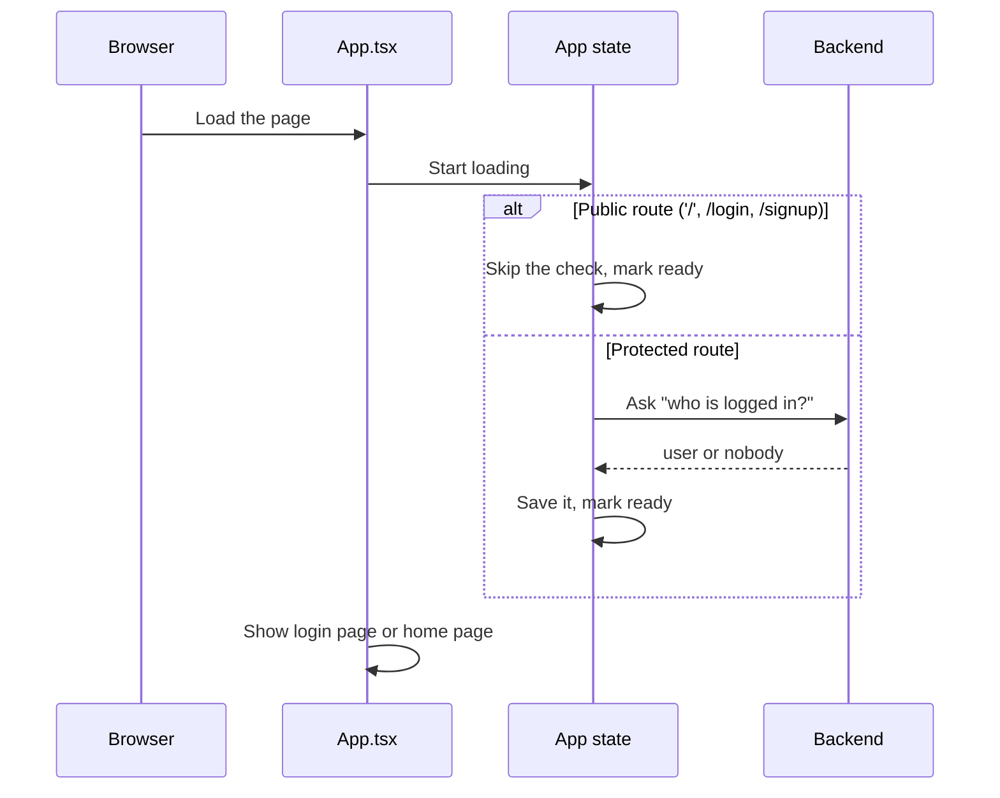

# Frontend — App Bootstrap

## Table of Contents

- [Overview](#overview) — Root app component, route categories and authentication guard logic
- [Files](#files) — Source file inventory
- [Key Types / Interfaces](#key-types--interfaces) — Route categories and AppProvider shape
- [Core Logic / Flow](#core-logic--flow) — Mermaid sequence diagram of bootstrap and routing flow
- [Logic Paths Summary](#logic-paths-summary) — Decision trees for route rendering and redirects
- [Dependencies](#dependencies) — Internal and external dependencies


---
---


## Overview

The app bootstrap layer does four things:

1. **Route maps** — `FULL_ROUTES` maps every path to its page; all routes render full-screen.
2. **Authentication guard** — sends signed-out users to `/login` and signed-in users away from public routes. Account-action routes (email verification, password reset, 2FA (two-factor authentication)) are the exception: they must stay reachable even when another account is signed in.
3. **Session bootstrap** — `AppProvider` calls `/api/auth/me` on page load to see if the user is already logged in. The probe is skipped on the guest-facing public routes (`/`, `/login`, `/signup`), where there cannot be a session to restore.
4. **full-screen rendering** — every route renders directly via `FULL_ROUTES`; there is no shell layout wrapper.


---
---


## Files

| File | Role |
|------|------|
| `src/App.tsx` | Root component — route maps, authentication guard, AppProvider container |
| `src/store.tsx` | `AppProvider` context — session state, login/register/logout/2FA/password-reset actions, game state |


---
---


## Key Types / Interfaces


---
---


### Route Categories

```typescript
/** All routes render full-screen. */
const FULL_ROUTES: Record<string, () => ReactNode> = {
  '/home': () => <Home />,
  '/leaderboard': () => <Leaderboard />,
  '/friends': () => <Friends />,
  '/profile': () => <Profile />,
  '/login': () => <Login />,
  '/signup': () => <Signup />,
  '/2fa': () => <TwoFactor />,
  '/forgot-password': () => <ForgotPassword />,
  '/reset-password': () => <ResetPassword />,
  '/gamelobby': () => <LudoLobby />,
  '/gamelobby/table': () => <Lobby />,
  '/game': () => <Game />,
  '/privacy': () => <LegalPage initialDoc="privacy" />,
  '/terms': () => <LegalPage initialDoc="terms" />,
  // '/results': () => <Results />,
}

/** Public routes, can be reached without a session */
const PUBLIC_ROUTES = new Set([
  '/login', '/signup', '/2fa',
  '/forgot-password', '/reset-password',
  '/privacy', '/terms'
])
```


---
---


### AppProvider State

```typescript
type AppState = {
  user: AuthUser | null  // The logged-in user
  authReady: boolean  // Whether the sign-in state has loaded
  // Auth actions
  login: (identifier: string, password: string) => Promise<{ error?: string; pendingToken?: string }>  // Logs the user in
  register: (username: string, password: string, email: string) => Promise<string | null>  // Creates a new account
  verify2fa: (pendingToken: string, code: string) => Promise<string | null>  // Checks the 2FA code
  forgotPassword: (email: string) => Promise<string | null>  // Requests a password reset
  resetPassword: (token: string, password: string) => Promise<string | null>  // Sets a new password
  logout: () => Promise<void>  // Logs the user out
  // 2FA preference
  twoFactor: boolean  // Whether 2FA is on
  toggleTwoFactor: () => void  // Turns 2FA on/off
  // Game setup state
  playerCount: 2 | 3 | 4  // How many players
  seats: Seat[]          // { you | bot | player | empty }
  dice: number  // Current dice value
  rolling: boolean  // Whether the dice is animating
  turn: number  // Whose turn (index)
  settings: Record<string, boolean>  // Game settings (sound, music and others)
  setPlayerCount: (n: PlayerCount) => void  // Changes the player count
  addBot: (i: number) => void  // Adds a bot to a seat
  removeBot: (i: number) => void  // Removes a bot from a seat
  addPlayer: (i: number) => void  // Adds a human player to a seat
  removePlayer: (i: number) => void  // Removes a player from a seat
  renamePlayer: (i: number, name: string) => void  // Renames a seat
  resetSeats: () => void  // Clears every seat but the host
  startGame: () => boolean  // Starts the game
  roll: () => void  // Rolls the dice
  endTurn: () => void  // Passes the turn
  settingOn: (key: string) => boolean  // Checks if a setting is on
  toggleSetting: (key: string) => void  // Flips a setting
  // Real-time match
  activeMatch: ActiveMatch | null   // from POST /api/match/create
  setActiveMatch: (m: ActiveMatch | null) => void  // Updates the current match
  lastResult: LastResult | null     // finished-match data for the Results view
  setLastResult: (r: LastResult | null) => void  // Saves finished match results
  // Theme
  theme: ThemeType  // Current theme (synthwave, persisted as retro_theme)
  setTheme: (t: ThemeType) => void  // Changes the theme
  // Language
  lang: Lang  // Selected language
  setLang: (l: Lang) => void  // Changes the language
  // Presence
  setPlaying: (playing: boolean) => void  // Marks the user as in-game
}
```


---
---


## Core Logic / Flow


---
---


### Bootstrap and Routing

Sequence of steps from page load to rendered route.



---
---


## Logic Paths Summary


---
---


### Initial Load Path
```
Browser load
  └── App mounts AppProvider
       ├── path is '/', '/login', or '/signup' → skip the check, setAuthReady(true)
       └── otherwise fetch('/api/auth/me')
            ├── 200 → setUser(user), setAuthReady(true)
            ├── 401/403 → setUser(null), setAuthReady(true)
            └── 429/5xx/network → retry (backoff), then setAuthReady(true)
```


---
---


### Route Guard Path
```
useEffect([authReady, known, user, isPublic, hasNotice])
  ├── authReady = false → return null
  ├── !known → navigate(user ? '/home' : '/login')
  ├── !user && !isPublic → navigate('/login')
  ├── user && isPublic && !hasNotice → navigate('/home')
  └── else → render route component
```


---
---


### Account-action notices

Account-action arrivals (`?verified=...`, `?reset=...`, `?error=...`, `?token=...`) are tied to one account action, not to the signed-in session, so a signed-in user must still see them instead of being sent to `/home`. `Screen` therefore treats any route carrying one of those query keys as exempt from the "signed-in users leave public routes" redirect — for example, verifying (or resetting) account B while account A happens to be signed in in the same browser.


---
---


## Dependencies

| Dependency | Purpose |
|-----------|---------|
| `store.tsx` | `AppProvider`, `useApp`, `AuthUser`, all auth and game actions |
| `router.tsx` | `useRoute`, `navigate` |
| full-screen pages | `Home`, `Leaderboard`, `Friends`, `Profile`, `Login`, `Signup`, `TwoFactor`, `ForgotPassword`, `ResetPassword`, `LudoLobby`, `Lobby`, `Game`, `Results` |