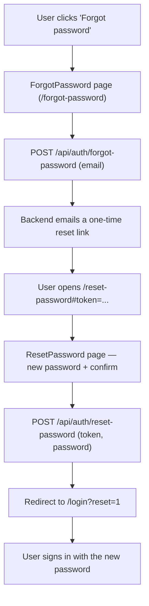
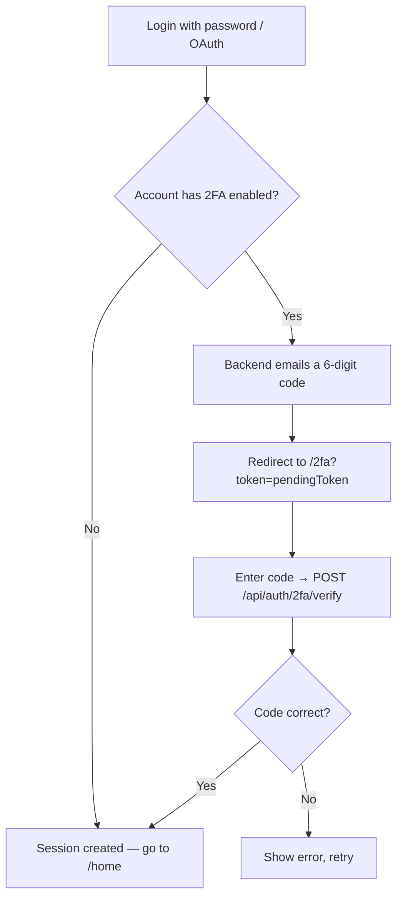
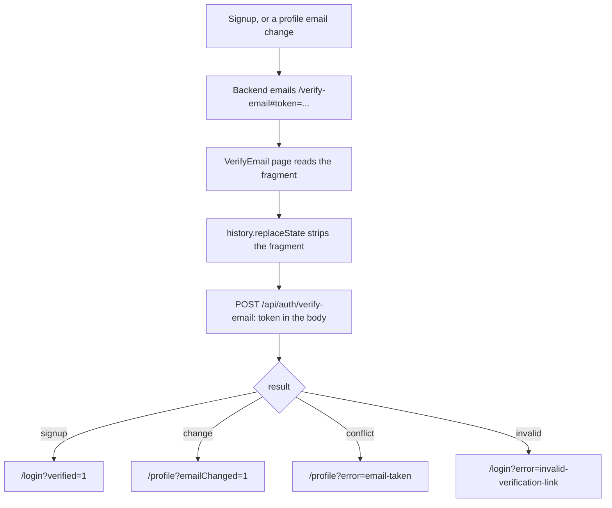

# Frontend: Auth Extras (2FA, Password Reset, Email Verification)

## Table of Contents

- [Overview](#overview): Two-factor authentication, password reset, and email-verification landing pages
- [Files](#files) — Source file inventory
- [Pages](#pages) — Individual page descriptions


---
---


## Overview

These pages handle the steps that happen after the password check:

1. **TwoFactor** (`/2fa`) — 6-digit code entry after password login or OAuth (Open Authorization), when two-factor authentication (2FA) is enabled.
2. **ForgotPassword** (`/forgot-password`) — password reset step one: collect an email and request a reset link.
3. **ResetPassword** (`/reset-password`) — password reset step two: use the emailed token to set a new password.
4. **VerifyEmail** (`/verify-email`): landing page for the emailed verification link. Redeems the token and routes on the outcome.

All four are full-screen routes (no side rail) and are public, so no session is required.


---
---


## Files

| File | Role |
|------|------|
| `src/pages/TwoFactor.tsx` | 2FA code entry page |
| `src/pages/ForgotPassword.tsx` | Password reset step 1 — email input |
| `src/pages/ResetPassword.tsx` | Password reset step 2 — new password form |
| `src/pages/VerifyEmail.tsx` | Emailed-link landing page: reads the token from the URL fragment, strips it, redeems it |
| `src/components/RetroAuthLayout.tsx` | Layout container for all auth pages |
| `src/store.tsx` | `verify2fa`, `resend2fa`, `forgotPassword`, `resetPassword`, `verifyEmail` actions |
| `src/validatePassword.ts` | Client-side password validation (same rules as the backend policy) |


---
---


## Pages


---
---


### TwoFactor (`/2fa`)

Reached with `?token=<pendingToken>` after password login or OAuth when the account has 2FA enabled.

- Shows a 6-digit code input (numeric, focused automatically).
- Calls `POST /api/auth/2fa/verify` with `pendingToken` and `code`.
- On success, navigates to `/home`.
- On failure, shows an error message.
- A **"Regenerate code"** button re-issues a fresh code for the same challenge via `POST /api/auth/2fa/resend` (the previous code is invalidated); the per-user cap is 3/hour, over which the route returns `429 AUTH_CODE_RESEND_LOCKED`.

**Route params:** the `token` query parameter holds the `pendingToken` from the login response.


---
---


### Password reset flow




---
---


### 2FA flow




---
---


### ForgotPassword (`/forgot-password`)

Step one of password reset.

- Email input with validation.
- Calls `POST /api/auth/forgot-password` with the email.
- Always shows the same success message, so it never reveals whether an address is registered.
- On success, shows "check your inbox" confirmation with a link back to `/login`.


---
---


### ResetPassword (`/reset-password`)

Step two of password reset.

- Reached from the emailed link: `/reset-password#token=<resetToken>`. The token travels in the URL **fragment**, not the query string, so it is never sent to the server.
- New password + confirm password fields.
- Validates password against the same policy as signup (12+ chars, upper, lower, number, special).
- Calls `POST /api/auth/reset-password` with `token` and `password`.
- On success, navigates to `/login?reset=1`.
- If the fragment carries no `token`, shows an "invalid reset link" error.

**URL fragment:** the `token` fragment parameter holds the 64-character hexadecimal reset token from the email. The page reads it on the first render, strips it with `history.replaceState`, and then sends it in the body of `POST /api/auth/reset-password`.


---
---


### VerifyEmail (`/verify-email`)

Landing page for the emailed verification link: both the signup link and the email-change link point here.

- Reached from the emailed link: `/verify-email#token=<verifyToken>`. The token travels in the URL **fragment**, not the query string.
- Reads `window.location.hash` on the first render, then calls `history.replaceState` to strip the fragment *before* the request, so the token cannot stay in browser history or appear in a later navigation.
- Calls `POST /api/auth/verify-email` with the token in the **request body** (via the store's `verifyEmail` action). Fragments are never sent to the server, so the token cannot reach nginx's access or error log; the same property protects single-use tokens from mail clients that prefetch links.
- Routes on the returned `result`: `signup` → `/login?verified=1`, `change` → `/profile?emailChanged=1`, `conflict` → `/profile?error=email-taken`, `invalid` → `/login?error=invalid-verification-link`.
- If the fragment is missing (some clients strip them), shows the invalid-link notice with a link to `/login`.
- If the request itself fails, the token was **not** consumed: the page keeps it in memory and offers **Try again**, instead of sending the user back to their inbox.
- A `useRef` guard keeps the redemption from running twice: React `StrictMode` double-invokes effects in development, and a second `POST` would come back `invalid` and race the first navigation.

**Route params:** the `token` **fragment** holds the 64-character hexadecimal verification token from the email. Note this page is also listed in `ACCOUNT_ACTION_ROUTES` (`src/App.tsx`) so that an already-signed-in user, the normal case for an email-change link, is not bounced to `/home` by the route guard.


---
---


### Email verification flow




---
---


## Password Policy

Both pages enforce the same policy as registration:

```typescript
// frontend/src/validatePassword.ts — mirror of backend dto/password.rules.ts
const PASSWORD_MIN = 12;
const PASSWORD_MAX = 72;
const PASSWORD_REGEX = /^(?=.*[a-z])(?=.*[A-Z])(?=.*\d)(?=.*[^A-Za-z0-9]).+$/;

export function passwordError(pw: string): string | null {
  if (pw.length < PASSWORD_MIN) return `Password must be at least ${PASSWORD_MIN} characters`;
  if (pw.length > PASSWORD_MAX) return `Password must be at most ${PASSWORD_MAX} characters`;
  if (!PASSWORD_REGEX.test(pw))
    return 'Password needs an uppercase letter, a lowercase letter, a number, and a special character';
  return null;
}
```


---
---


## Page Notes

- **ForgotPassword** collects an email and asks the backend to send a reset link. The confirmation screen always appears: the backend never reveals whether the address is registered, and neither does the page.
- **ResetPassword** is reached from the emailed link, which carries the token in the URL fragment (`/reset-password#token=<resetToken>`). It validates the new password against the same policy as signup (`validatePassword.ts`); on success it sends the user to `/login`. Redeeming the link also marks the address as verified, so an account that had not verified yet can sign in afterwards.
- **TwoFactor** is reached in two ways, both with `?token=<pendingToken>`: from `Login.tsx` after the password step succeeds, or from the backend's OAuth callback after it emails the code.


---
---


## Dependencies

| Dependency | Purpose |
|-----------|---------|
| `store.tsx` | `verify2fa`, `resend2fa`, `forgotPassword`, `resetPassword` actions |
| `router.tsx` | `navigate`, `useRoute` for token query params |
| `validatePassword.ts` | Client-side password validation |
| `RetroAuthLayout.tsx` | Centered card layout wrapper |
| `styles/tw.ts` | `RETRO_AUTH_*` class constants (title, input, label, button, error, link) |
