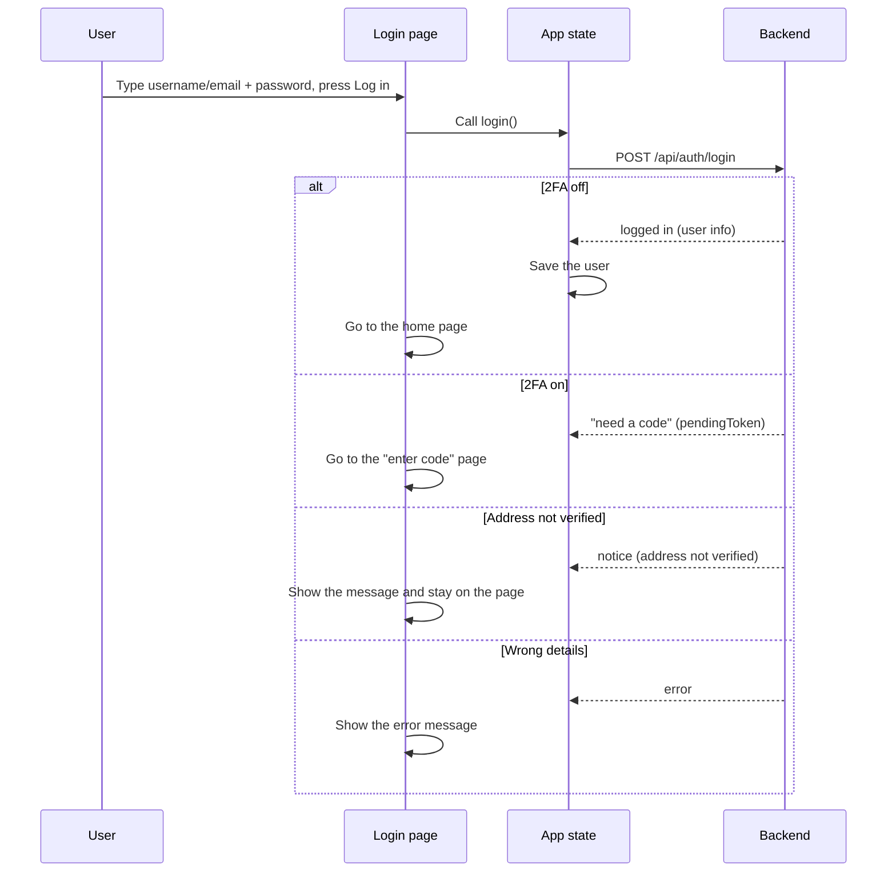
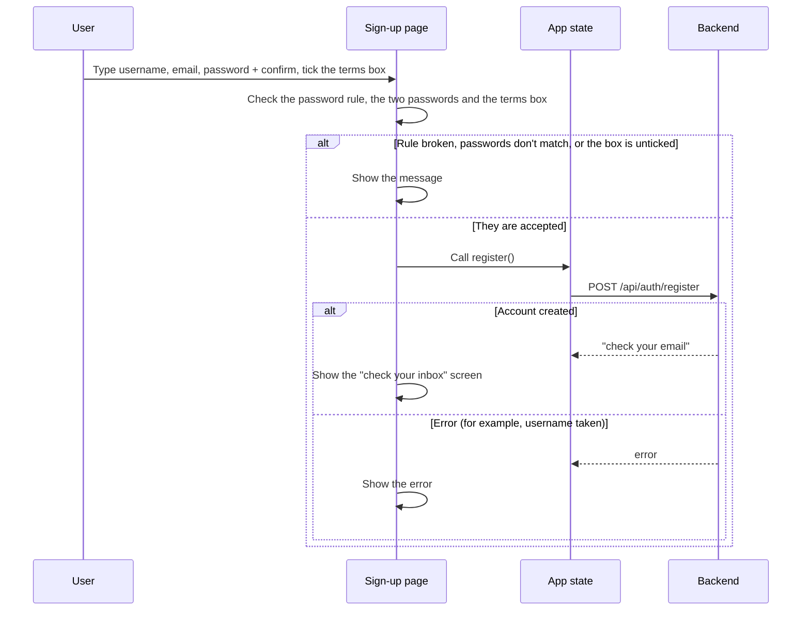
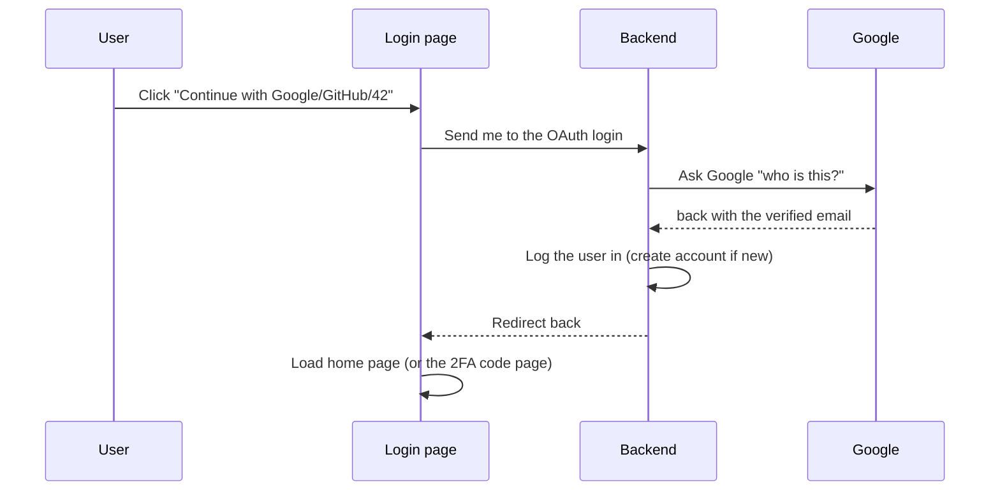

# Frontend — Auth Pages (Login & Signup)

## Table of Contents

- [Overview](#overview) — Login and signup forms with OAuth integration and 2FA
- [Files](#files) — Source file inventory
- [Key Types / Interfaces](#key-types--interfaces) — Form state and validation shapes
- [Core Logic / Flow](#core-logic--flow) — Mermaid sequence diagrams for login and signup flows
- [Logic Paths Summary](#logic-paths-summary) — Decision trees for form submission
- [Dependencies](#dependencies) — Internal and external dependencies


---
---


## Overview

These pages are the entry point to the app. They are:

1. **Login** — identifier (username or email), password, OAuth (Open Authorization) buttons, and two-factor authentication (2FA) support. It also shows one-shot notices carried in the query string (`verified`, `reset`, `error`) that arrive from email links and OAuth callbacks.
2. **Signup** — username, email and password fields, a confirm-password field that must match, and a terms tick that must be checked before the form submits. Its link opens the legal popup. On success the form is replaced by a "check your inbox" confirmation screen, which also shows the username assigned to the new account.

Both pages use the `RetroAuthLayout` container and share the same styling: the retro/cyber theme and the provider buttons.

Login shows the brand title and the tagline from `authExtra.brandTitle` and `authExtra.brandTagline`, so its header follows the selected language. The other auth pages keep their own headings.


---
---


## Files

| File | Role |
|------|------|
| `src/pages/Login.tsx` | Login form — identifier, password, OAuth buttons, 2FA redirect |
| `src/pages/Signup.tsx` | Signup form — username, email, password, confirm password |
| `src/pages/TwoFactor.tsx` | 2FA code entry |
| `src/pages/ForgotPassword.tsx` | Password reset — step 1 (request link) |
| `src/pages/ResetPassword.tsx` | Password reset — step 2 (set new password) |
| `src/components/RetroAuthLayout.tsx` | Layout wrapper — logo, tagline, centered card (imports `GRID_BACKGROUND` from `styles/tw.ts`); also exports `NeonCheck`, the terms-tick glyph |
| `src/components/OAuthButtons.tsx` | 42, GitHub, Google provider buttons |
| `src/validatePassword.ts` | Client-side password-policy check (`passwordError`) |
| `src/validateEmail.ts` | Loose client-side email-format check (`isValidEmail`) |


---
---


## Key Types / Interfaces

### Login Form State

```typescript
const [identifier, setIdentifier] = useState('')
const [password, setPassword] = useState('')
const [error, setError] = useState<string | null>(null)
const [submitting, setSubmitting] = useState(false)
const [notVerified, setNotVerified] = useState(false)     // shows the resend-verification link
const [resendNotice, setResendNotice] = useState<string | null>(null)
const [resending, setResending] = useState(false)
```

### Signup Form State

```typescript
const [username, setUsername] = useState('')
const [email, setEmail] = useState('')
const [password, setPassword] = useState('')
const [confirm, setConfirm] = useState('')
const [error, setError] = useState<string | null>(null)
const [submitting, setSubmitting] = useState(false)
const [agreed, setAgreed] = useState(false)
const [legalOpen, setLegalOpen] = useState(false)
```

### Validation Rules

| Field | Rule |
|-------|------|
| Username | Required. The backend enforces 3-20 chars, alphanumeric + underscore only; the signup form does not validate it client-side. |
| Email | Required, valid email format (`isValidEmail`, a loose mirror of the backend `@IsEmail()`; used for verification and 2FA) |
| Password | Required, 12-72 chars, must contain uppercase, lowercase, number, and special character (`passwordError`) |
| Confirm | Must match password |
| Agree | Must be ticked before the form submits; its link opens the legal popup |


---
---


## Core Logic / Flow

### 1. Login Flow

Sequence of steps when a user logs in, with or without 2FA.

```mermaid
sequenceDiagram
    participant User
    participant Login as Login page
    participant Store as App state
    participant API as Backend

    User->>Login: Type username/email + password, press Log in
    Login->>Store: Call login()
    Store->>API: POST /api/auth/login
    alt 2FA off
        API-->>Store: logged in (user info)
        Store->>Store: Save the user
        Login->>Login: Go to the home page
    else 2FA on
        API-->>Store: "need a code" (pendingToken)
        Login->>Login: Go to the "enter code" page
    else Address not verified
        API-->>Store: notice (address not verified)
        Login->>Login: Show the message and stay on the page
    else Wrong details
        API-->>Store: error
        Login->>Login: Show the error message
    end
```

### 2. Signup Flow

Sequence of steps when a user creates an account. The backend sends a verification email and returns no session; the page then swaps the form for a confirmation screen.

```mermaid
sequenceDiagram
    participant User
    participant Signup as Sign-up page
    participant Store as App state
    participant API as Backend

    User->>Signup: Type username, email, password + confirm, tick the terms box
    Signup->>Signup: Check the password rule, the two passwords and the terms box
    alt Rule broken, passwords don't match, or the box is unticked
        Signup->>Signup: Show the message
    else They are accepted
        Signup->>Store: Call register()
        Store->>API: POST /api/auth/register
        alt Account created
            API-->>Store: "check your email"
            Signup->>Signup: Show the "check your inbox" screen
        else Error (for example, username taken)
            API-->>Store: error
            Signup->>Signup: Show the error
        end
    end
```

### 3. OAuth Flow

Sequence of steps when a user clicks a provider button.

```mermaid
sequenceDiagram
    participant User
    participant Login as Login page
    participant API as Backend
    participant Google

    User->>Login: Click "Continue with Google/GitHub/42"
    Login->>API: Send me to the OAuth login
    API->>Google: Ask Google "who is this?"
    Google-->>API: back with the verified email
    API->>API: Log the user in (create account if new)
    API-->>Login: Redirect back
    Login->>Login: Load home page (or the 2FA code page)
```


---
---


## Logic Paths Summary

### Login Path
```
onSubmit(e)
  ├── e.preventDefault()
  ├── If submitting → return
  ├── login(identifier, password)
  │   ├── POST /api/auth/login
  │   │   ├── 200 + twoFactorRequired=false → setUser(user), return {}
  │   │   ├── 200 + twoFactorRequired=true → return { pendingToken }
  │   │   ├── 200 + code=AUTH_EMAIL_NOT_VERIFIED → return { error, notVerified: true }
  │   │   └── error → return { error }
  ├── setNotVerified(!!result.notVerified)   (unlocks the "resend verification" link)
  ├── If result.error → setError(message)
  ├── Else if result.pendingToken → navigate('/2fa?token=' + result.pendingToken)
  ├── Else → navigate('/home')  (2FA off: the session already exists)
  └── setSubmitting(false)
```

### Signup Path
```
onSubmit(e)
  ├── e.preventDefault()
  ├── If submitting → return
  ├── If !isValidEmail(email) → setError(the email-format message); return
  ├── If passwordError(password) → setError(the password rule message); return
  ├── If password !== confirm → setError('Passwords do not match'); return
  ├── If !agreed → setError(the terms message); return
  ├── register(username, password, email)
  │   ├── POST /api/auth/register
  │   │   ├── 200 → setAssigned(result.username); setSent(true) (the form is replaced by the "check your inbox" screen, which also shows the assigned username; no session is created)
  │   │   └── error → setError(message)
  └── setSubmitting(false)
```

### OAuth Path
```
onClick provider button
  └── window.location.href = '/api/auth/{provider}'
       └── The backend handles the full OAuth redirect
```


---
---


## Dependencies

| Dependency | Purpose |
|-----------|---------|
| `store.tsx` | `useApp()` for login/register/resendVerification actions; `login` returns `{ error?, pendingToken?, notVerified? }` |
| `router.tsx` | `navigate` for post-auth redirect |
| `styles/tw.ts` | `RETRO_AUTH_*` class constants (title, input, label, button, error, link) |
| `validatePassword.ts` / `validateEmail.ts` | Client-side mirrors of the backend password policy and `@IsEmail()` rule |
| `RetroAuthLayout.tsx` | Retro-styled centered card container (`tag` + `children`), and `NeonCheck` — the glyph that shows the terms tick |
| `LegalModal.tsx` | The legal popup the terms link opens: Terms of Service and Privacy Policy, with tabs and language buttons |
| `OAuthButtons.tsx` | Provider button row |