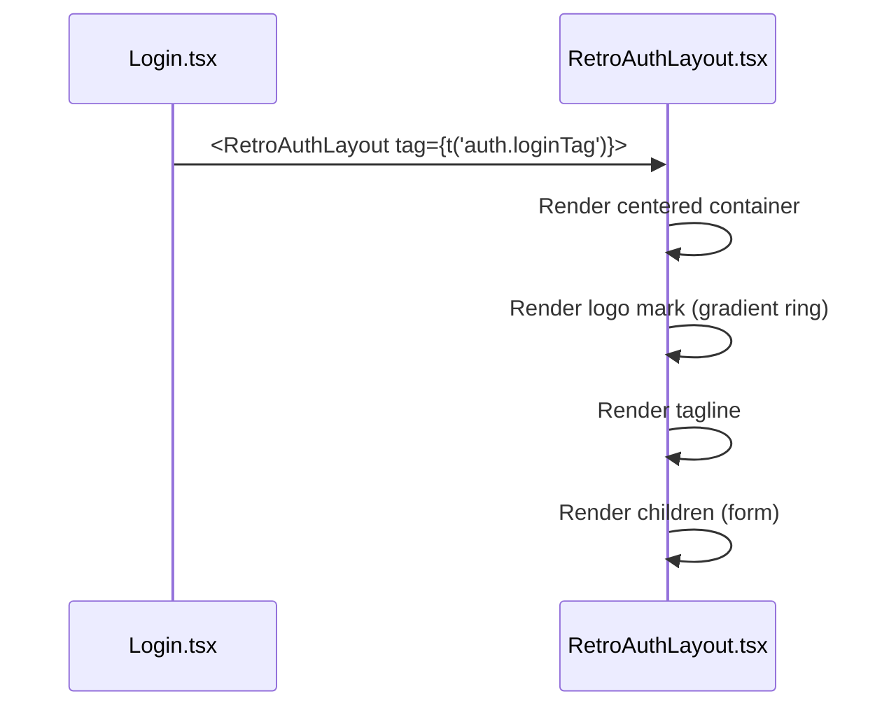
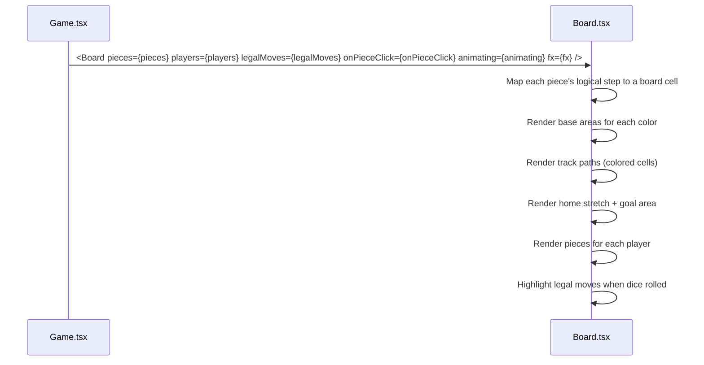
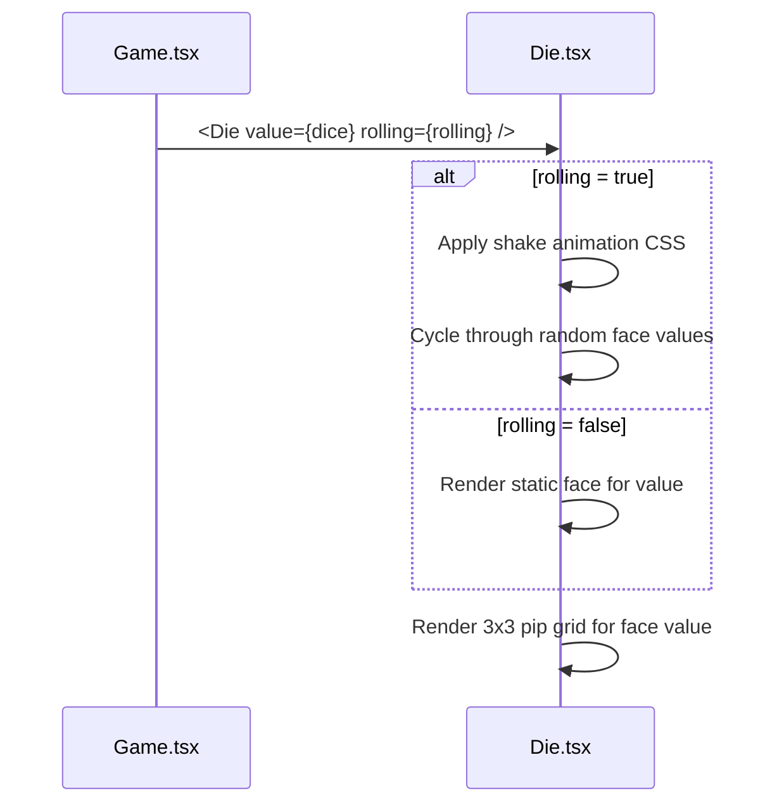
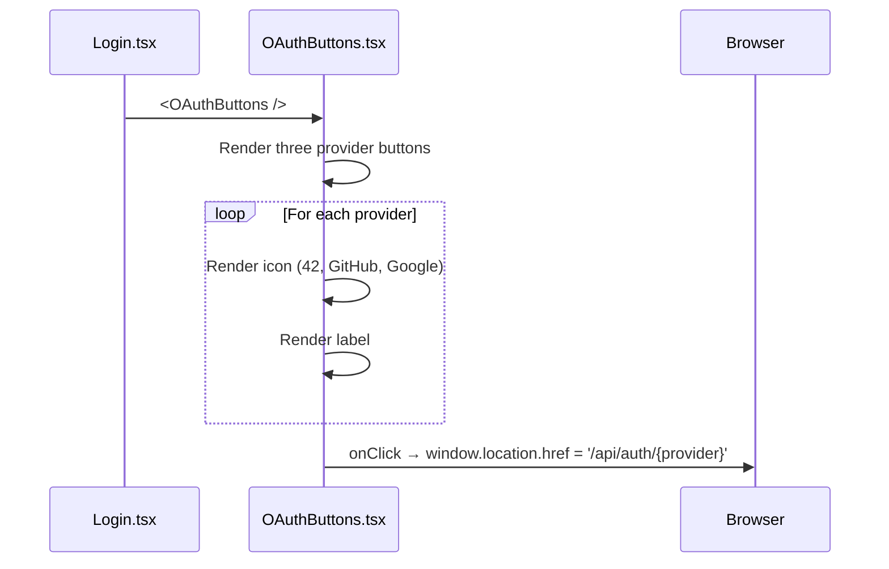

# Frontend — Shared Components

## Table of Contents

- [Overview](#overview) — Reusable UI (user interface) components used across pages
- [Files](#files) — Source file inventory
- [Key Types / Interfaces](#key-types--interfaces) — Component props and shared helpers
- [Core Logic / Flow](#core-logic--flow) — Mermaid sequence diagrams for each component
- [Logic Paths Summary](#logic-paths-summary) — Decision trees for rendering
- [Tailwind Utilities (`styles/tw.ts`)](#tailwind-utilities-stylestwts) — The shared utility-class constants
- [Implementation Notes](#implementation-notes) — Portals, compact mode, avatar attributes, CJK (Chinese, Japanese and Korean) text sizing
- [Dependencies](#dependencies) — Internal and external dependencies


---
---


## Overview

The shared components are reusable UI (user interface) building blocks used on several pages. They are:

1. **RetroNavbar** — top navigation bar used by the full-screen pages.
2. **RetroNavbar** — top navigation bar used by every page (logo, nav links, language selector, user menu).
4. **RetroAuthLayout** — centered layout for the authentication pages (login, signup, 2FA, forgot/reset password).
5. **Board / Die** — the Ludo board and the animated die.
6. **UserAvatar** — avatar rendering.
7. **OAuthButtons** — Google, GitHub and 42 provider buttons.
8. **NotificationBell / NotificationToast** — the notification bell and toasts.
9. **JoinByCode** — invite-code input for joining a game.
10. **ProfileEditModal / RulesModal** — edit-profile dialog and rules popup.
11. **CyberModal / ResultsModal** — cyber-styled modal base and the post-game results overlay.


---
---


## Files

| File | Role |
|------|------|
| `src/components/RetroNavbar.tsx` | Top navigation bar — logo, nav links, language selector, user menu, sign out (used by every page) |
| `src/components/railButton.ts` | Shared rail-button styles — `railButtonStyle(active)` and `railHoverHandlers(active, edge)`, used by the navbar rail buttons |
| `src/components/RetroAuthLayout.tsx` | Retro-styled authentication page container (`tag` + `children`), and `NeonCheck` — the terms tick glyph |
| `src/components/Board.tsx` | Ludo board — tracks, bases, pieces, legal-move highlights |
| `src/components/Die.tsx` | Dice component — face rendering with roll animation |
| `src/components/UserAvatar.tsx` | Avatar image — keyed by the immutable `userId`; requests the photo only when the seat is not a bot and a photo is known to exist (payload flag or a live `avatar_changed` override), otherwise renders the DiceBear default. A failed load marks that id broken for the session so it is not retried; an optional `onPhotoError` callback runs when that happens, so a parent component can show a message (the Profile page uses it to show a warning in the user's language) |
| `src/dicebear.ts` | DiceBear helper — generates an avatar data URI (Uniform Resource Identifier) (`avataaars`/`bottts`/`identicon`) |
| `src/components/OAuthButtons.tsx` | OAuth provider buttons (42, GitHub, Google) |
| `src/components/NotificationBell.tsx` | Bell icon, unread badge and dropdown |
| `src/components/NotificationToast.tsx` | Toast notifications |
| `src/components/JoinByCode.tsx` | Invite-code input for joining a game |
| `src/components/ProfileEditModal.tsx` | Edit-profile dialog |
| `src/components/DeleteAccountModal.tsx` | Delete-account dialog (sets a password first for OAuth-only accounts) |
| `src/components/RulesModal.tsx` | "How to Play" rules popup |
| `src/components/LegalModal.tsx` | Privacy Policy / Terms of Service popup, opened from Home's footer and from the Signup terms link |
| `src/components/MarkdownViewer.tsx` | Renders the markdown legal documents |
| `src/components/CyberModal.tsx` | Cyber-styled modal base (`CyberButton`, `CyberModal`) used for confirmations and dialogs |
| `src/components/ResultsModal.tsx` | Post-game results overlay — podium, rank badges, outcome title, return-to-lobby |
| `src/avatarCache.ts` | Avatar state store, keyed by immutable user id — live `avatar_changed` overrides (`{has, style}`), a remount stamp per user, and a `broken` set so a failed photo is not retried |


---
---


## Key Types / Interfaces

### RetroAuthLayout Props

```typescript
type RetroAuthLayoutProps = {
  tag?: string;          // Optional tagline displayed above the form
  children: ReactNode;   // Form content
}
```

### NeonCheck Props

```typescript
type NeonCheckProps = {
  offsetTop?: boolean;   // Nudges the box down 1px to line up with the first text line
  checked?: boolean;     // Draws the tick and the glow; an empty box when false
  className?: string;    // Extra classes, such as the focus ring Signup passes in
}
```

### Board Component

No props of its own; it reads the game state from `useApp()`.

### Die Component

```typescript
type DieProps = {
  value: number;         // 1-6
  rolling?: boolean;     // If true, shows rolling animation
}
```

### OAuthButtons

No props; it renders the three provider buttons.


---
---


## Core Logic / Flow

### 1. RetroAuthLayout

Sequence of steps when an authentication page renders.


### 2. Board

Sequence of steps when the game board renders.


### 3. Die

Sequence of steps when the die renders.


### 4. OAuthButtons

Sequence of steps when the provider buttons render.



---
---


## Logic Paths Summary

### RetroAuthLayout Path
```
<RetroAuthLayout tag={tag}>
  └── Render centered container
       ├── Logo mark (CSS gradient ring)
       ├── Tagline text
       └── {children}
```

### Board Path
```
<Board />
  └── useApp() → mode, seats, dice, rolling, turn
       ├── Calculate geometry for mode
       ├── Render base areas (4 corners)
       ├── Render track cells (colored paths)
       ├── Render home stretches
       ├── Render goal area
       ├── Render pieces
       └── Highlight legal moves
```

### Die Path
```
<Die value={dice} rolling={rolling} />
  ├── rolling = true → shake animation, cycle faces
  └── rolling = false → render static face
       └── Render 3x3 pip grid for value
```

### OAuthButtons Path
```
<OAuthButtons />
  ├── Render 42 button → onClick → '/api/auth/42'
  ├── Render GitHub button → onClick → '/api/auth/github'
  └── Render Google button → onClick → '/api/auth/google'
```

### RetroNavbar Account Popover Path
```
<RetroNavbar /> account button
  ├── Render avatar button with initials
  ├── onClick → toggle popover
  ├── Language option → setLang(lang)
  └── Sign out → logout() → POST /api/auth/logout → navigate('/login')
```


---
---


## Tailwind Utilities (`styles/tw.ts`)

`src/styles/tw.ts` holds Tailwind class strings that several components share, so the same long list of utility classes is not written out at every place it is used.

Rules that apply to the whole file:

- **No theme logic.** Every colour comes from the custom properties declared on `:root, [data-theme='synthwave']` in `retrowave.css`.
- **`!` (the important modifier) marks a real specificity conflict.** Four constants need it: `GAME_WINDOW_HEADER_EXTRA`, `CYBER_BTN_PINK`, `CYBER_BTN_YELLOW` and `CYBER_BTN_DANGER`, where another utility of the same specificity would otherwise win.
- **`@keyframes` and custom easing curves** (`--flicker`) cannot be written as utility classes, so they stay in `retrowave.css` and are referenced with `var()` or arbitrary `animation:` values.
- **State controlled by JavaScript** (open/closed, glitching, an active LED) is written as a literal or conditional class, or as a `data-*` attribute read through a `group-data-` variant.

Per-constant notes:

| Constant | Notes |
|---|---|
| `THEME_TRIGGER_BTN_BASE` | The account and notification trigger buttons. Callers set inline background, border and shadow; `active` is a literal class set by JavaScript, so `&.active` matches it. |
| `THEME_POPOVER_MENU_BASE` | The account popover panel, coloured by the `--fs-*` custom properties. Open/closed/up/down is JavaScript state (`THEME_POPOVER_MENU_HIDDEN` / `_ACTIVE_DOWN` / `_ACTIVE_UP`); the `popover-slide-*` keyframes stay in CSS. |
| `CRT_SCREEN` | The "page shell" shared by Home, Profile, Leaderboard, Friends, Lobby, Game and LudoLobby. Every value comes from a custom property. |
| `GRID_BACKGROUND` | The fixed cityscape background layer used by RetroAuthLayout and the page shells, with a darkening gradient on its `after:` layer. |
| `GAME_WINDOW_HEADER_EXTRA` | The Game.tsx-only header look. `!bg-[#140a35]` beats `WINDOW_HEADER`'s plain default. |
| `ARCADE_START_TITLE` | `whitespace-nowrap` is required: at 1.5px letter-spacing the heading and its spaced arrows are wider than the overlay, so the arrows would wrap onto their own lines. |
| `CYBER_MODAL_*` | CyberModal's overlay, box, body and glitch layers. The modal state travels through the `data-modal-state` and `data-glitching` attributes, read with `group-data-` variants. |
| `CYBER_BTN_*` | The modal buttons. `_PINK`, `_YELLOW` and `_DANGER` use `!` on their `--btn-accent`/`--btn-shadow` overrides so they beat `CYBER_BTN_BASE`'s defaults. |
| `RESULTS_INVOICE` / `TICKET_CONTAINER` / `INVOICE_VALUE` | ResultsModal's "vending machine ticket", printed by the `printVendingTicketJitter` keyframe; the invoice uses Share Tech Mono and VT323 with `top-6` and `z-5`. |
| `PAY_TAG_BASE` / `PAY_TAG_*` | The payment tags: border, background and colour come from the rank modifier class. |


---
---


## Implementation Notes

- **Overlays rendered through a portal.** `NotificationBell`'s dropdown and `RetroNavbar`'s account popover both render into `<body>`. A high `z-index` cannot escape an ancestor's stacking context (the sticky sidebar's `position: sticky` creates one, which traps even very large z-indices), so the overlays render outside it. Their position comes from the trigger's current `getBoundingClientRect()` instead of CSS anchoring.
- **Avatars are keyed by the immutable user id, and a version marker is appended when the URL changes.** `UserAvatar` takes `userId` (the photo key) and keeps `username` only as the DiceBear seed and alt text, so a display-name rename can never invalidate an avatar URL. It requests `/api/user/id/<userId>/avatar` only when the seat is not a bot **and** a photo is known to exist — from the payload's `hasAvatarPhoto` or from a live `avatar_changed` override in `avatarCache.ts`. Anything else renders the DiceBear default, so a user without a photo never causes a 404 request. **A change also appends `?v=<stamp>`**, because React re-rendering is not enough on its own: a byte-identical image URL can be served from the browser's in-memory image cache without any request, so `no-cache` never gets the chance to revalidate. The stamp value comes from the SSE event (or `Date.now()` for the uploader's own client, so its own view needs no SSE). A failed load records that id in the store's `broken` set, so the session stops retrying it. `ResultsModal` passes no id for opponents (the client-side `LastResult` does not include one), so they render the generated avatar. The full pipeline — storage, the shared Redis record, caching and freshness — is described in [`avatar-system.md`](../avatar-system.md).
- **`DeleteAccountModal` is a two-step dialog.** Accounts created through a provider have no password, so they set one first, because deletion always requires the password. They then confirm with that password and an acknowledgement checkbox. On success the store's `logout()` clears the session and the user lands on `/login`.
- **CJK label sizing (`RetroNavbar` account popover).** CJK (Chinese, Japanese and Korean) glyphs fill the em box, while Latin letters take up roughly half of it, so Latin labels use a smaller px value and look the same size.
- **RetroNavbar compact mode.** Below Tailwind's `xl` breakpoint (1280px) the sidebar collapses to an icon-only rail. The labels are hidden from JavaScript rather than by CSS, because parts of the bar are plain inline styles. Every page that renders the bar uses the same threshold with `w-[88px] xl:w-[270px]`.
- **RetroNavbar track layout.** The nav track uses `overflow-y: auto` only as a fallback. The track is not shifted vertically, because at short window heights a shift pushes the last item over the theme button.


---
---


## Dependencies

| Component | Depends On | Purpose |
|-----------|-----------|---------|
| `RetroAuthLayout` | `theme.ts` | `goldText`, inline styles |
| `Board` | `store.tsx` | `useApp` for game state |
| `Board` | `theme.ts` | `COL`, inline styles |
| `Die` | `theme.ts` | Keyframe CSS for the shake animation, gradient backgrounds |
| `OAuthButtons` | `theme.ts` | `btnOutline` style |
| `RetroNavbar` | `store.tsx` | `useApp` for `user`, `lang`, `setLang`, `logout` |
