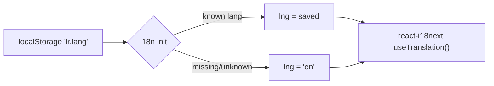

# Frontend — i18n, Utilities & App Entry

## Table of Contents

- [Overview](#overview) — Internationalization, audio, bot-name and legal-page support files
- [Files](#files) — Source file inventory
- [Key Types / Interfaces](#key-types--interfaces) — Language codes and engine shapes
- [Core Logic / Flow](#core-logic--flow) — Language selection and legal documents
- [Dependencies](#dependencies) — Internal and external dependencies


---
---


## Overview

Supporting modules shared by every screen:

1. **i18n** — `i18next` + `react-i18next` with three languages: English (`en`), Malay (`ms`), French (`fr`). The choice persists in `localStorage` under the key `lr.lang`. If the saved value is unknown or missing, the default language `en` is used.
2. **Audio** — `RetroAudioEngine`, a Web Audio chiptune synthesizer with three built-in tracks, used by the Game page for dice/move effects (`playUiBeep`) and background music. Muting is toggled via `toggleMute()`.
3. **Bot names** — `localizedBotName()` maps the engine's `bot-<color>` user ids to a translated "bot-<color>" string using the `common.bot` label and the `lobby.color*` i18n keys.
4. **Legal pages** — `LegalPage` renders the Privacy Policy and Terms of Service (public routes `/privacy` and `/terms`) from markdown files bundled with Vite's `?raw` imports, one variant per language.
5. **Entry point** — `main.tsx` mounts `<App />` in `StrictMode` and imports the CSS plus `./i18n` so translations are ready before the first render.


---
---


## Files

| File | Role |
|------|------|
| `src/main.tsx` | Entry point — mounts `App` in `StrictMode`, imports CSS and `i18n` |
| `src/i18n.ts` | `i18next` setup — `en` / `ms` / `fr` resources, `lr.lang` localStorage persistence, `en` fallback |
| `src/locales/en.ts` | English translation namespace |
| `src/locales/fr.ts` | French translation namespace |
| `src/locales/ms.ts` | Malay translation namespace |
| `src/utils/audio.ts` | `RetroAudioEngine` — Web Audio chiptune tracks, UI beeps, mute toggle |
| `src/utils/botName.ts` | `localizedBotName()` — `bot-<color>` → translated bot name |
| `src/pages/LegalPage.tsx` | Privacy / Terms pages (`/privacy`, `/terms`) — markdown viewer per language |


---
---


## Key Types / Interfaces

```typescript
// Language handling (i18n.ts)
type Lang = 'en' | 'ms' | 'fr'          // stored in localStorage as 'lr.lang'

// Legal documents (LegalPage.tsx)
interface LegalPageProps {
  initialDoc?: 'privacy' | 'terms'      // defaults to 'privacy'; /terms overrides
}
// Markdown is bundled per language:
// content/docs/Privacy-Policy-{en,fr,my}.md
// content/docs/Terms-of-Service-{en,fr,my}.md   (?raw Vite imports)
```


---
---


## Core Logic / Flow



1. On startup `i18n.ts` reads `lr.lang`, validates it against `['en', 'ms', 'fr']`, and initializes i18next with the matching resource bundle (`en` fallback).
2. Components call `useTranslation()`; the language selector (in `RetroNavbar`, `LegalPage`, and others) switches language at runtime via `setLang` from the store, which updates both i18next and `lr.lang`.
3. `LegalPage` reads the route (`/privacy` or `/terms`), picks the markdown document for the current language, and renders it through `MarkdownViewer`.


---
---


## Dependencies

| Dependency | Purpose |
|-----------|---------|
| `store.tsx` | `lang` / `setLang` state shared by the language selectors |
| `router.tsx` | `useRoute()` so `/terms` opens the Terms doc |
| `components/MarkdownViewer.tsx` | Renders the legal markdown |
| `styles/tw.ts` | Retrowave style constants used by `LegalPage` |
| `i18next` / `react-i18next` | External i18n framework |
