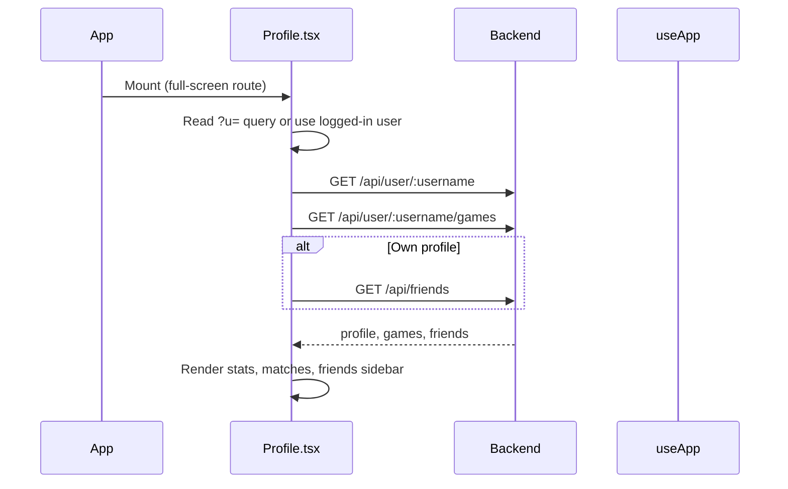
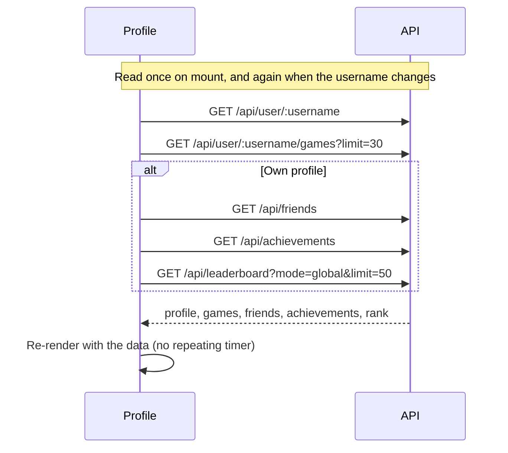

# Frontend — Profile Page

## Table of Contents

- [Overview](#overview) — User profile with statistics, match history and a friends panel
- [Files](#files) — Source file inventory
- [Key Types / Interfaces](#key-types--interfaces) — Profile, match history, and friend types
- [Core Logic / Flow](#core-logic--flow) — Data fetching, and when it repeats
- [Dependencies](#dependencies) — Internal and external dependencies


---
---


## Overview

The Profile page (`/profile`) shows a user's public profile with statistics, recent match history and a friends panel. It is a full-screen route (rendered directly by the router); the page renders its own `RetroNavbar`.

1. **Profile header** — username, status indicator, avatar initials, rating and the date the account was created.
2. **Stats grid** — wins, losses, win rate, best streak.
3. **Recent matches** — each game with the other human players' names, the result (victory, defeat or draw), pieces in goal and the date. A game against bots lists only you.
4. **Friends panel** — friends with their online status and their rating; shown only on your own profile.
5. **Avatar actions (own profile)** — the `EDIT AVATAR`, `RESET` and `EDIT PROFILE` buttons, and below them a **message area with a fixed height**. The area shows upload and reset errors in red, and the photo-load warning (`profile.photoLoadError`) in amber. Because the height is fixed, a longer translation in Malay or French wraps onto more lines without moving the content below it.

When the page loads it reads the profile, game history, achievements, friends and leaderboard rank. It reads them again when the username changes or when the edit modal closes. It does **not** repeat on a timer.


---
---


## Files

| File | Role |
|------|------|
| `src/pages/Profile.tsx` | Profile page component |
| `src/components/RetroNavbar.tsx` | Top navigation bar (profile page is full-screen) |
| `src/store.tsx` | `useApp` for authentication state, presence and API (Application Programming Interface) calls |
| `src/theme.ts` | `STATUS_STYLE`, `card`, `avatarBlue`, `goldText` styles |


---
---


## Key Types / Interfaces

### UserProfile

```typescript
{
  id: string;  // Unique ID
  username: string;  // Player's username
  displayName?: string;  // Name shown in the game
  avatarStyle: string | null;  // Avatar style name
  hasAvatarPhoto: boolean;  // Whether a custom photo is uploaded
  rating: number;  // Player's rating (score)
  highestRating: number;  // Best rating ever reached
  wins: number;  // Games won
  losses: number;  // Games lost
  winStreak: number;  // Wins in a row right now
  bestWinStreak: number;  // Longest winning streak ever
  createdAt: string;  // When the record was created
  status: 'online' | 'playing' | 'offline';  // Current status
}
```

### MatchHistory

```typescript
{
  games: Array<{  // List of games played
    gameId: string;  // ID of the game
    status: string;  // Current status
    gameType: 'PVP' | 'PVE';  // Match type
    color: string;  // Seat color
    rank: number | null;  // Position in the ranking
    piecesCaptured: number;  // Pieces knocked off
    piecesInGoal: number;  // Pieces finished (0-4)
    ratingDelta: number;  // Rating change from this game
    startedAt: string;  // When the game started
    endedAt: string | null;  // When the game ended
    participants: Array<{  // Every human who played; a game against bots lists only you
      username: string;  // Player's username
      avatarStyle: string | null;  // Avatar style name
      hasAvatarPhoto?: boolean;  // Whether a custom photo is uploaded
      color: string;  // Seat color
      rank: number | null;  // Position in the ranking
      piecesInGoal: number;  // Pieces finished (0-4)
    }>;
  }>;
  total: number;  // Total number of items
  page: number;  // Page number
  limit: number;  // Items per page
}
```

### Friend

```typescript
{
  id: string;  // Unique ID
  username: string;  // Player's username
  displayName?: string;  // Name shown in the game
  avatarStyle: string | null;  // Avatar style name
  hasAvatarPhoto?: boolean;  // Whether a custom photo is uploaded
  rating: number;  // Player's rating (score)
  friendsSince: string;  // When the friendship started
  status: 'online' | 'playing' | 'offline';  // Current status
}
```


---
---


## Core Logic / Flow

### Page Load



### Data Refresh




---
---


## Achievements (own profile)

Your own profile renders the 13 achievements defined by `ACHIEVEMENTS_DEF` in `Profile.tsx`. The thresholds match the backend registry, which is the version that runs (see [backend-achievements-module.md](../backend/backend-achievements-module.md)). Match types are PvP (player versus player) and PvE (player versus environment, against bots).

| Key | Requirement |
|-----|-------------|
| `achFirstBlood` | 1 win (PvP or PvE) |
| `achOnFire` | `User.winStreak` >= 2 |
| `achDiceMaster` | 3 wins |
| `achBabySteps` | 1 bot win |
| `achTheDiceLoveMe` | 3 bot wins |
| `achTactician` | 5 wins |
| `achMaster` | 8 wins |
| `achGrandBotMaster` | 12 wins |
| `achWorldChampion` | 15 wins |
| `achft_Transcendence` | 10 PvP wins (PvE never counts) |
| `achLoveTheMachine` | 3 consecutive PvE games, any outcome (a PvP game resets it) |
| `achSpeedDemon` | win in under 30 minutes (unknown duration means no unlock) |
| `achUnstoppable` | 3 captures in a single game |

Hotseat games never count towards any achievement. The badge/tab counter shows `unlocked / 13`.


---
---


## Dependencies

| Dependency | Purpose |
|-----------|---------|
| `store.tsx` | `useApp()` for `user` and navigation |
| `router.tsx` | `useRoute()` to read the `?u=` query parameter |
| `theme.ts` | `STATUS_STYLE`, `card`, `avatarBlue`, `goldText` |
| `api.ts` | `translateErrorCode()`, which turns an error code from a `fetch` response into text in the user's language |
| `components/UserAvatar.tsx` | Renders the avatar; `onPhotoError` runs when a photo fails to load |