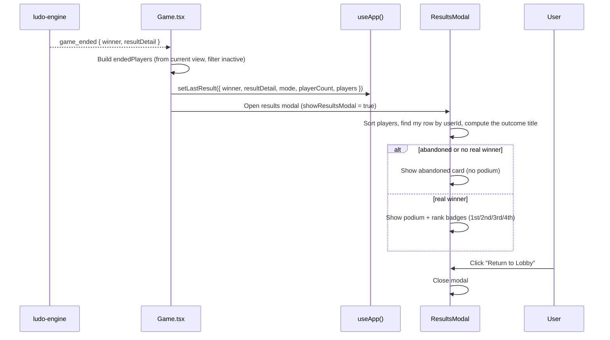

# Frontend — Results

## Table of Contents

- [Overview](#overview): Results summary shown after a match ends
- [Files](#files): Source file inventory
- [Key Types / Interfaces](#key-types--interfaces): LastResult shape
- [Core Logic / Flow](#core-logic--flow): Mermaid sequence diagram for results display
- [Logic Paths Summary](#logic-paths-summary): Decision trees for post-game actions
- [Dependencies](#dependencies): Internal and external dependencies


---
---


## Overview

The results screen appears **inside the Game page** after a match ends, as a
modal overlay (`ResultsModal`). It shows:

1. **Match summary**: winner, final ranks, podium, per-player pieces in goal.
2. **Outcome handling**: the right label for a victory, a defeat or an abandoned match.
3. **Exit**: returns to the lobby or the home page after the game.

Results render through `src/components/ResultsModal.tsx`, which `Game.tsx` opens when the engine emits `game_ended`.


---
---


## Files

| File | Role |
|------|------|
| `src/components/ResultsModal.tsx` | Results overlay: podium, summary, rank badges, outcome title |
| `src/pages/Game.tsx` | Opens the modal on `game_ended`; holds the socket connection and the `lastResult` state |
| `src/store.tsx` | `setLastResult` / `lastResult` state |


---
---


## Key Types / Interfaces

### LastResult (from store)

```typescript
type ResultPlayer = {  // One row of the invoice
  color: PlayerColor  // Seat color
  username: string  // Seat label: display name or hotseat name; for a bot the raw "bot-<color> (<assistant>)" label, localized for display and used as the avatar seed
  isBot: boolean  // Whether it is a bot
  piecesInGoal: number  // Pieces finished (0-4)
  userId?: string  // Immutable account id: absent for bots and hotseat's local seats, except the host's own row, which Game.tsx stamps with the store's /me id
  hasAvatarPhoto?: boolean  // Engine roster snapshot, or the store's /me flag on the host's hotseat row: a photo was known to exist
  avatarStyle?: string | null  // DiceBear style that seat chose
}

type LastResult = {
  winner: PlayerColor  // Winning color
  resultDetail: string  // How the game ended
  mode: 'pvp' | 'pve' | 'hotseat'  // Game mode
  playerCount: number  // How many players
  players: ResultPlayer[]  // List of players
  abandoned?: boolean   // abandoned/expired match → no winner/podium
} | null
```


---
---


## Core Logic / Flow

### Results Rendering

Sequence of steps when the engine reports that the game has ended.



---
---


## Logic Paths Summary

### Results Render Path
```
Game.tsx receives 'game_ended'
  ├── Build endedPlayers: view.players (status !== 'inactive')
  │   └── PvP: trim to activeMatch.playerCount if the list is longer
  ├── setLastResult({ winner, resultDetail, mode, playerCount, players })
  └── setShowResultsModal(true)

ResultsModal renders
  ├── my row: matched by userId, then by name, then the first human seat
  │   (hotseat: Game.tsx stamps the host's /me id onto the host's own seat)
  ├── result.abandoned OR no player reached 4 pieces in goal
  │   └── Abandoned card: outcome title "abandoned", no podium
  ├── Else podium by rank + rank badges (1st/2nd/3rd/4th)
  ├── outcome title: victory (my color = winner) / defeat / match complete (hotseat)
  └── Return to Lobby button → onReturnToLobby (closes modal)
```


---
---


## Avatar Flags

Each row carries the avatar facts the engine's roster (`PlayerMeta`) reported for that seat: `userId`,
`hasAvatarPhoto`, and `avatarStyle`. `Game.tsx` builds them with one helper (`toResultPlayers`, called by
`game_ended`, the abandoned fallback, and `endGame`), which renders an opponent's photo, keeps the DiceBear
style a seat chose, and requests no URL for a row that has no photo. A bot, a hotseat local seat, and the
lobby-seat fallback have no account, so they arrive without an id and render the generated avatar. A bot
row keeps its raw `bot-<color> (<assistant>)` label, so `avatarSeed()` draws the same avatar the lobby
table and the arena produced for that seat while the invoice still lists the localized name.

**Hotseat's host row is the exception.** The engine describes no account for any local seat, so the helper
stamps the host's own seat (the colour this device joined the match with) with the store's live `/me` facts:
the invoice then resolves the host's row by `userId`, so the host sees their own uploaded photo there while
every other local seat keeps the generated avatar. See [avatar-system.md](../avatar-system.md) → 4. Game
seats.

The viewer's own row is resolved by `userId === user.id` first, then by name, then by the first human
seat. `players[].username` is the seat label the UI shows, which is a display name or a lobby name
rather than the account name, so matching on the name alone can select the wrong row after a rename.
That row also keeps the store's live `/me` photo flag, because the profile page writes it on upload or
delete. See [frontend-components-system.md](frontend-components-system.md) → Implementation Notes.


---
---


## Dependencies

| Dependency | Purpose |
|-----------|---------|
| `store.tsx` | `useApp` → lastResult, setLastResult |
| `components/UserAvatar.tsx` | Player avatars on the podium |
| `utils/audio.ts` | `retroAudio` end-of-game chimes |

