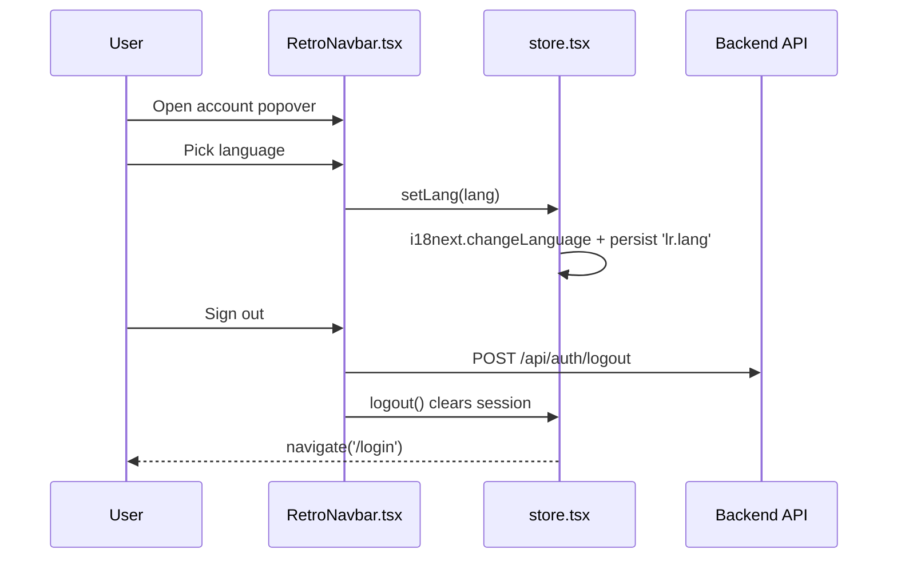

# Frontend — Settings

## Table of Contents

- [Overview](#overview) — Account settings and game preferences
- [Files](#files) — Source file inventory
- [Key Types / Interfaces](#key-types--interfaces) — Setting keys and defaults
- [Core Logic / Flow](#core-logic--flow) — Where each setting is toggled
- [Dependencies](#dependencies) — Internal and external dependencies


---
---


## Overview

There is **no dedicated settings page** — account settings are distributed across the surfaces that need them:

1. **Language selector** — in the `RetroNavbar` account popover and on `LegalPage`; switches between `en`, `ms` and `fr` via `setLang` from the store.
2. **2FA (two-factor authentication) toggle** — in the `ProfileEditModal` on the Profile page; saves through the profile update request (`PATCH /api/auth/profile` with `twoFactorEnabled`).
3. **Sign out** — in the `RetroNavbar` account popover; calls `POST /api/auth/logout`, then navigates to `/login`.
4. **Game preference toggles** (sound, music, auto-roll, fast animations, move hints, friend invites, weekly recap) live in `store.tsx` as `SETTING_DEFAULTS`; no dedicated settings page exposes them yet.

> **Note:** There is no `src/pages/Settings.tsx` and no `AccountMenu` — the former Shell/AccountMenu layout was removed; the account popover is now part of `RetroNavbar`, and the 2FA toggle moved to the Profile page's edit modal.


---
---


## Files

| File | Role |
|------|------|
| `src/components/RetroNavbar.tsx` | Account popover — language selector and sign out |
| `src/components/ProfileEditModal.tsx` | 2FA on/off toggle (saved with the profile update) |
| `src/pages/Profile.tsx` | Opens the edit modal on the Profile page |
| `src/store.tsx` | `lang` / `setLang`, `SETTING_DEFAULTS`, `logout` |


---
---


## Key Types / Interfaces

### SETTING_DEFAULTS

```typescript
export const SETTING_DEFAULTS: Record<string, boolean> = {
  '0-0': true,   // Sound effects
  '0-1': true,   // Music
  '1-0': true,   // Auto-roll
  '1-1': false,  // Fast animations
  '1-2': true,   // Move hints
  '2-0': true,   // Friend invites
  '2-1': false,  // Weekly recap
}
```

### Setting State

```typescript
settings: Record<string, boolean>  // Stored values; anything missing uses SETTING_DEFAULTS
```


---
---


## Core Logic / Flow



Game preference toggles are read with a fallback:

```typescript
(key: string) => (key in settings ? settings[key] : (SETTING_DEFAULTS[key] ?? false))
```


---
---


## Dependencies

| Dependency | Purpose |
|-----------|---------|
| `store.tsx` | `useApp` for `user`, `lang`, `setLang`, `settings`, `logout` |
| `i18n.ts` | `changeLanguage` on switch |
| `api.ts` | `postApi` for `/api/auth/logout` |
| `router.tsx` | `navigate('/login')` after sign out |
