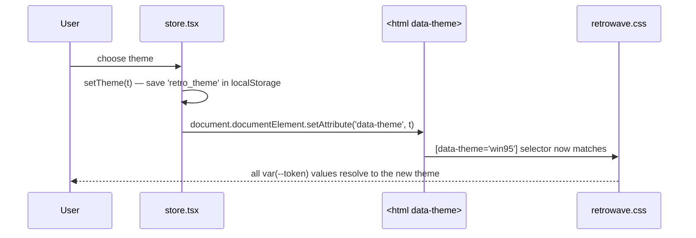

# Frontend — Styles & Theming

## Table of Contents

- [Overview](#overview) — The two stylesheets and how theming works
- [Files](#files) — Source file inventory
- [Key Types / Interfaces](#key-types--interfaces) — Theme tokens and theme names
- [Core Logic / Flow](#core-logic--flow) — How a theme change reaches the screen
- [Dependencies](#dependencies) — Internal and external dependencies

---

## Overview

Styling is split between CSS files and TypeScript constants, with a clear rule for what belongs where:

1. **`retrowave.css`** (950 lines) — the theme design system. Defines three complete color/font themes as CSS custom properties on `[data-theme]`, plus the global reset, scrollbar styles, `@keyframes` animations, and the few classes that must stay in CSS.
2. **`index.css`** (179 lines) — imports Tailwind, sets base element styles (`body`, `input`, `a`), and holds the Home page's layout rules with two responsive `@media (max-height: …)` breakpoints.
3. **`styles/tw.ts`** — long Tailwind utility-class strings shared by several components. Each constant replaces one `retrowave.css` rule one-for-one; where a rule cannot be expressed as utilities (`@keyframes`, custom easing curves such as `--flicker`), it stays in `retrowave.css` and is referenced with `var()` or an arbitrary `animation:` value.

**Themes are handled entirely in CSS.** No JavaScript reads theme names to pick colors — a component never checks "which theme is active".

---

## Files

| File | Role |
|------|------|
| `src/styles/retrowave.css` | Theme design system — three `[data-theme]` token sets, fonts, reset, scrollbar, `@keyframes` |
| `src/index.css` | Tailwind import, base element styles, Home page layout rules, scrollbar fallback |
| `src/styles/tw.ts` | Shared Tailwind utility-class constants (documented in [frontend-components-system.md](frontend-components-system.md)) |
| `src/theme.ts` | Small TypeScript constants tied to the theme (`STATUS_STYLE`, `goldText`, `BOT_POOL`) |
| `src/store.tsx` | Owns the `theme` state and applies `data-theme` to `<html>` |

---

## Key Types / Interfaces

### The three themes

| Theme | `[data-theme]` value | Look |
|-------|----------------------|------|
| Synthwave '84 (default) | `synthwave` — also the `:root` default | Dark purple/pink neon, glowing borders, CRT scanlines |
| Windows 95 Desktop | `win95` | Flat gray `#c0c0c0`, solid 2 px borders, inset shadows |
| CRT Terminal (Green Phosphor) | `terminal` | Black/green monochrome look |

### Theme tokens (CSS custom properties)

Both `:root`/`[data-theme='synthwave']`, `[data-theme='win95']` and `[data-theme='terminal']` define the same token set, for example:

```css
--bg-primary, --bg-secondary, --bg-card   /* backgrounds */
--accent-cyan, --accent-pink, --accent-yellow, --accent-purple
--text-main, --text-muted
--border-color, --box-shadow, --card-border-style
--font-heading, --font-display, --font-mono  /* Press Start 2P, Orbitron, Share Tech Mono */
--crt-scanline-opacity, --crt-flicker-opacity
--window-header-bg, --window-header-text
```

Because every theme defines every token, a component only ever references `var(--accent-cyan)` (and so on) and the correct color appears for the active theme.

---

## Core Logic / Flow



1. On startup the store reads `retro_theme` from `localStorage` (default `synthwave`) and sets the `data-theme` attribute on `document.documentElement`.
2. `retrowave.css` defines each token set twice: once on `:root, [data-theme='synthwave']` (the default) and once per other theme. Changing one attribute on `<html>` switches every color, font and shadow in the application at once.
3. Components and `tw.ts` constants only reference tokens (`var(--accent-pink)`) or use Tailwind arbitrary variants such as `[[data-theme=win95]_&]:…` when one theme needs a different structure.

---

## Dependencies

| Dependency | Purpose |
|-----------|---------|
| `store.tsx` | `theme` / `setTheme` state; persists `retro_theme` and sets the `data-theme` attribute |
| `styles/tw.ts` | Consumes the tokens through Tailwind arbitrary values; documented separately |
| Tailwind CSS | Imported by `index.css` (`@import 'tailwindcss'`) |
| Google Fonts | `Press Start 2P`, `VT323`, `Orbitron`, `Share Tech Mono`, imported at the top of `retrowave.css` |
