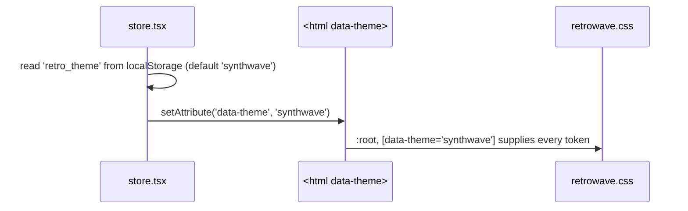

# Frontend — Styles & Theming

## Table of Contents

- [Overview](#overview) — The two stylesheets and how theming works
- [Files](#files) — Source file inventory
- [Key Types / Interfaces](#key-types--interfaces) — Theme tokens
- [Core Logic / Flow](#core-logic--flow) — How the theme reaches the screen on boot
- [Dependencies](#dependencies) — Internal and external dependencies


---
---


## Overview

Styling is split between CSS files and TypeScript constants, with a clear rule for what belongs where:

1. **`retrowave.css`** (610 lines) — the theme design system. Defines the Synthwave '84 color and font custom properties on `:root, [data-theme='synthwave']`, plus the scrollbar styles, `@keyframes` animations, and the few rules that must stay in CSS.
2. **`index.css`** (179 lines) — imports Tailwind, sets base element styles (`body`, `input`, `a`), and holds the Home page's layout rules with two responsive `@media (max-height: …)` breakpoints.
3. **`styles/tw.ts`** — long Tailwind utility-class strings shared by several components. Each constant replaces one `retrowave.css` rule one-for-one; where a rule cannot be expressed as utilities (`@keyframes`, custom easing curves such as `--flicker`), it stays in `retrowave.css` and is referenced with `var()` or an arbitrary `animation:` value.

**Themes are handled entirely in CSS.** No JavaScript reads theme names to pick colors — a component never checks "which theme is active".

### Cascade and CSS-only rules

`index.css` imports Tailwind, whose preflight supplies the base reset, so `retrowave.css` defines no reset of its own. `retrowave.css` is imported unlayered, so a rule written there outranks every Tailwind utility class.

These rules stay in CSS because no utility expresses them:

| Rule | Why it stays in CSS |
|------|---------------------|
| `.crt-screen` | `body:has(.game-page)` targets the class by name, so it also has to stay on the element in the JSX. |
| `@keyframes arcade-start-pulse` | Applied the same way. It animates `scale` only: Tailwind's `-translate-x-1/2` sets the standalone `translate` property, which composes with `transform`, so a keyframe `translateX` would add a second -50 percent shift. |


---
---


## Files

| File | Role |
|------|------|
| `src/styles/retrowave.css` | Theme design system — the `[data-theme='synthwave']` token set, fonts, scrollbar, `@keyframes` |
| `src/index.css` | Tailwind import, base element styles, Home page layout rules, scrollbar fallback |
| `src/styles/tw.ts` | Shared Tailwind utility-class constants (documented in [frontend-components-system.md](frontend-components-system.md)) |
| `src/theme.ts` | Small TypeScript constants tied to the theme (`STATUS_STYLE`, `goldText`, `BOT_POOL`) |
| `src/store.tsx` | Owns the `theme` state and applies `data-theme` to `<html>` |


---
---


## Key Types / Interfaces

### The theme

The application runs one theme, Synthwave '84. Its tokens are declared on `:root, [data-theme='synthwave']`, and the store writes `data-theme="synthwave"` onto `<html>` and `<body>` on boot.

### Theme tokens (CSS custom properties)

`:root, [data-theme='synthwave']` declares the whole token set, for example:

```css
--bg-primary, --bg-secondary, --bg-card   /* backgrounds */
--accent-cyan, --accent-pink, --accent-yellow, --accent-purple
--text-main, --text-muted
--border-color, --box-shadow, --card-border-style
--font-heading, --font-display, --font-mono  /* Press Start 2P, Orbitron, Share Tech Mono */
--crt-scanline-opacity, --crt-flicker-opacity
--window-header-bg, --window-header-text
```

A component only ever references `var(--accent-cyan)` (and so on), so the colour comes from the stylesheet.


---
---


## Core Logic / Flow



1. On startup the store reads `retro_theme` from `localStorage` (default `synthwave`) and sets the `data-theme` attribute on both `document.documentElement` and `document.body`.
2. `retrowave.css` declares the tokens on `:root, [data-theme='synthwave']`, so the values resolve with or without the attribute.
3. Components and `tw.ts` constants only reference tokens (`var(--accent-pink)`) or plain Tailwind utilities.


---
---


## Dependencies

| Dependency | Purpose |
|-----------|---------|
| `store.tsx` | `theme` / `setTheme` state; persists `retro_theme` and sets the `data-theme` attribute |
| `styles/tw.ts` | Consumes the tokens through Tailwind arbitrary values; documented separately |
| Tailwind CSS | Imported by `index.css` (`@import 'tailwindcss'`) |
| Google Fonts | `Press Start 2P`, `VT323`, `Orbitron`, `Share Tech Mono`, imported at the top of `retrowave.css` |
