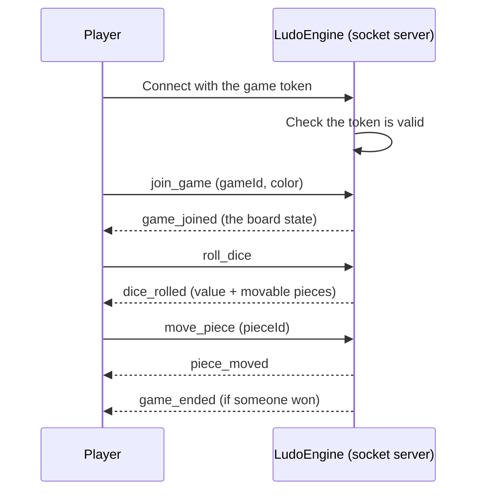

# Ludo Engine — Socket.IO Events

## Table of Contents

- [Overview](#overview) — Socket.IO server, connection, and event protocol
- [Quick Reference](#quick-reference) — What triggers each event, and the input/output of every socket event
- [Files](#files) — Source file inventory
- [Connection](#connection) — Handshake auth and JWT
- [Client → Server Events](#client--server-events) — Events emitted by the client
- [Server → Client Events](#server--client-events) — Events broadcast by the server
- [Event Reference](#event-reference) — Complete event payload reference
- [Configuration](#configuration) — Socket.IO server settings


---
---


## Overview

The ludo-engine exposes a Socket.IO server on port 3001. All game communication happens through events. The engine requires JWT authentication in the handshake `auth` object.

The server is started by `index.ts` which calls `SocketServer.start(3001)`. The `SocketServer` class in `socket/server.ts` registers all event handlers and holds the `engine` (game state machine) and the `store` (`RedisGameStore`, persistence).


---
---


## Quick Reference

Every socket event at a glance — direction, what triggers it, and its
input/output. Each event is documented in full below; see
[Event Reference](#event-reference) for the complete payload schemas.


---
---


### Client → Server

| Event | Triggered by | Payload (client → server) | Server action | Resulting broadcasts |
|---|---|---|---|---|
| `join_game` | Entering a room — PvP join/rejoin, PvE/hotseat seat-in (hotseat sends one call per local seat) | `(gameId: string, playerColor?, userId?, displayName?)` | Bind the socket to the room/seat (reconnect or fresh join), create the game if missing, auto-start PvE/hotseat. A non-reconnecting join to an **ACTIVE** game is rejected with an `error` ("Game already in progress") — hotseat is exempt (one socket controls all its seats) | `game_joined` to the sender |
| `roll_dice` | Current player, phase `WAITING_FOR_ROLL` | `()` | Roll the die and compute the legal moves (a 3rd six auto-forfeits the turn) | `dice_rolled` |
| `move_piece` | Current player, phase `WAITING_FOR_MOVE` | `(pieceId: string)` | Validate and apply the move | `piece_moved` |
| `player_ready` | Seated player in the waiting lobby | `()` | Mark ready; when every active player is ready the game starts | `game_started` |
| `select_color` | Seated player during color selection | `(color: 'red'/'green'/'yellow'/'blue')` | Move the player to the requested seat color; clears Ready on both colors involved | `color_selected` + `lobby_update` |
| `leave_game` | Player leaving a room (e.g. after a match) | `()` | Waiting room: seat parked `inactive` and reserved. Live game: seat parked `exited`, pieces cleared, turn advances | `player_exited` (+ `state_update` live) |
| `end_game` | Host presses "End Game" | `()` | PvE/hotseat: abort the whole game. PvP: prune this player, abort the room if fewer than 2 humans remain | `game_expired` or `player_aborted` |
| `disconnect` | Socket drops (automatic) | — | Start the reconnect grace period, but only for a live, unfinished **active** seat — an exited/finished seat has no pieces left and must not be revivable. In **PvP**, dropping during your own turn also pauses the game (`paused` + `pauseTurnOwner`); dropping during someone else's turn lets play continue until the turn reaches the departed seat, which then simply waits | `player_disconnected`, then `player_reconnected` or `player_exited` |


---
---


### Server → Client

| Event | Triggered by | Payload (server → client) | Notes |
|---|---|---|---|
| `game_joined` | A successful `join_game` | `GameState` | Sent to the joining socket only |
| `dice_rolled` | A die roll | `{ value, legalMoves, bonusRoll, currentTurn, forfeited? }` | Room-wide |
| `piece_moved` | A legal move applied | `MoveResult` | Room-wide |
| `game_started` | All players ready / PvE or hotseat auto-start | `{ gameId }` | Room-wide |
| `game_ended` | A match finishes (all pieces home / forfeit) | `{ winner, resultDetail }` | Room-wide |
| `game_timeout` | 60 s after `game_ended` — the finished room is torn down | — | Room-wide |
| `game_expired` | Room teardown: idle lobby (5 min, < 2 seated), single-instance disconnect window expired, or quorum lost after an exit | `{ gameId }` | Room-wide, emitted by `teardownRoom` through the engine event → publisher → broadcaster path |
| `player_exited` | Permanent exit — leaving the room or disconnect grace expired | `{ color }` | Room-wide |
| `player_aborted` | Host ended a PvP game / room aborted | `{ color, username }` | Room-wide |
| `player_disconnected` | A socket dropped (temporary) | `{ color }` | Room-wide |
| `player_reconnected` | Reconnect inside the grace window | `{ color, displayName? }` | Room-wide. Sent only when the seat really was restored, and carries the name the client reports (a rename while away rides along) |
| `seat_expired` | A `join_game` for a seat already removed (left, or its grace window expired) | `{ gameId, color }` | Sent to that socket only — the seat is gone for good, so the client shows the end-of-match card and leaves |
| `lobby_update` | Lobby seats / ready state changed | `{ players: [{ userId, username, avatarStyle, color, ready }] }` | Room-wide |
| `color_selected` | A seat color change | `{ gameId, userId, color }` | Room-wide |
| `state_update` | A live exit moved the turn (and cleared the departed seat's pieces), or a PvP disconnect set/cleared the reconnect pause | full `GameState` (includes `paused` / `pauseTurnOwner`) | Room-wide. The SPA's reducer merges it field by field; it is also the fallback for any other pub/sub frame |
| `error` | Invalid action / failed authentication | `string` | Sent to the offending socket |


---
---


## Files

| File | Role |
|------|------|
| `index.ts` | Entry point — `SocketServer.start(3001)` |
| `socket/server.ts` | `SocketServer` class — event routing, JWT middleware, engine lifecycle |
| `socket/auth.ts` | `GameSocket` type, JWT extraction middleware |
| `socket/socket-handlers.ts` | All client→server event handlers (join, roll, move, etc.) |
| `socket/join-manager.ts` | `JoinManager` — seat resolution, game creation, reconnect vs fresh join, PvE/hotseat auto-start |
| `socket/bot-scheduler.ts` | One timer per game that drives bot turns |
| `socket/post-game.ts` | End-of-game flow — post-game timeout and room teardown |
| `socket/event-publisher.ts` | `EventPublisher` — publishes each engine event to the Redis `game:{gameId}` channel |
| `socket/redis-broadcaster.ts` | `RedisBroadcaster` — forwards Redis `game:*` messages into the matching Socket.IO room |
| `socket/result-submitter.ts` | POST /api/game/end callback to backend — submits the human seats that finished; skips a seat whose account cannot be recovered and logs the colour; posts nothing when no account resolves; reports the piece count read from the board rather than from a cached tally |


---
---


## Connection


---
---


### Handshake

Connect to the engine with a JWT token in the `auth` object. The browser connects to its **own origin** (`/socket.io/`), which nginx (or the Vite proxy) forwards to the engine:

```js
const io = require('socket.io-client');
const socket = io(window.location.origin, {   // same-origin → nginx → ludo-engine
  auth: { token: '<jwt-from-match-endpoint>' },
  transports: ['websocket'],
});
```

The JWT payload (issued by `MatchService`) contains:

```json
{
  "gameId": "uuid",
  "playerId": "user-id",
  "username": "username",
  "displayName": "Display Name",
  "role": "player1" | "player",
  "color": "red" | "green" | "yellow" | "blue",
  "mode": "pvp" | "pve" | "hotseat"
}
```

`playerId` is the account id, which the engine reads as `userId`. `color` always identifies the seat and becomes the socket's seat colour. `mode` is present only on tokens minted when the match is created; tokens from `joinMatch` and `rejoin` omit it, and the engine derives the mode from the match record instead.


---
---


### JWT Validation

The handshake middleware in `socket/server.ts` reads the token from `socket.handshake.auth.token` and passes it to `verifyToken` in `socket/auth.ts`. That function validates the token itself: it accepts only `HS256`, recomputes the HMAC-SHA256 signature and compares it in constant time, and rejects an expired token (`exp`). No external JWT library is used.

`verifyToken` reads the account id from `playerId`, `sub`, or `userId`, and also returns `gameId`, `username`, `displayName`, `role` (default `player`), `color`, and `mode`. The middleware stores these on `socket.data`, where `color` becomes `tokenColor` — the seat colour issued by the backend. `handleJoinGame` prefers `tokenColor` over the colour the client sends, so a client cannot claim another seat. A missing token or a failed check rejects the connection.


---
---


### Connection flow




---
---


### Rooms

- Each game has a Socket.IO room named after its raw `gameId` (no prefix) — `socket.join(gameId)` / `io.to(gameId).emit(...)`.
- Not to be confused with the Redis pub/sub **channel** `game:{gameId}`, which `RedisBroadcaster` subscribes to and then re-emits into the `{gameId}` Socket.IO room.
- Players join the room via `join_game`.
- Server broadcasts to a room using `io.to(room).emit(...)`.


---
---


## Client → Server Events


---
---


### `join_game`

Join or create a game room.

```js
socket.emit('join_game', gameId, playerColor, userId?, displayName?);
```

| Param | Type | Notes |
|---|---|---|
| `gameId` | string | Match UUID |
| `playerColor` | `'red'` \| `'green'` \| `'yellow'` \| `'blue'` | Your chosen color |
| `userId` | string | (optional) Account id of the joining user; omitted for hotseat's local seats |
| `displayName` | string | (optional) Display name for the seat |

**Response:** `game_joined` event with full `GameState`

**Errors:** `error` event with message.


---
---


### `end_game`

End the game prematurely (host/admin action).

```js
socket.emit('end_game');
```

**Response:** In PvP, `player_aborted` is broadcast, and `game_expired` follows if the room falls below quorum. In PvE and hotseat the whole room is torn down with `game_expired`. No result is posted.


---
---


### `roll_dice`

Roll the dice for the current turn.

```js
socket.emit('roll_dice');
```

**Response:** `dice_rolled` event (broadcast to all in room)

**Errors:** `error` if the game is paused, it is not your turn, the phase is wrong, or the current player has exited.


---
---


### `move_piece`

Move a piece using a legal pieceId.

```js
socket.emit('move_piece', pieceId);
```

| Param | Type | Notes |
|---|---|---|
| `pieceId` | string | e.g. `"red-0"` |

**Response:** `piece_moved` event (broadcast to all in room)

**Errors:** `error` if piece not in current legal moves.


---
---


### `player_ready`

Signal that the current player is ready to start the game.

```js
socket.emit('player_ready');
```

**Response:** `game_started` once every active seat is ready, and `lobby_update` on each ready toggle.


---
---


### `select_color`

Select a color for the player (used during lobby/color selection phase).

```js
socket.emit('select_color', color);
```

| Param | Type | Notes |
|---|---|---|
| `color` | string | e.g. `"red"` |

**Response:** `color_selected` plus `lobby_update`.


---
---


### `leave_game`

Leave the current game.

```js
socket.emit('leave_game');
```

**Response:** `player_exited` (plus `state_update` in a live game). The effect depends on the room state:

- **Waiting room** — the seat is parked `inactive` and its Redis row is reserved, so a rejoin returns the same colour.
- **Live game** — the seat is parked `exited`, every piece is moved to `step = -1`, and the turn advances if it was theirs.

Exits are applied by one function, `finalizeDeparture` in `backend/app/ludo-engine/src/player-handler.ts`, which also tears the room down when the departure drops it below quorum.


---
---


### `disconnect`

Automatically handled by Socket.IO on connection drop.

```js
// No manual emit needed — Socket.IO handles this
```

**Response:** `player_disconnected` is broadcast immediately; `player_reconnected` fires if the player returns inside the grace window; `player_exited` (and possible room teardown) only if the grace window expires without a reconnect.

The window is only opened for a **live** seat (`status === 'active'` and not finished). Expiry is final: `finalizeDeparture(..., 'timeout')` parks every one of that colour's pieces at `step = -1` and marks the seat `exited`, and `handlePlayerDisconnect` refuses to open a new window for a seat in that state. A later `join_game` for such a seat is therefore rejected instead of being treated as a reconnect — otherwise the seat would come back `active` with all four pieces at `-1`, which `MoveValidator` skips, leaving a player who can never produce a legal move and whose turn auto-passes forever. The rejected client gets `seat_expired` (that socket only).

A rename is carried through the reconnect: the `join_game` payload's `displayName` is persisted and republished on `player_reconnected`, because the rest of the room only sees that event — a live game never re-broadcasts the whole lobby roster.

Expiry is not tied to the in-process timer: the window itself lives in Redis (`disconnectedPlayers[].reconnectDeadline`), so `expireDisconnectedPlayer` is also replayed by a 1-minute server sweep and once at startup. A restart between disconnect and expiry therefore still kicks the seat out, instead of leaving it `disconnected` with the turn held on it forever.

Advancing a turn always resets the turn-scoped snapshot (`turnPhase` → `WAITING_FOR_ROLL`, and `pendingLegalMoves` / `pendingDiceValue` / `pendingIsFirstRoll` cleared) plus the new player's `consecutiveSixes` / `hasRolled` / `bonusRoll`, so whoever inherits the turn can roll immediately. Without that, a prune landing mid-`WAITING_FOR_MOVE` kept the *departed* player's pending moves: the next player could neither roll (`Invalid turn phase`) nor move, freezing the game.

Because `player_exited` carries only `{ color }`, a live exit also republishes the full state as `state_update` — otherwise every client keeps rendering the departed player's turn (and their pieces) until some unrelated event happens to carry `currentTurn`.

**Pause and wait.** A PvP drop pauses the game only when the dropped player holds the turn: `handlePlayerDisconnect` sets `state.paused` and `state.pauseTurnOwner`, and `rollDice`, `movePiece`, and bot turns are all rejected while the flag is set. Dropping during another player's turn pauses nothing — play continues until the turn reaches the departed seat, which then waits there because no other seat owns the turn. PvE and hotseat never pause: they are single-instance games, so their only states are running and aborted, and the long window's expiry tears the room down.

The pause is cleared when its owner reconnects (`handlePlayerReconnect`, which also resumes the same turn with its pending dice and moves), when the seat is pruned (`finalizeDeparture`, which then advances the turn), and by a defensive owner-only check in `join-manager` on `join_game`. Another player's reconnect must not clear a pause that belongs to a seat still inside its grace window.

**Room teardown is emitted from one place.** `teardownRoom` emits `game_expired`, marks the match `ABORTED`, deletes the engine game state, and runs the cleanup callback. Callers do not emit `game_expired` themselves, so a client never receives it twice.


---
---


## Server → Client Events

| Event | Payload | When |
|---|---|---|
| `game_joined` | `GameState` (full state) | After `join_game` |
| `dice_rolled` | `{ value, legalMoves, bonusRoll, currentTurn, forfeited? }` | After dice rolled |
| `piece_moved` | `MoveResult` | After piece moved |
| `game_started` | `{ gameId }` | Game transitions from waiting → active |
| `game_ended` | `{ winner, resultDetail }` | Game finished |
| `game_timeout` | none | Post-game lobby expired (60s) — finished room torn down |
| `game_expired` | `{ gameId }` | Room torn down: idle lobby (5 min, < 2 seated), single-instance disconnect window expired, or quorum lost after an exit |
| `player_exited` | `{ color }` | Permanent exit — left the room or the disconnect grace window expired |
| `player_aborted` | `{ color, username }` | A player aborted the game |
| `player_disconnected` | `{ color }` | A player's connection dropped |
| `player_reconnected` | `{ color, displayName? }` | A player reconnected (name included in case they renamed while away) |
| `seat_expired` | `{ gameId, color }` | Your `join_game` was refused: that seat was already removed (left, or its grace window expired) — this socket only |
| `lobby_update` | `{ players: [{ userId, username, avatarStyle, color, ready }] }` | Lobby seats changed |
| `color_selected` | `{ gameId, userId, color }` | A player picked a color |
| `state_update` | full `GameState` | A live exit moved the turn, or a PvP disconnect set or cleared the reconnect pause |
| `error` | `string` | On invalid action |


---
---


## Event Reference


---
---


### GameState

```typescript
{
  id: string;                          // Unique game id (same as the match gameId)
  pieces: Piece[];                     // 16 pieces: 4 per player × 4 players
  players: PlayerMeta[];               // Per-seat player info (status, name, stats)
  currentTurn: PlayerColor;            // Whose turn it is
  consecutiveSixes: number;            // Current 6-streak (a third 6 forfeits the turn)
  moveCounter: number;                 // Total moves made in the game
  turnPhase: 'WAITING_FOR_ROLL' | 'WAITING_FOR_MOVE';  // Must the player roll, or move?
  firstRollOfTurn: boolean;            // True until the six-bonus has been used once during the current player's turn-holding streak
  pendingLegalMoves: LegalMove[];      // Server-authoritative legal moves after a roll
  pendingDiceValue?: number;           // Dice value from the most recent roll (server-authoritative)
  pendingIsFirstRoll?: boolean;        // Whether pendingDiceValue came from the first roll of the turn
  disconnectedPlayers: DisconnectState[];  // Players temporarily disconnected (grace period)
  status: 'waiting' | 'active' | 'finished';  // Game lifecycle state
  winner?: PlayerColor;                // Winner color once the game is finished
  resultDetail?: string;               // Finish reason, e.g. 'four_pieces'
  resultSubmitted?: boolean;           // Prevents duplicate backend submissions
  botBusy?: boolean;                   // Prevents overlapping bot turns
  readyPlayers: PlayerColor[];         // Players who have clicked "ready"
  paused?: boolean;                    // Whether the game is currently paused
  pauseTurnOwner?: PlayerColor;        // Whose turn it was when the game paused
  pausedReason?: string;               // Why the game paused, e.g. 'disconnect_grace'
}
```


---
---


### PlayerMeta

```typescript
{
  color: PlayerColor;                  // Seat color
  status: 'active' | 'exited' | 'inactive' | 'disconnected';  // Player lifecycle state
  username: string;                    // Immutable account name (bots: `bot-<color>`)
  displayName?: string;                // Name shown in the UI
  userId?: string;                     // Account id used to key the avatar; absent for bots and hotseat seats
  hasAvatarPhoto: boolean;             // Whether the account has an uploaded photo
  avatarStyle?: string;                // DiceBear style used when there is no photo
  isBot: boolean;                      // Whether this seat is a bot
  isConnected: boolean;                // Whether the player's socket is currently connected
  piecesInGoal: number;                // Pieces finished (0-4)
  hasRolled: boolean;                  // Whether the player has rolled this turn
  consecutiveSixes: number;            // Per-player 6-streak (resets on turn advance)
  bonusRoll: boolean;                  // Rolled a 6 → rolls again
  isFinished: boolean;                 // All 4 pieces in goal
  finishedAt?: string;                 // ISO timestamp when the player finished
  stats: {  // Per-game counters
    turns: number;                     // Turns taken in this game
    captures: number;                  // Pieces captured in this game
    piecesInGoal: number;              // Pieces that reached goal in this game
  };
}
```


---
---


### Piece

```typescript
{
  id: PieceId;          // e.g. "red-0"
  color: PlayerColor;   // Piece owner
  step: number;         // -1=exited, 0=prison, 1-51=track, 52-56=home lane, 57=goal
  isInGoal?: boolean;   // true when step === 57
  isInBase?: boolean;   // true when step <= 0
}
```


---
---


### MoveResult

```typescript
{
  ply: number;                 // Move number (increments each move in the game)
  color: PlayerColor;          // Player who moved
  diceValue: number;           // The roll that produced the move
  pieceId: PieceId;            // Which piece moved
  from: number;                // Starting step
  path: number[];              // Every intermediate step from `from`+1 through `to`, for step-by-step animation
  to: number;                  // Landing step
  captured: boolean;           // Whether this move captured an opponent piece
  capturedPieceIds?: PieceId[];  // Opponent pieces sent home from the landing square (a stacked block sends all of them back)
  enteredHome: boolean;        // Whether the piece entered the home lane
  bonusRoll: boolean;          // The same player rolls again (a 6 or a capture)
}
```


---
---


## Configuration

| Variable | Default | Used By |
|----------|---------|---------|
| `PORT` | 3001 | Socket.IO server listen port |
| `REDIS_HOST` | `redis` | Redis pub/sub and game store |
| `REDIS_PORT` | `6479` | Redis port |
| `REDIS_PASSWORD` | (from secrets) | Redis authentication |
| `BACKEND_URL` | `http://backend:3000` | Engine callback URL |
| `ENGINE_API_KEY` | (from secrets) | Validates engine→backend callbacks |


---
---


### Tunable constants

Module-level constants in the socket layer — edit the value at the top of the file to tweak behaviour:

| Constant | File | Default | What it controls |
|----------|------|---------|------------------|
| `IDLE_LOBBY_TIMEOUT_MS` | `socket/server.ts` | 5 min | A WAITING room (< 2 seated) is aborted after this long idle |
| `POST_GAME_TIMEOUT_MS` | `socket/server.ts` | 60 s | Post-game room auto-times-out after a game ends |
| `BOT_STEP_ANIM_MS` | `socket/server.ts` | 220 ms | Per-step piece-move animation pacing used to time bot turns |
| `BOT_THINK_MS` | `socket/server.ts` | 500 ms | Flat "thinking" pause before a bot rolls |
| (inline) lobby sweep | `socket/server.ts` | 60 s | How often the lobby-expiry sweep runs (`setInterval(..., 60_000)` in `start()`) |
| (inline) dice-anim wait | `socket/server.ts` | 750 ms | Frontend dice-roll animation wait before a bot acts |
| `SLOT_COLORS` | `socket/join-manager.ts` | blue, red, green, yellow | Seat order used when creating games / auto-filling bot seats |
| `BOT_PREFIX` | `socket/auth.ts` | `bot-` | Prefix that marks a user id as a bot |
| `BACKEND_URL` | `socket/auth.ts` | `http://backend:3000` | Base URL the engine POSTs results to (env `BACKEND_URL`) |